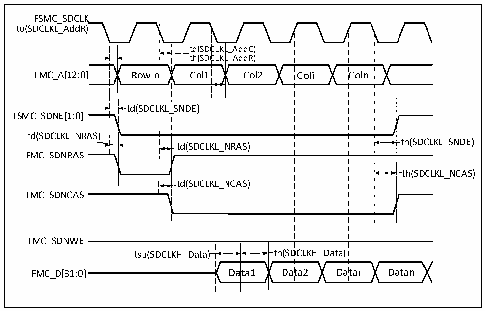

<!-- source-page: 114 -->

[← p.113](0113.md) · [index](../README.md) · [PDF p.114](https://ch32-riscv-ug.github.io/CH32H417/datasheet_zh/CH32H417DS0.PDF#page=114) · [p.115 →](0115.md)

<!-- header: CH32H417、H416、H415数据手册 https://wch.cn -->

### 3.3.26 SDRAM特性

图3-24 SDRAM读操作波形（CL = 1）  
 <!-- rendered from the PDF; verify at https://ch32-riscv-ug.github.io/CH32H417/datasheet_zh/CH32H417DS0.PDF#page=114 -->

🖼 Text parsed from the figure above

FSMC_SDCLK  
to(SDCLKL_AddR)  
td(SDC  CLKL  L_AddC) L_AddR)  ttdh((SSDDCC  CLKL  
FMC_A[12:0] Row n Col1 Col2 Coli Coln  
td(SDCLKL_SNDE)  
FSMC_SDNE[1:0]  
td(SDCLKL_NRAS)  
td(SDCLKL_NRAS)  )  
th(SDCLKL_SNDE)  
FMC_SDNRAS  
th(SDCLKL_NCAS)  
td(SDCLKL_NCAS)  
FMC_SDNCAS  
FMC_SDNWE  
tsu(SDCLKH_Data)  
t  th(SDCLKH_Data)  ata1  
tsu(SDCLKH_Data) th(SDCLKH_Data)  
FMC_D[31:0] Data1 Data2 Datai Datan  

<!-- p114-table-005 (table-3-40@1) -->
<table><caption>表3-40 SDRAM读操作时序</caption><tr><th>符号</th><th>参数</th><th>最小值</th><th>最大值</th><th>单位</th></tr><tr><td style="text-align:left">t W（SDCLK）</td><td>FMC_SDCLK周期</td><td>9.5</td><td>10.5</td><td rowspan="10">ns</td></tr><tr><td style="text-align:left">t SU（SDCLKH_DATA）</td><td>数据输入建立时间</td><td>3.5</td><td></td></tr><tr><td style="text-align:left">t h（SDCLKH_DATA）</td><td>数据输入保持时间</td><td>1.5</td><td></td></tr><tr><td style="text-align:left">t d（SDCLKL_ADD）</td><td>地址有效时间</td><td></td><td>4</td></tr><tr><td style="text-align:left">t d（SDCLKL_SDNE）</td><td>芯片选择有效时间</td><td></td><td>1</td></tr><tr><td style="text-align:left">t h（SDCLKL_SDNE）</td><td>芯片选择保持时间</td><td>0</td><td></td></tr><tr><td style="text-align:left">t d（SDCLKL_SDNRAS）</td><td>SDNRAS有效时间</td><td></td><td>1</td></tr><tr><td style="text-align:left">t h（SDCLKL_SDNRAS）</td><td>SDNRAS保持时间</td><td>0</td><td></td></tr><tr><td style="text-align:left">t d（SDCLKL_SDNCAS）</td><td>SDNCAS有效时间</td><td></td><td>1</td></tr><tr><td style="text-align:left">t h（SDCLKL_SDNCAS）</td><td>SDNCAS保持时间</td><td>0</td><td></td></tr></table>

注：读SDRAM时，FMC_SDCLK的最大值设置为100MHz。  

<!-- p114-table-006 (table-3-41@1) pages 114-115 -->
<table><caption>表3-41 LPSDR SDRAM读操作时序</caption><tr><th>符号</th><th>参数</th><th>最小值</th><th>最大值</th><th>单位</th></tr><tr><td style="text-align:left">t W（SDCLK）</td><td>FMC_SDCLK周期</td><td>9.5</td><td>10.5</td><td rowspan="6">ns</td></tr><tr><td style="text-align:left">t SU（SDCLKH_DATA）</td><td>数据输入建立时间</td><td>3.0</td><td></td></tr><tr><td style="text-align:left">t h（SDCLKH_DATA）</td><td>数据输入保持时间</td><td>1.5</td><td></td></tr><tr><td style="text-align:left">t d（SDCLKL_ADD）</td><td>地址有效时间</td><td></td><td>3.5</td></tr><tr><td style="text-align:left">t d（SDCLKL_SDNE）</td><td>芯片选择有效时间</td><td></td><td>1</td></tr><tr><td style="text-align:left">t h（SDCLKL_SDNE）</td><td>芯片选择保持时间</td><td>0</td><td></td></tr><tr><td style="text-align:left">t d（SDCLKL_SDNRAS）</td><td>SDNRAS有效时间</td><td></td><td>1</td><td rowspan="4"></td></tr><tr><td style="text-align:left">t h（SDCLKL_SDNRAS）</td><td>SDNRAS保持时间</td><td>0</td><td></td></tr><tr><td style="text-align:left">t d（SDCLKL_SDNCAS）</td><td>SDNCAS有效时间</td><td></td><td>1</td></tr><tr><td style="text-align:left">t h（SDCLKL_SDNCAS）</td><td>SDNCAS保持时间</td><td>0</td><td></td></tr></table>

<!-- image: p114-draw-image-00001 bbox=[502.8, 779.28, 522.24, 789.6] -->
<!-- footer: V1.8 110 -->
