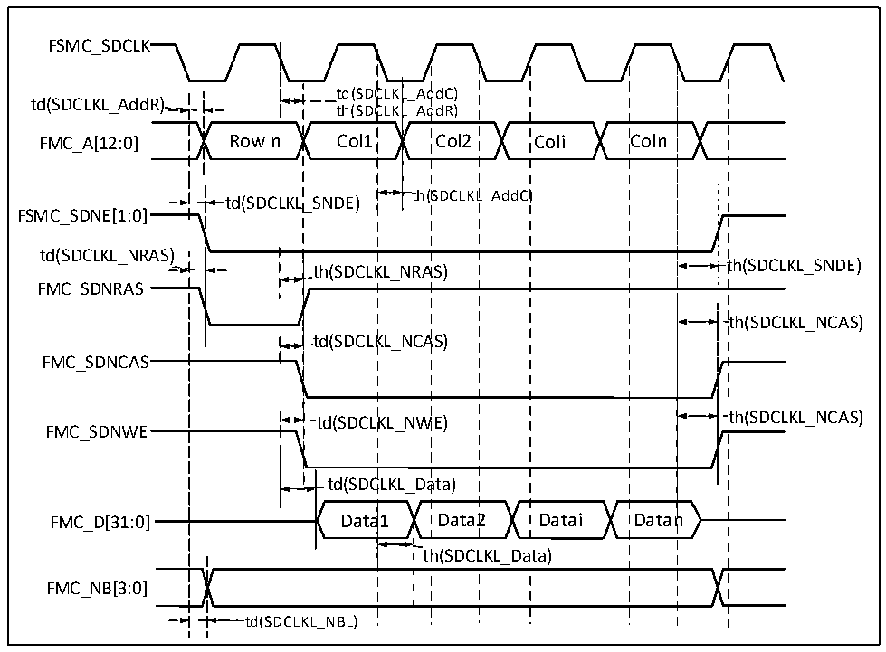

<!-- source-page: 115 -->

[← p.114](0114.md) · [index](../README.md) · [PDF p.115](https://ch32-riscv-ug.github.io/CH32H417/datasheet_zh/CH32H417DS0.PDF#page=115) · [p.116 →](0116.md)

<!-- header: CH32H417、H416、H415数据手册 https://wch.cn -->

> ⬆ **Table continued** — rendered in full at [page 114](0114.md). <!-- p115-table-001 -->

注：读SDRAM时，FMC_SDCLK的最大值设置为100MHz。  

图3-25 SDRAM写操作波形  
 <!-- rendered from the PDF; verify at https://ch32-riscv-ug.github.io/CH32H417/datasheet_zh/CH32H417DS0.PDF#page=115 -->

🖼 Text parsed from the figure above

FSMC_SDCLK  
td(SDC  CLKLCLKL  L_AddC) L_AddR)  ttdh((SSDDCC  CLK  L_AddR) Col2  
td(SDCLKL_AddR)  
th(SDCLKL_AddC)  th(  
td(SDCLKL_SNDE)  
FSMC_SDNE[1:0]  
td(SDCLKL_NRAS)  
th(SDCLKL_NRAS)  )  
th(SDCLKL_SNDE)  
FMC_SDNRAS  
th(SDCLKL_NCAS)  
td(SDCLKL_NCAS)  
FMC_SDNCAS  
th(SDCLKL_NCAS  t  
td(SDCLKL_NWE)  
FMC_SDNWE  
td(SDCLKL_Data)  
a1  
FMC_D[31:0] Data1 Data2 Datai Datan  
FMC_NB[3:0]  
td(SDCLKL_NBL)  

<!-- p115-table-007 (table-3-42@1) -->
<table><caption>表3-42 SDRAM写操作时序</caption><tr><th>符号</th><th>参数</th><th>最小值</th><th>最大值</th><th>单位</th></tr><tr><td style="text-align:left">t W（SDCLK）</td><td>FMC_SDCLK周期</td><td>9.5</td><td>10.5</td><td rowspan="12">ns</td></tr><tr><td style="text-align:left">t SU（SDCLKL_DATA）</td><td>数据输出有效时间</td><td></td><td>2</td></tr><tr><td style="text-align:left">t h（SDCLKL_DATA）</td><td>数据输出保持时间</td><td>0.5</td><td></td></tr><tr><td style="text-align:left">t d（SDCLKL_ADD）</td><td>地址有效时间</td><td></td><td>4</td></tr><tr><td style="text-align:left">t d（SDCLKL_SDNWE）</td><td>SDNWE有效时间</td><td></td><td>1</td></tr><tr><td style="text-align:left">t h（SDCLKL_SDNWE）</td><td>SDNWE保持时间</td><td>0</td><td></td></tr><tr><td style="text-align:left">t d（SDCLKL_SDNE）</td><td>芯片选择有效时间</td><td></td><td>1</td></tr><tr><td style="text-align:left">t h（SDCLKL_SDNE）</td><td>芯片选择保持时间</td><td>0</td><td></td></tr><tr><td style="text-align:left">t d（SDCLKL_SDNRAS）</td><td>SDNRAS有效时间</td><td></td><td>1</td></tr><tr><td style="text-align:left">t h（SDCLKL_SDNRAS）</td><td>SDNRAS保持时间</td><td>0</td><td></td></tr><tr><td style="text-align:left">t d（SDCLKL_SDNCAS）</td><td>SDNCAS有效时间</td><td></td><td>1</td></tr><tr><td style="text-align:left">t h（SDCLKL_SDNCAS）</td><td>SDNCAS保持时间</td><td>0</td><td></td></tr></table>

注：写SDRAM时，FMC_SDCLK的最大值设置为100MHz。  
<!-- image: p115-draw-image-00001 bbox=[502.8, 779.28, 522.24, 789.6] -->
<!-- footer: V1.8 111 -->
