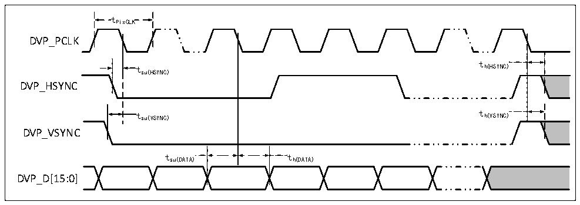

<!-- source-page: 116 -->

[← p.115](0115.md) · [index](../README.md) · [PDF p.116](https://ch32-riscv-ug.github.io/CH32H417/datasheet_zh/CH32H417DS0.PDF#page=116) · [p.117 →](0117.md)

<!-- header: CH32H417、H416、H415数据手册 https://wch.cn -->

<!-- p116-table-001 (table-3-43@1) -->
<table><caption>表3-43 LPSDR SDRAM写操作时序</caption><tr><th>符号</th><th>参数</th><th>最小值</th><th>最大值</th><th>单位</th></tr><tr><td style="text-align:left">t W（SDCLK）</td><td>FMC_SDCLK周期</td><td>9.5</td><td>10.5</td><td rowspan="12">ns</td></tr><tr><td style="text-align:left">t SU（SDCLKL_DATA）</td><td>数据输出有效时间</td><td></td><td>4</td></tr><tr><td style="text-align:left">t h（SDCLKL_DATA）</td><td>数据输出保持时间</td><td>0</td><td></td></tr><tr><td style="text-align:left">t d（SDCLKL_ADD）</td><td>地址有效时间</td><td></td><td>3.5</td></tr><tr><td style="text-align:left">t d（SDCLKL_SDNWE）</td><td>SDNWE有效时间</td><td></td><td>1</td></tr><tr><td style="text-align:left">t h（SDCLKL_SDNWE）</td><td>SDNWE保持时间</td><td>0</td><td></td></tr><tr><td style="text-align:left">t d（SDCLKL_SDNE）</td><td>芯片选择有效时间</td><td></td><td>1</td></tr><tr><td style="text-align:left">t h（SDCLKL_SDNE）</td><td>芯片选择保持时间</td><td>0</td><td></td></tr><tr><td style="text-align:left">t d（SDCLKL_SDNRAS）</td><td>SDNRAS有效时间</td><td></td><td>1</td></tr><tr><td style="text-align:left">t h（SDCLKL_SDNRAS）</td><td>SDNRAS保持时间</td><td>0</td><td></td></tr><tr><td style="text-align:left">t d（SDCLKL_SDNCAS）</td><td>SDNCAS有效时间</td><td></td><td>1</td></tr><tr><td style="text-align:left">t h（SDCLKL_SDNCAS）</td><td>SDNCAS保持时间</td><td>0</td><td></td></tr></table>

注：写SDRAM时，FMC_SDCLK的最大值设置为100MHz。  

### 3.3.27 DVP接口特性

图3-26 DVP时序波形  
 <!-- rendered from the PDF; verify at https://ch32-riscv-ug.github.io/CH32H417/datasheet_zh/CH32H417DS0.PDF#page=116 -->

🖼 Text parsed from the figure above

tPixCLK  
DVP_PCLK  
t  
t h(HSYNC)  
su(HSYNC)  
DVP_HSYNC  
t su(VSYNC) t h(VSYNC)  
DVP_VSYNC  
t su(DATA)  )  
t h(DATA)  
tsu(DATA) th(DATA)  
DVP_D[15:0]  

<!-- p116-table-004 (table-3-44@1) -->
<table><caption>表3-44 DVP接口特性</caption><tr><th>符号</th><th>参数及描述</th><th>最小值</th><th>最大值</th><th>单位</th></tr><tr><td style="text-align:left">f /t PixCLK PixCLK</td><td>像素时钟输入频率</td><td></td><td>150</td><td>MHz</td></tr><tr><td style="text-align:left">Duty （PixCLK）</td><td>像素时钟的占空比</td><td>15</td><td></td><td>%</td></tr><tr><td style="text-align:left">t su（DATA）</td><td>数据建立时间</td><td>2.5</td><td></td><td>ns</td></tr><tr><td style="text-align:left">t h（DATA）</td><td>数据保持时间</td><td>1</td><td></td><td>ns</td></tr><tr><td style="text-align:left">t /t su（HSYNC） su（VSYNC）</td><td>HSYNC/VSYNC信号输入建立时间</td><td>2.5</td><td></td><td>ns</td></tr><tr><td style="text-align:left">t /t h（HSYNC） h（VSYNC）</td><td>HSYNC/VSYNC信号输入保持时间</td><td>1</td><td></td><td>ns</td></tr></table>

<!-- image: p116-draw-image-00001 bbox=[502.8, 779.28, 522.24, 789.6] -->
<!-- footer: V1.8 112 -->
