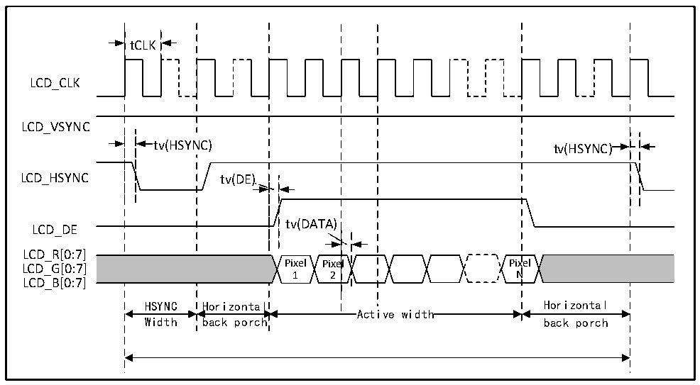
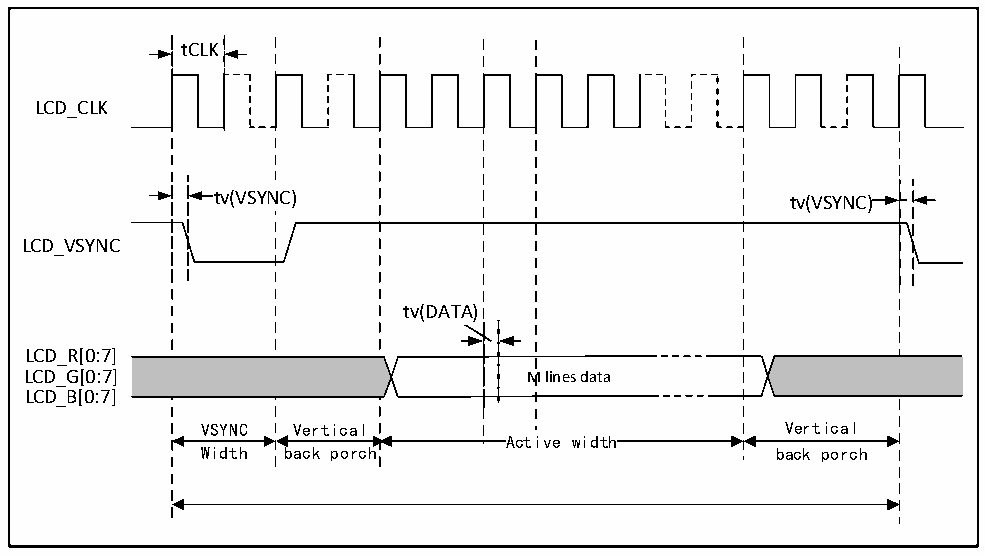

<!-- source-page: 117 -->

[← p.116](0116.md) · [index](../README.md) · [PDF p.117](https://ch32-riscv-ug.github.io/CH32H417/datasheet_zh/CH32H417DS0.PDF#page=117) · [p.118 →](0118.md)

> ⚠ 3 subscript glyph(s) on this page appear as `*` because the PDF's text layer maps them to `*` (broken ToUnicode); the printed page shows the real subscripts -- read [the PDF, p.117](https://ch32-riscv-ug.github.io/CH32H417/datasheet_zh/CH32H417DS0.PDF#page=117).

<!-- header: CH32H417、H416、H415数据手册 https://wch.cn -->

### 3.3.28 LTDC接口特性

图3-27 LTDC水平时序图  
 <!-- rendered from the PDF; verify at https://ch32-riscv-ug.github.io/CH32H417/datasheet_zh/CH32H417DS0.PDF#page=117 -->

🖼 Text parsed from the figure above

tCLK  
LCD_CLK  
LCD_VSYNC  
tv(HSYNC) tv(HSYNC)  
LCD_HSYNC tv(DE)  
tv(DATA)  
LCD_DE  
LCD_R[0:7]  
LCD_G[0:7] Pixel Pixel Pixel  
1 2 N  
LCD_B[0:7]  
HSYNC Horizontal Horizontal  
Active width  
Width back porch back porch  

图3-28 LTDC垂直时序图  
 <!-- rendered from the PDF; verify at https://ch32-riscv-ug.github.io/CH32H417/datasheet_zh/CH32H417DS0.PDF#page=117 -->

🖼 Text parsed from the figure above

tCLK  
LCD_CLK  
tv(VSYNC) tv(VSYNC)  
LCD_VSYNC  
tv(DATA)  
LCD_R[0:7]  
LCD_G[0:7] M lines data  
LCD_B[0:7]  
VSYNC Vertical Vertical  
Active width  
Width back porch back porch  

<!-- p117-table-001 (table-3-45@1) pages 117-118 -->
<table><caption>表3-45 LTDC接口特性</caption><tr><th>符号</th><th>参数</th><th>条件</th><th>最小值</th><th>典型值</th><th>最大值</th><th>单位</th></tr><tr><td rowspan="3" style="text-align:left">FCLK</td><td rowspan="3">时钟输出频率</td><td style="text-align:left">CL=30pF，V(1) = 2.7-3.6V *</td><td></td><td></td><td>120</td><td>MHz</td></tr><tr><td style="text-align:left">CL=10pF，V(1) = 2.7-3.6V *</td><td></td><td></td><td>200</td><td>MHz</td></tr><tr><td style="text-align:left">CL=30pF，V(1) = 1.6-2.7V *</td><td></td><td></td><td>55</td><td>MHz</td></tr><tr><td style="text-align:left">Duty （CLK）</td><td>时钟占空比</td><td>CL=30pF</td><td>45</td><td></td><td>55</td><td>%</td></tr><tr><td style="text-align:left">t W（CKH）</td><td>时钟高/低电平时间</td><td>CL=30pF</td><td style="text-align:left">t /2-0.7CLK</td><td></td><td style="text-align:left">t /2+0.7CLK</td><td>ns</td></tr><tr><td style="text-align:left">t V</td><td style="text-align:left">数据及控制信号输出有效时间</td><td>CL=30pF</td><td></td><td></td><td>0.7</td><td>ns</td></tr><tr><td style="text-align:left">t S</td><td style="text-align:left">数据及控制信号输出保持时间</td><td>CL=30pF</td><td>0</td><td></td><td></td><td>ns</td></tr></table>

<!-- image: p117-draw-image-00001 bbox=[502.8, 779.28, 522.24, 789.6] -->
<!-- footer: V1.8 113 -->
