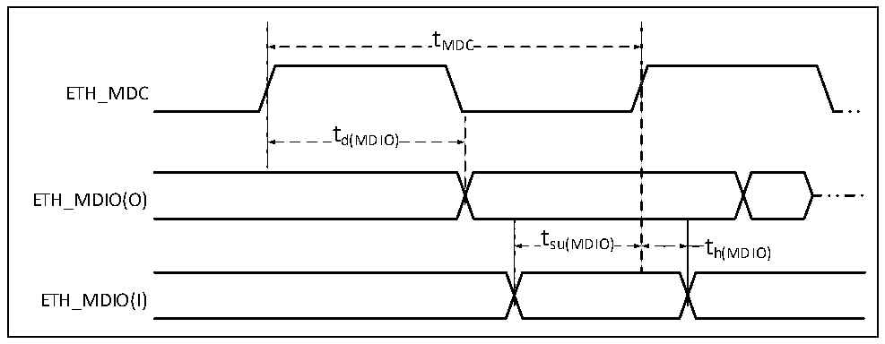
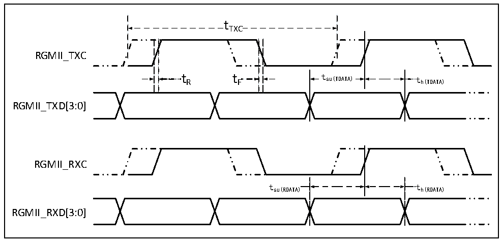

<!-- source-page: 118 -->

[← p.117](0117.md) · [index](../README.md) · [PDF p.118](https://ch32-riscv-ug.github.io/CH32H417/datasheet_zh/CH32H417DS0.PDF#page=118) · [p.119 →](0119.md)

> ⚠ 1 subscript glyph(s) on this page appear as `*` because the PDF's text layer maps them to `*` (broken ToUnicode); the printed page shows the real subscripts -- read [the PDF, p.118](https://ch32-riscv-ug.github.io/CH32H417/datasheet_zh/CH32H417DS0.PDF#page=118).

<!-- header: CH32H417、H416、H415数据手册 https://wch.cn -->

> ⬆ **Table continued** — rendered in full at [page 117](0117.md). <!-- p118-table-001 -->

注：1.上表中，V*根据具体的引脚可表示为VDDIO、VIO18 或VDD33。  

### 3.3.29 千兆以太网接口特性

图3-29 ETH-SMI 时序波形  
 <!-- rendered from the PDF; verify at https://ch32-riscv-ug.github.io/CH32H417/datasheet_zh/CH32H417DS0.PDF#page=118 -->

🖼 Text parsed from the figure above

tMDC  
ETH_MDC  
td(MDIO)  
ETH_MDIO(O)  
t  
su(MDIO) t  
h(MDIO)  
ETH_MDIO(I)  

<!-- p118-table-002 (table-3-46@1) -->
<table><caption>表3-46 以太网MAC的SMI信号特性</caption><tr><th>符号</th><th>参数及描述</th><th>最小值</th><th>典型值</th><th>最大值</th><th>单位</th></tr><tr><td style="text-align:left">f /t MDC MDC</td><td>MDC时钟频率</td><td></td><td></td><td>2.5</td><td>MHz</td></tr><tr><td style="text-align:left">t d（MDIO）</td><td>MDIO写数据的有效时间</td><td>0</td><td></td><td>300</td><td rowspan="3">ns</td></tr><tr><td style="text-align:left">t su（MDIO）</td><td>读数据建立时间</td><td>10</td><td></td><td></td></tr><tr><td style="text-align:left">t h（MDIO）</td><td>读数据保持时间</td><td>10</td><td></td><td></td></tr></table>

图3-30 ETH-RGMII信号时序波形  
 <!-- rendered from the PDF; verify at https://ch32-riscv-ug.github.io/CH32H417/datasheet_zh/CH32H417DS0.PDF#page=118 -->

🖼 Text parsed from the figure above

tTXC  
RGMII_TXC  
t R t F t su(TDATA) t h(TDATA)  
RGMII_TXD[3:0]  
RGMII_RXC  
tsu(RDATA) th(RDATA)  
RGMII_RXD[3:0]  

<!-- image: p118-draw-image-00001 bbox=[502.8, 779.28, 522.24, 789.6] -->
<!-- footer: V1.8 114 -->
