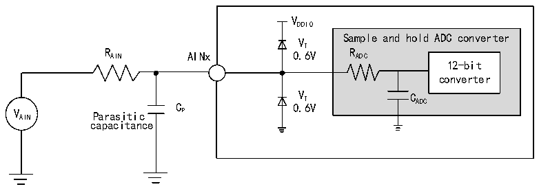
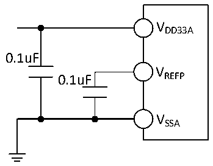

<!-- source-page: 121 -->

[← p.120](0120.md) · [index](../README.md) · [PDF p.121](https://ch32-riscv-ug.github.io/CH32H417/datasheet_zh/CH32H417DS0.PDF#page=121) · [p.122 →](0122.md)

<!-- header: CH32H417、H416、H415数据手册 https://wch.cn -->

图3-31 ADC典型连接图  
 <!-- rendered from the PDF; verify at https://ch32-riscv-ug.github.io/CH32H417/datasheet_zh/CH32H417DS0.PDF#page=121 -->

🖼 Text parsed from the figure above

VDDIO  
Sample and hold ADC converter  
VT  
R AIN AINx 0.6V R ADC  
12-bit  
converter  
C 0 V . T 6V C ADC  
V AIN Parasitic P  
capacitance  

图3-32 模拟电源及退耦电路参考  
 <!-- rendered from the PDF; verify at https://ch32-riscv-ug.github.io/CH32H417/datasheet_zh/CH32H417DS0.PDF#page=121 -->

🖼 Text parsed from the figure above

VDD33A  
0.1uF  
V  
0.1uF REFP  
VSSA  

### 3.3.31 10位HSADC特性

<!-- p121-table-001 (table-3-52@1) -->
<table><caption>表3-52 HSADC特性</caption><tr><th>符号</th><th>参数</th><th>条件</th><th>最小值</th><th>典型值</th><th>最大值</th><th>单位</th></tr><tr><td style="text-align:left">VDD33A</td><td>供电电压</td><td></td><td>3.0</td><td>3.3</td><td>3.6</td><td>V</td></tr><tr><td style="text-align:left">V （2） REFP</td><td>正参考电压</td><td style="text-align:left">V ≤ V REFP DD33A</td><td>2.4</td><td>3.3</td><td>3.6</td><td>V</td></tr><tr><td style="text-align:left">VDDIO</td><td>使用HSADC时的I/O引脚电压</td><td></td><td style="text-align:left">VREFP</td><td></td><td></td><td>V</td></tr><tr><td style="text-align:left">IDDA</td><td>供电电流</td><td></td><td></td><td>1.1</td><td></td><td>mA</td></tr><tr><td style="text-align:left">IDDIO</td><td>ADC I/O引脚电流</td><td></td><td></td><td>1.8</td><td></td><td>mA</td></tr><tr><td style="text-align:left">f HSADC</td><td>ADC时钟频率</td><td></td><td></td><td>100</td><td></td><td>MHz</td></tr><tr><td style="text-align:left">f S</td><td>采样速率</td><td></td><td></td><td>20</td><td></td><td>MHz</td></tr><tr><td rowspan="2" style="text-align:left">VAIN</td><td rowspan="2">转换电压范围</td><td style="text-align:left">V ≥ V REFP DDIO</td><td>0</td><td></td><td style="text-align:left">VDDIO</td><td>V</td></tr><tr><td style="text-align:left">V ＜ V REFP DDIO</td><td>0</td><td></td><td style="text-align:left">VREFP</td><td>V</td></tr><tr><td style="text-align:left">RAIN</td><td>外部输入阻抗</td><td></td><td></td><td></td><td>0.4</td><td>kΩ</td></tr><tr><td style="text-align:left">RHSADC</td><td>采样开关电阻</td><td></td><td></td><td>0.1</td><td>0.25</td><td>kΩ</td></tr><tr><td style="text-align:left">CHSADC</td><td>内部采样和保持电容</td><td></td><td></td><td>1.1</td><td></td><td>pF</td></tr><tr><td style="text-align:left">t CAL</td><td>校准时间</td><td></td><td></td><td>1</td><td></td><td>us</td></tr><tr><td rowspan="2" style="text-align:left">t s</td><td rowspan="2">采样时间</td><td style="text-align:left">f = 100MHz HSADC</td><td></td><td>10</td><td></td><td>ns</td></tr><tr><td></td><td></td><td>1</td><td></td><td style="text-align:left">1/f HSADC</td></tr><tr><td style="text-align:left">t STAB</td><td>上电时间</td><td></td><td></td><td></td><td>1</td><td>us</td></tr><tr><td rowspan="2" style="text-align:left">t CONV</td><td rowspan="2">总的转换时间（包括采样时间）</td><td style="text-align:left">f = 100MHz HSADC</td><td></td><td>50</td><td></td><td>ns</td></tr><tr><td></td><td></td><td>5</td><td></td><td style="text-align:left">1/f HSADC</td></tr></table>

注：1.以上均为设计参数保证。  
2.VREFP 外接电容要尽可能近，否则影响HSADC性能。  
<!-- image: p121-draw-image-00001 bbox=[502.8, 779.28, 522.24, 789.6] -->
<!-- footer: V1.8 117 -->
