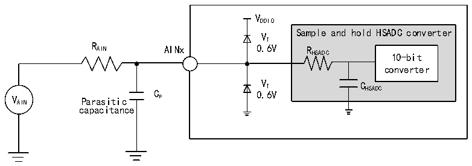
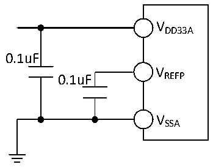

<!-- source-page: 122 -->

[← p.121](0121.md) · [index](../README.md) · [PDF p.122](https://ch32-riscv-ug.github.io/CH32H417/datasheet_zh/CH32H417DS0.PDF#page=122) · [p.123 →](0123.md)

<!-- header: CH32H417、H416、H415数据手册 https://wch.cn -->
公式：最大RAIN  
<em>T</em>  
<em>R &lt; S -R</em>  
<em>AIN f ×C ×ln2N+2 HSADC</em>  
<em>HSADC HSADC</em>  
上述公式用于决定最大的外部阻抗，使得误差可以小于1/4 LSB。其中N=10(表示10位分辨率)。  

<!-- p122-table-001 (table-3-53@1) -->
<table><caption>表3-53 HSADC误差</caption><tr><th>符号</th><th>参数</th><th>条件</th><th>最小值</th><th>典型值</th><th>最大值</th><th>单位</th></tr><tr><td>EO</td><td>偏移误差</td><td rowspan="3" style="text-align:left">R ＜ 0.4kΩ, AIN V = 3.3VDD33A</td><td></td><td>±4</td><td>±9</td><td rowspan="3">LSB</td></tr><tr><td>ED</td><td>微分非线性误差</td><td></td><td>±2</td><td>±4</td></tr><tr><td>EL</td><td>积分非线性误差</td><td></td><td>±3</td><td>±4</td></tr></table>

注：以上均为设计参数保证。  
Cp 表示PCB与焊盘上的寄生电容（大约5pF），可能与焊盘和PCB布局质量有关。较大的Cp 数值将  
降低转换精度，解决办法是降低fADC 值。  

图3-33 HSADC典型连接图  
 <!-- rendered from the PDF; verify at https://ch32-riscv-ug.github.io/CH32H417/datasheet_zh/CH32H417DS0.PDF#page=122 -->

🖼 Text parsed from the figure above

VDDIO  
Sample and hold HSADC converter  
VT  
R AIN AINx 0.6V R  
HSADC 10-bit  
converter  
C 0 V . T 6V C HSADC  
V AIN Parasitic P  
capacitance  

图3-34 模拟电源及退耦电路参考  
 <!-- rendered from the PDF; verify at https://ch32-riscv-ug.github.io/CH32H417/datasheet_zh/CH32H417DS0.PDF#page=122 -->

🖼 Text parsed from the figure above

VDD33A  
0.1uF  
V  
0.1uF REFP  
VSSA  

### 3.3.32 DAC特性

<!-- p122-table-002 (table-3-54@1) pages 122-123 -->
<table><caption>表3-54 DAC特性</caption><tr><th>符号</th><th>参数</th><th>条件</th><th>最小值</th><th>典型值</th><th>最大值</th><th>单位</th></tr><tr><td style="text-align:left">VDD33A</td><td>供电电压</td><td></td><td>2.4</td><td>3.3</td><td>3.6</td><td>V</td></tr><tr><td style="text-align:left">VREFP</td><td>正参考电压</td><td style="text-align:left">V ≤ V REFP DD33A</td><td>2.4</td><td>3.3</td><td>3.6</td><td>V</td></tr><tr><td style="text-align:left">R（1） L</td><td>缓冲器打开时的负载电阻</td><td></td><td>5</td><td></td><td></td><td>kΩ</td></tr><tr><td style="text-align:left">C（1） L</td><td>缓冲器打开时负载电容</td><td></td><td></td><td></td><td>50</td><td>pF</td></tr><tr><td style="text-align:left">V （1） OUT_MIN</td><td rowspan="2">缓冲器打开，12位DAC转换</td><td></td><td>0</td><td></td><td>8</td><td>mV</td></tr><tr><td style="text-align:left">V （1） OUT_MAX</td><td style="text-align:left">V = 3.3VREFP</td><td>3.29</td><td></td><td>3.3</td><td>V</td></tr><tr><td style="text-align:left">V （1） OUT_MIN</td><td rowspan="2">缓冲器关闭，12位DAC转换</td><td></td><td>0</td><td></td><td>3</td><td>mV</td></tr><tr><td style="text-align:left">V （1） OUT_MAX</td><td style="text-align:left">V = 3.3VREFP</td><td>3.295</td><td></td><td>3.3</td><td>V</td></tr><tr><td rowspan="3" style="text-align:left">IVREFP</td><td colspan="2">无负载，输入值0x800</td><td></td><td>58</td><td></td><td rowspan="3">uA</td></tr><tr><td colspan="2" style="text-align:left">无负载，V = 3.6V时，输入值0xF1CREFP</td><td></td><td>194</td><td></td></tr><tr><td colspan="2" style="text-align:left">无负载，V = 3.6V时，输入值0x555（最差） REFP</td><td></td><td>331</td><td></td></tr><tr><td rowspan="3" style="text-align:left">IDDA</td><td colspan="2">缓冲器打开无负载，输入值0x800</td><td></td><td>170</td><td></td><td rowspan="3">uA</td></tr><tr><td colspan="2" style="text-align:left">缓冲器打开无负载，V = 3.6V，输入值0xF1CREFP</td><td></td><td>150</td><td></td></tr><tr><td colspan="2" style="text-align:left">缓冲器打开无负载，V = 3.6V，输入值0x555（最差） REFP</td><td></td><td>170</td><td></td></tr><tr><td>DNL</td><td>微分非线性误差</td><td></td><td></td><td>±2</td><td></td><td>LSB</td></tr><tr><td>INL</td><td>积分非线性误差</td><td style="text-align:left">经过失调误差和增益误差校正后</td><td></td><td>±4</td><td></td><td>LSB</td></tr><tr><td rowspan="2">失调</td><td rowspan="2">偏移误差</td><td></td><td></td><td>±3</td><td>±12</td><td>mV</td></tr><tr><td style="text-align:left">V = 3.6VREFP</td><td></td><td></td><td>±10</td><td>LSB</td></tr><tr><td>增益误差</td><td></td><td>DAC配置为12位</td><td></td><td>±0.4</td><td></td><td>%</td></tr><tr><td>放大器增益（1）</td><td>开环时放大器的增益</td><td>5kΩ的负载（最大）</td><td>80</td><td>85</td><td></td><td>dB</td></tr><tr><td style="text-align:left">t SETTLING</td><td style="text-align:left">设置时间（全范围：输入代码从最小值转变为最大值， DAC_OUT达到其终值的±1LSB）</td><td style="text-align:left">C ≤ 50pFLOAD R ≥ 5kΩLOAD</td><td></td><td>3</td><td>4</td><td>us</td></tr><tr><td>更新速率</td><td style="text-align:left">当输入代码为较小变化时（从数值i变到i+1LSB），得到正确DAC_OUT的最大频率</td><td style="text-align:left">C ≤ 50pFLOAD R ≥ 5kΩLOAD</td><td></td><td></td><td>1</td><td>MS/s</td></tr><tr><td>PSRR+（1）</td><td style="text-align:left">供电抑制比（相对于V ）（静DD33A态直流测量）</td><td style="text-align:left">没有R ，C ≤ 50pF LOAD LOAD</td><td></td><td>-100</td><td>-75</td><td>dB</td></tr></table>

<!-- image: p122-draw-image-00001 bbox=[502.8, 779.28, 522.24, 789.6] -->
<!-- footer: V1.8 118 -->
