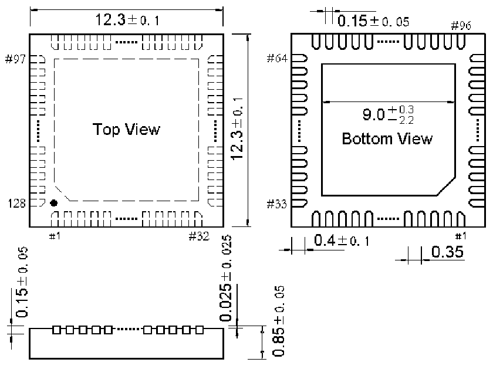
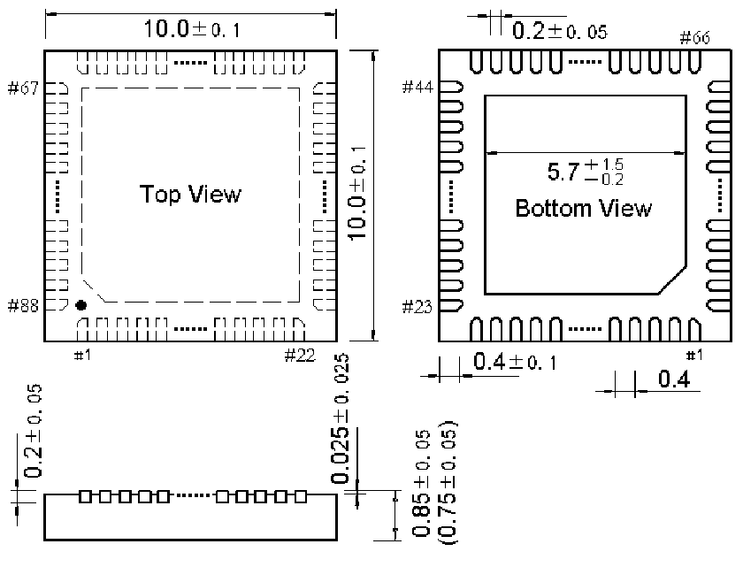

<!-- source-page: 128 -->

[← p.127](0127.md) · [index](../README.md) · [PDF p.128](https://ch32-riscv-ug.github.io/CH32H417/datasheet_zh/CH32H417DS0.PDF#page=128) · [p.129 →](0129.md)

<!-- header: CH32H417、H416、H415数据手册 https://wch.cn -->
说明：尺寸标注的单位是 mm（毫米），引脚中心间距总是标称值，没有误差，除此之外的尺寸误差不  
大于±0.2mm或者±10%两者中的较大值。  

## 4.1 QFN128封装

 <!-- p128-draw-image-00002 rendered from the PDF -->

## 4.2 QFN88封装

 <!-- p128-draw-image-00003 rendered from the PDF -->

<!-- image: p128-draw-image-00001 bbox=[502.8, 779.28, 522.24, 789.6] -->
<!-- footer: V1.8 124 -->
