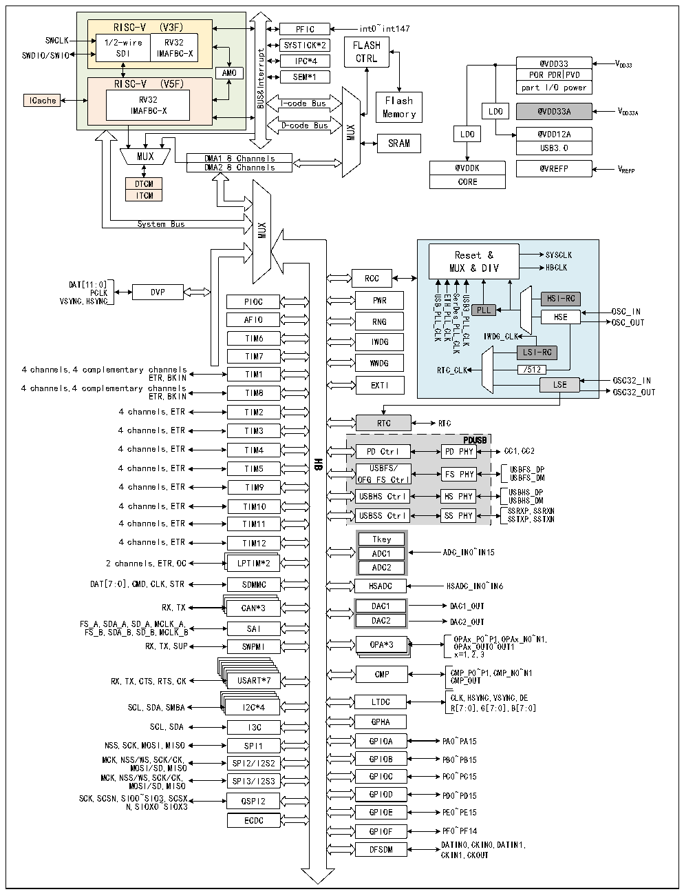

<!-- source-page: 5 -->

[← p.4](0004.md) · [index](../README.md) · [PDF p.5](https://ch32-riscv-ug.github.io/CH32H417/datasheet_en/CH32H417RM.PDF#page=5) · [p.6 →](0006.md)

<!-- header: CH32H417 Reference Manual https://wch-ic.com -->

Figure 1-1-2 CH32H416 System block diagram  
 <!-- rendered from the PDF; verify at https://ch32-riscv-ug.github.io/CH32H417/datasheet_en/CH32H417RM.PDF#page=5 -->

🖼 Text parsed from the figure above

RISC-V (V3F) 1/2-wire RV32 SDI IMAFBC-XAMO  AMO  A RISC-V (V5F) RV32IMAFBC-X  AMO  
PFIC  SYSTICK*2IPC*4  
int0~int147  
SWCLK  
FLASH  
CTRL  
AMOtpurretnI&amp;SUB SEM*1  
PORPDRPVD  
partI/O power  
RV32 I-code Bus Flash  
ICache  
IMAFBC-X Memory  
LDO @VDD33A VDD33A  
D-code Bus  
MUX  
LDO @VDD12A  
SRAM  
USB3.0  
MUX DMA1 8 Channels  
DMA2 8 Channels  
@VDDK @VREFP VREFP  
CORE  
DTCM  
ITCM  
System Bus  
MUX  
Reset &amp; SYSCLK  
MUX &amp; DIV HBCLK  
RCC  
DAT[11:0]  
PCLK DVP  
USB_PLL_CLK ETH_PLL_CLK SerDes_PLL_CLK USB3_PLL_CLK  
HSI-RC  
VSYNC,HSYNC PIOC PWR  
PLL OSC_IN  
HSE OSC_OUT  
AFIO RNG  
IWDG_CLK  
TIM6 IWDG  
LSI-RC  
TIM7  
WWDG  
4 channels,4 complementary channels ETR,BKIN TIM1 4 channels,4 complementary channels EXTI ETR,BKIN TIM8  
/512  
RTC_CLK LSE OSC32_IN OSC32_OUT  
4 channels,ETR TIM2  
RTC  
RTC  
4 channels,ETR TIM3  
PDUSB  
4 channels,ETR TIM4 PD Ctrl PD PHY CC1,CC2  
HB  
4 channels,ETR TIM5 OFG U S F B S F S C / trl FS PHY U U S S B B F F S S _ _ D D P M  
4 channels,ETR TIM9  
USBHS Ctrl HS PHY USBHS_DP  
USBHS_DM  
4 channels,ETR TIM10  
4 channels,ETR TIM11 USBSS Ctrl SS PHY S S S S R T X X P P , , S S S S R T X X N N  
4 channels,ETR TIM12 Tkey  
ADC1 ADC_IN0~IN15  
2 channels,ETR,OC LPTIM*2  
ADC2  
SDMMCCAN*3  
RX,TX CAN*3 DAC1 DAC1_OUT  
FS_A,SDA_A,SD_A,MCLK_A, DAC2 DAC2_OUT  
FS_B,SDA_B,SD_B,MCLK_B SAI  
OPAx_P0~P1,OPAx_N0~N1,  
RX,TX,SUP SWPMI OPA*3 OPAx_OUT0~OUT1  
x=1,2,3  
CMP CMP_P0~P1,CMP_N0~N1  
RX,TX,CTS,RTS,CK USART*7 CMP_OUT  
LTDC CLK,HSYNC,VSYNC,DE  
SCL,SDA,SMBA I2C*4 R[7:0],G[7:0],B[7:0]  
GPHA  
SCL,SDA I3C  
NSS,SCK,MOSI,MISO SPI1 GPIOA PA0~PA15  
MCK,NSS/WS,SCK/CK, SPI2/I2S2 GPIOB PB0~PB15  
MOSI/SD,MISO  
MCK,NSS/WS,SCK/CK, SPI3/I2S3 GPIOC PC0~PC15  
MOSI/SD,MISO  
SCK,SCSN,SIO0~SIO3,SCSX QSPI2 GPIOD PD0~PD15  
N,SIOX0~SIOX3  
GPIOE PE0~PE15  
ECDC  
GPIOF PF0~PF14  
DFSDM DATIN0,CKIN0,DATIN1,  
CKIN1,CKOUT  

<!-- image: p5-draw-image-00001 bbox=[502.44, 786.36, 521.88, 796.68] -->
<!-- footer: V1.7 3 -->
