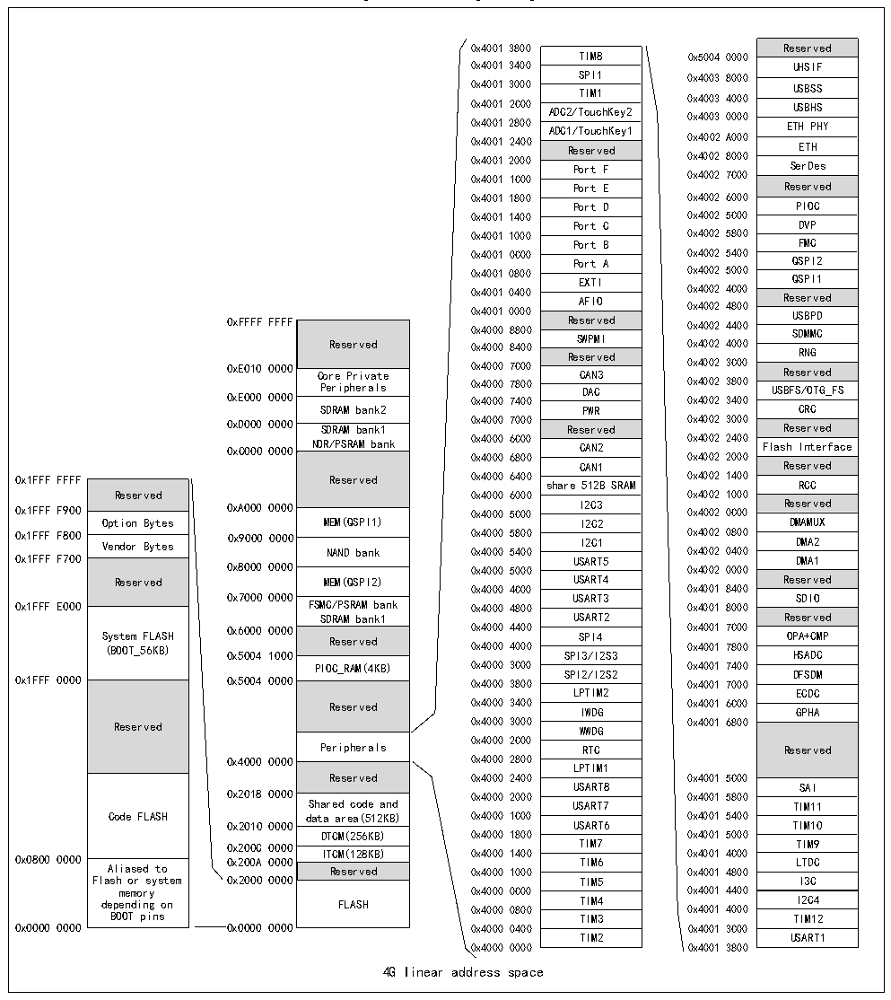

<!-- source-page: 8 -->

[← p.7](0007.md) · [index](../README.md) · [PDF p.8](https://ch32-riscv-ug.github.io/CH32H417/datasheet_en/CH32H417RM.PDF#page=8) · [p.9 →](0009.md)

<!-- header: CH32H417 Reference Manual https://wch-ic.com -->

## 1.2 Memory Map

The CH32H417 family contains program memory, data memory, core registers, peripheral registers, and more, all  
addressed in a 4GB linear space.  
System storage stores data in small-end format, i.e., low bytes are stored at the low address and high bytes are  
stored at the high address.  

Figure 1-2 Storage image  
 <!-- rendered from the PDF; verify at https://ch32-riscv-ug.github.io/CH32H417/datasheet_en/CH32H417RM.PDF#page=8 -->

🖼 Text parsed from the figure above

Reserved  UHSIF  USBSS  USBHS  ETH PHY  ETH  SerDes  Reserved  PIOC  DVP  FMC  QSPI2  QSPI1  Reserved  USBPD  SDMMC  RNGReserved  Reserved  USBFS/OTG_FS  CRC  Reserved  Flash Interface  Reserved  RCC  Reserved  DMAMUX  DMA2  DMA1  Reserved  SDIO  Reserved  OPA+CMP  HSADC  DFSDM  ECDC  GPHA  Reserved  SAI  TIM11  TIM10  TIM9  LTDC  I3C  I2C4TIM12  USART1  
0x4001 3800 Reserved  
TIM8  SPI1  TIM1  ADC2/TouchKey2  ADC1/TouchKey1  Reserved  Port F  Port E  Port D  Port C  Port B  Port A  EXTI  AFIO  Reserved  Reserved SWPMI  Reserved  CAN3  DAC  PWR  Reserved  CAN2  CAN1  share 512B SRAM  I2C3  I2C3I2C2  I2C1  USART5  USART4  USART3  USART2  SPI4  SPI3/I2S3  SPI2/I2S2  LPTIM2  IWDG  WWDG  RTC  LPTIM1  USART8  USART7  USART6  TIM7  TIM6  TIM5  TIM4  TIM3  TIM2  
TIM8 0x5004 0000  
0x4001 3400 UHSIF  
SPI1 0x4003 8000  
0x4001 3000 TIM1 USBSS  
0 0 x x 4 4 0 0 0 0 1 1 2 2 8 C 0 00 0 A A D D C C 2 1 / / T T o o u u c c h h K K e e y y 2 1 0 0 x x 4 4 0 0 0 0 3 3 0 4 0 0 0 0 0 0 ET U H S B P H H S Y  
0x4001 2400 Reserved 0x4002 A000 ETH  
0x4001 2000 Port F 0x4002 8000 SerDes  
Port E Reserved  
Port D PIOC  
Port C DVP  
Port B FMC  
Port A QSPI2  
0x4001 0800 EXTI 0x4002 5000 QSPI1  
0xFFFF FFFF Reserved 0 0 0 0 x x x x 4 4 4 4 0 0 0 0 0 0 0 0 1 1 0 0 0 0 8 8 0 4 4 8 0 0 0 0 0 0 0 0 R R e e S A s s W F e e P I r r M O v v I e e d d 0 0 0 0 x x x x 4 4 4 4 0 0 0 0 0 0 0 0 2 2 2 2 4 4 4 4 0 4 8 C 0 0 0 00 0 0 0 Re S U s D S R e M B N r M P G v C D ed  
Reserved  Core Private Peripherals  SDRAM bank2  SDRAM bank1 NOR/PSRAM bank  Reserved  MEM(QSPI1)  NAND bank  MEM(QSPI2)  FSMC/PSRAM bank SDRAM bank1  Reserved  PIOC_RAM(4KB)  Reserved  Peripherals  Reserved  Shared code and data area(512KB)  DTCM(256KB)  ITCM(128KB)  Reserved  FLASH  
0xE010 0000 Core Private 0x4000 7C00 CAN3 0x4002 3C00 Reserved  
0xE000 0000 Peripherals 0 0 x x 4 4 0 0 0 0 0 0 7 7 4 8 0 0 0 0 DAC 0 0 x x 4 4 0 0 0 0 2 2 3 3 4 8 0 0 0 0 USBFS/OTG_FS  
0xD000 0000 SDRAM bank1 0x4000 7000 Reserved 0x4002 3000 Reserved  
0xC000 0000 NOR/PSRAM bank 0x4000 6C00 CAN2 0x4002 2400 Flash Interface  
CAN1 Reserved  
0x1FFF FFFF Reserved 0x4000 6400 share 512B SRAM 0x4002 1400 RCC  
Reserved  Option Bytes  Vendor Bytes  Reserved  System FLASH (BOOT_56KB)  Reserved  Code FLASH  Aliased to Flash or system memory depending on BOOT pins  
Reserved 0x4000 6000 0x4002 1000  
0x1FFF F900 0xA000 0000 0x4000 5C00 I2C3 0x4002 0C00 Reserved  
Option Bytes MEM(QSPI1) I2C2 DMAMUX  
0x1FFF F800 Vendor Bytes 0x9000 0000 NAND bank 0 0 x x 4 4 0 0 0 0 0 0 5 5 4 8 0 0 0 0 I2C1 0 0 x x 4 4 0 0 0 0 2 2 0 0 4 8 0 0 0 0 DMA2  
0x1FFF F700 0x8000 0000 0x4000 5000 USART5 0x4002 0000 DMA1  
Reserved MEM(QSPI2) USART4 Reserved  
0x7000 0000 USART3 SDIO  
S ( y B s O t O e T m _ 5 F 6 L K A B S ) H 0 0 x x 5 6 0 0 0 0 4 0 1 0 0 0 0 0 0 0 Reserved 0 0 x x 4 4 0 0 0 0 0 0 4 4 4 0 0 0 0 0 SPI S 3 P / I I 4 2S3 0 0 x x 4 4 0 0 0 0 1 1 7 7 8 C 0 00 0 O H P S A A + D C C MP  
PIOC_RAM(4KB) 0x4000 3C00 0x4001 7400  
0x1FFF 0000 0x5004 0000 0x4000 3800 SPI2/I2S2 0x4001 7000 DFSDM  
LPTIM2 ECDC  
Reserved 0x4000 3000 WWDG 0x4001 6800  
0x4000 2C00  
Reserved 0x4000 2400 0x4001 5C00  
USART8 SAI  
0x2018 0000 0x4000 2000 0x4001 5800  
Code FLASH data area(512KB) 0x4000 1C00 0x4001 5400  
0x2010 0000 USART6 TIM10  
DTCM(256KB) 0x4000 1800 0x4001 5000  
0x200C 0000 TIM7 TIM9  
0x0800 0000 0x200A 0000 ITCM(128KB) 0x4000 1400 TIM6 0x4001 4C00 LTDC  
Aliased to Reserved 0x4000 1000 0x4001 4800  
Flash or system 0x2000 0000 TIM5 I3C  
memory 0x4000 0C00 0x4001 4400  
depending on FLASH 0x4000 0800 TIM4 0x4001 4000 I2C4  
BOOT pins TIM3 TIM12  
TIM2 USART1  
4G linear address space  

<!-- image: p8-draw-image-00001 bbox=[502.44, 786.36, 521.88, 796.68] -->
<!-- footer: V1.7 6 -->
