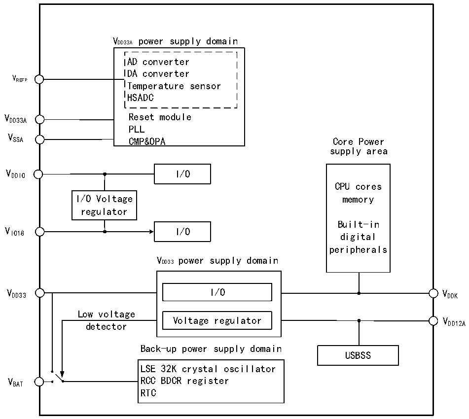

<!-- source-page: 10 -->

[← p.9](0009.md) · [index](../README.md) · [PDF p.10](https://ch32-riscv-ug.github.io/CH32H417/datasheet_en/CH32H417RM.PDF#page=10) · [p.11 →](0011.md)

<!-- header: CH32H417 Reference Manual https://wch-ic.com -->

# Chapter 2 Power Control (PWR)

## 2.1 Overview

The CH32H417 system operating voltage VDD ranges from 2.4 to 3.6 V. The built-in voltage regulator provides  
the low-voltage power supply required by the core. When the main power supply, VDD33, is powered down, a  
backup power source such as a battery can provide power for the real-time clock (RTC) through the VBAT pin. If  
no backup power is required, it is recommended that VDD33 be connected directly to the VBAT pin.  
The VDD33A and VSSA pins are specifically designed to power analog-related circuits within the system, including  
ADCs, DACs, temperature sensors, and similar components. VREFP serves as a reference point for the upper  
voltage limit of certain analog circuits, such as ADCs. In some packages, it is provided as a separate pin; in others,  
it remains unpackaged and internally equals VDD33A within the chip.  

Figure 2-1 Block diagram of power supply structure  
 <!-- rendered from the PDF; verify at https://ch32-riscv-ug.github.io/CH32H417/datasheet_en/CH32H417RM.PDF#page=10 -->

🖼 Text parsed from the figure above

VDD33A power supply domain  
AD converter  
DA converter  
V  
REFP Temperature sensor  
HSADC  
VDD33A Reset module  
PLL  
V  
SSA CMP&amp;OPA Core Power  
supply area  
VDDIO I/O  
CPU cores  
I/O Voltage memory  
regulator  
Built-in  
V I/O  
IO18 digital  
peripherals  
VDD33 power supply domain  
VDD33 I/O VDDK  
Low voltage  
Voltage regulator V  
detector DD12A  
Back-up power supply domain  
USBSS  
LSE 32K crystal oscillator  
VBAT RCC BDCR register  
RTC  

<!-- image: p10-draw-image-00001 bbox=[502.44, 786.36, 521.88, 796.68] -->
<!-- footer: V1.7 8 -->
