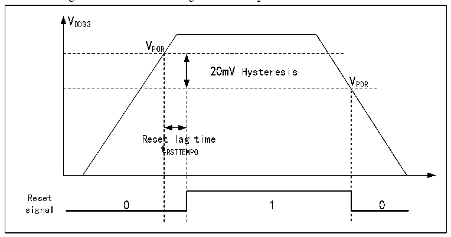

<!-- source-page: 11 -->

[← p.10](0010.md) · [index](../README.md) · [PDF p.11](https://ch32-riscv-ug.github.io/CH32H417/datasheet_en/CH32H417RM.PDF#page=11) · [p.12 →](0012.md)

<!-- header: CH32H417 Reference Manual https://wch-ic.com -->

## 2.2 Power Management

### 2.2.1 Power-on Reset and Power-down Reset

The system integrated a power-on reset POR and a power-down reset PDR circuit. When the chip supply voltage  
VDD33 falls below the corresponding threshold voltage, the system is reset by the relevant circuit, and no additional  
external reset circuit is required. Please refer to the corresponding datasheet for the parameters of the power-on  
threshold voltage VPOR and the power-down threshold voltage VPDR.  

Figure 2-2 Schematic diagram of the operation of POR and PDR  
 <!-- rendered from the PDF; verify at https://ch32-riscv-ug.github.io/CH32H417/datasheet_en/CH32H417RM.PDF#page=11 -->

🖼 Text parsed from the figure above

VDD33  
VPOR  
20mV Hysteresis  Reset  lag t RSTTEM  g time MPO  
VPDR  
tRSTTEMPO  
Reset  
signal  

### 2.2.2 Programmable Voltage Detector

The programmable voltage detector, PVD, is mainly used to monitor the change of the main power supply of the  
system, compared with the threshold voltage set by PLS[2:0] of the power control register PWR_CTLR, and  
together with the setting of the external interrupt register (EXTI), the relevant interrupt can be generated in order  
to notify the system to carry out the pre-dropout operation, such as the data saving, in time.  
The specific configuration is as follows:  
1) Set the PLS[2:0] fields of the PWR_CTLR register to select the voltage threshold to be monitored.  
2) Set the PVD bit of the PWR_CTLR register to enable the PVD function.  
3) Read the PVD0 bit of PWR_CSR status register to obtain the relationship between the current system main  
power supply and the threshold value set by PLS[2:0], and perform the corresponding soft processing. When the  
VDD33 voltage is higher than the PLS[2:0] setting threshold, the PVD0 position is 0; when the VDD33 voltage is  
lower than the PLS[2:0] setting threshold, the PVD0 position is 1.  
<!-- image: p11-draw-image-00001 bbox=[502.44, 786.36, 521.88, 796.68] -->
<!-- footer: V1.7 9 -->
