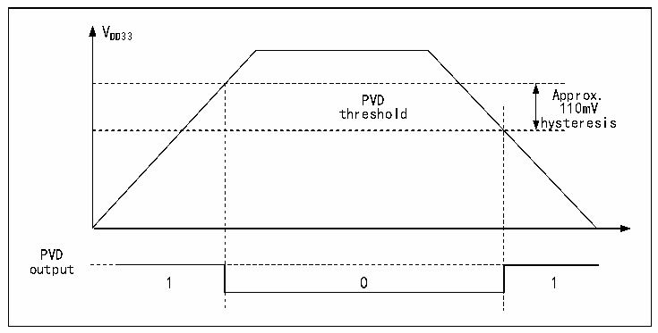

<!-- source-page: 12 -->

[← p.11](0011.md) · [index](../README.md) · [PDF p.12](https://ch32-riscv-ug.github.io/CH32H417/datasheet_en/CH32H417RM.PDF#page=12) · [p.13 →](0013.md)

<!-- header: CH32H417 Reference Manual https://wch-ic.com -->

Figure 2-3 Schematic diagram of PVD operation  
 <!-- rendered from the PDF; verify at https://ch32-riscv-ug.github.io/CH32H417/datasheet_en/CH32H417RM.PDF#page=12 -->

🖼 Text parsed from the figure above

VDD33  
PVD threshold  0  
hysteresis  
PVD  
output  

## 2.3 Low-power Modes

After a system reset, the microcontroller is in a normal operating state (run mode), where system power can be  
saved by reducing the system main frequency or turning off the unused peripheral clock or reducing the operating  
peripheral clock. If the system does not need to work, you can set the system to enter low-power mode and let the  
system jump out of this state by specific events.  
Microcontrollers currently offer 2 low-power modes, divided in terms of operating differences between processors,  
peripherals, voltage regulators, etc.  
● Sleep mode: The core stops running and all peripherals (including core private peripherals) are still running.  
● Stop mode: The stop mode only takes effect when both V3F and V5F enter stop mode. Stops all clocks and  
the system continues to run after waking up.  

<!-- p12-table-002 (table-2-1@1) -->
<table><caption>Table 2-1 Low-power mode list</caption><tr><th>Mode</th><th>Entry</th><th>Wake-up source</th><th>Effect on clock</th><th>Voltage regulator</th></tr><tr><td rowspan="2">SLEEP</td><td>WFI</td><td>Any interrupt</td><td rowspan="2" style="text-align:left">Core clock OFF, no effect on other clocks</td><td rowspan="2">Normal</td></tr><tr><td>WFE</td><td>Wake-up event</td></tr><tr><td>STOP</td><td style="text-align:left">Set SLEEPDEEP to 1 WFI or WFE</td><td style="text-align:left">Any external interrupt/event, external reset signal on NRST pin, IWDG reset</td><td style="text-align:left">Both V3F and V5F enter stop mode: HSE, HSI, PLL, and peripheral clocks are disabled.</td><td style="text-align:left">Normal: LPDS=0 or Low power: LPDS=1</td></tr></table>

### 2.3.1 Low-power Configuration Options

● WFI and WFE  
WFI: The microcontroller is woken up by an interrupt source with interrupt controller response, and the interrupt  
<!-- image: p12-draw-image-00001 bbox=[506.88, 786.36, 526.32, 796.68] -->
<!-- footer: V1.7 10 -->
