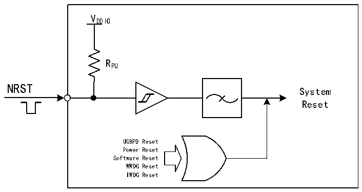

<!-- source-page: 19 -->

[← p.18](0018.md) · [index](../README.md) · [PDF p.19](https://ch32-riscv-ug.github.io/CH32H417/datasheet_en/CH32H417RM.PDF#page=19) · [p.20 →](0020.md)

<!-- header: CH32H417 Reference Manual https://wch-ic.com -->

Figure 3-1 System reset structure  
 <!-- rendered from the PDF; verify at https://ch32-riscv-ug.github.io/CH32H417/datasheet_en/CH32H417RM.PDF#page=19 -->

🖼 Text parsed from the figure above

VDDIO  
RPU  
NRST  
System  
Reset  
USBPD Reset  
Power Reset  
Software Reset  
WWDG Reset  
IWDG Reset  

### 3.2.3 Backup Domain Reset

When a backup domain reset occurs, only the backup domain registers are reset, including the backup registers,  
the RCC_BDCTLR registers (RTC enable and LSE oscillator). The conditions for its generation include:  
● Caused by VDD33 or VBAT power-up with both VDD33 and VBAT powered down  
● Set BDRST to 1 of the RCC_BDCTLR register  
<!-- image: p19-draw-image-00001 bbox=[506.88, 786.36, 526.32, 796.68] -->
<!-- footer: V1.7 17 -->
