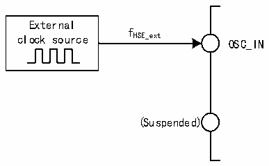
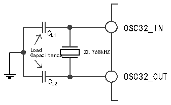

<!-- source-page: 23 -->

[← p.22](0022.md) · [index](../README.md) · [PDF p.23](https://ch32-riscv-ug.github.io/CH32H417/datasheet_en/CH32H417RM.PDF#page=23) · [p.24 →](0024.md)

<!-- header: CH32H417 Reference Manual https://wch-ic.com -->

Figure 3-5 High-speed clock source circuit  
 <!-- rendered from the PDF; verify at https://ch32-riscv-ug.github.io/CH32H417/datasheet_en/CH32H417RM.PDF#page=23 -->

🖼 Text parsed from the figure above

External  
f  
clock source HSE_ext  
OSC_IN  
(Suspended)  

### 3.3.3 Low-speed Clock (LSI/LSE)

LSI is a low-speed clock signal generated by a RC oscillator in the system. It can be kept running in stop mode,  
providing clock references for RTC clocks, independent watchdogs, and wake-up units. For further information,  
please refer to the electrical characteristics section of the data manual. LSI can be turned on and off by setting the  
LSION bit in the RCC_RSTSCKR register, and then check whether the LSIRC oscillation is stable by querying  
the LSIRDY bit, and the hardware sends the clock in after LSIRDY position 1. If the LSIRDYIE bit of the  
RCC_INTR register is set, the corresponding interrupt will be generated.  
LSE is an external low-speed clock signal, including external crystal/ceramic resonator generation or external  
low-speed clock input. It provides a low-power and accurate clock source for RTC clocks or other timing  
functions.  
● External crystal/ceramic resonator (LSE crystal): External low-speed oscillator with external 32.768kHz.  
LSE is turned on and off by setting the LSEON bit in the RCC_BDCTLR register, and the LSERDY bit  
indicates whether the LSE crystal oscillation is stable or not, and the hardware sends the clock into the  
system after LSERDY position 1. If the LSERDYIE bit of the RCC_INTR register is set, the corresponding  
interrupt will be generated.  

Figure 3-6 Low-speed external crystal circuit  
 <!-- rendered from the PDF; verify at https://ch32-riscv-ug.github.io/CH32H417/datasheet_en/CH32H417RM.PDF#page=23 -->

🖼 Text parsed from the figure above

OSC32_IN  
C  
L1  
L C o a a p d a citance 32.768kHZ  
OSC32_OUT  
C  
L2  

● External low-speed clock source (LSE bypass): this mode feeds the clock source directly from the outside to  
the OSC32_IN pin, and the OSC32_OUT pin is suspended. The application needs to set the LSEBYP bit  
when the LSEON bit is 0, turn on the LSE bypass function, and then set the LSEON bit.  
<!-- image: p23-draw-image-00001 bbox=[506.88, 786.36, 526.32, 796.68] -->
<!-- footer: V1.7 21 -->
