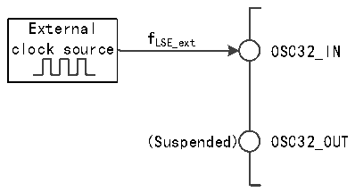

<!-- source-page: 24 -->

[← p.23](0023.md) · [index](../README.md) · [PDF p.24](https://ch32-riscv-ug.github.io/CH32H417/datasheet_en/CH32H417RM.PDF#page=24) · [p.25 →](0025.md)

<!-- header: CH32H417 Reference Manual https://wch-ic.com -->

Figure 3-7 Low-speed clock source circuit  
 <!-- rendered from the PDF; verify at https://ch32-riscv-ug.github.io/CH32H417/datasheet_en/CH32H417RM.PDF#page=24 -->

🖼 Text parsed from the figure above

External  
f  
clock source LSE_ext OSC32_IN  
(Suspended) OSC32_OUT  

### 3.3.4 PLL Clock

By configuring the RCC_CFGR0 register and RCC_PLLCFGR register, the internal PLL clock can select six  
clock sources and multiplication factors. These settings must be completed before each PLL is turned on. Once the  
PLL is turned on, these parameters cannot be changed.  
Set the PLLON bit in RCC_CTLR register to be turned on and off, and the PLLRDY bit indicates whether the  
PLL clock is stable, and the hardware sends the clock to the system after the PLLRDY bit is set.  
Set the USBHS_PLLON bit in the RCC_CTLR register to be turned on and off. The USBHS_PLLRDY bit  
indicates whether the USBHS_PLLRDY clock is stable, and the hardware sends the clock to the system after the  
USBHS_PLLRDY bit is set.  
Set the USBSS_PLLON bit in RCC_CTLR register to be turned on and off, and the USBSS_PLLRDY bit  
indicates whether the USBSS_PLLRDY clock is stable, and the hardware sends the clock to the system after the  
USBSS_PLLRDY bit is set.  
Set the ETH_PLLON bit in RCC_CTLR register to be turned on and off, and the ETH_PLLRDY bit indicates  
whether the ETH_PLLRDY clock is stable, and the hardware sends the clock to the system after the  
ETH_PLLRDY bit is set.  
Set the SERDES_PLLON bit in RCC_CTLR register to be turned on and off. The SERDES_PLLRDY bit  
indicates whether the SERDES_PLLRDY clock is stable, and the hardware sends the clock to the system after the  
SERDES_PLLRDY bit is set.  
If the PLLRDYIE bit, ETHPLLRDYIE bit or SERDESPLLRDYIE bit of RCC_INTR register is set, a  
corresponding interrupt will be generated.  
PLL clock source:  
● HSI clock input  
● HSE clock input  
● USBHS_PLL (480MHz) clock input  
● ETH_PLL (500MHz) clock input  
● USBSS_PLL (125MHz) clock input  
● SERDES_PLL clock output through 2 frequency division  

### 3.3.5 Bus/Peripheral Clock

#### 3.3.5.1 System Clock (SYSCLK)

By configuring the RCC_CFGR0 register SW[1:0] bit to configure the system clock source, SWS[1:0] indicates  
the current system clock source.  
<!-- image: p24-draw-image-00001 bbox=[506.88, 786.36, 526.32, 796.68] -->
<!-- footer: V1.7 22 -->
