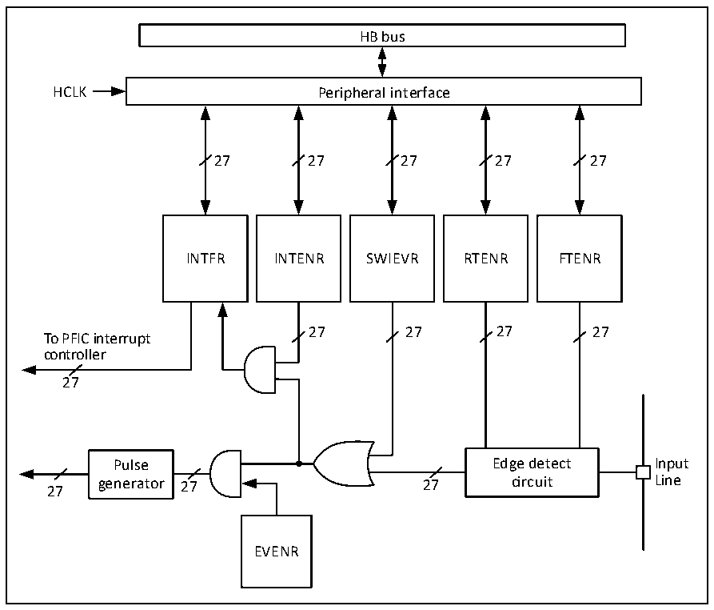

<!-- source-page: 100 -->

[← p.99](0099.md) · [index](../README.md) · [PDF p.100](https://ch32-riscv-ug.github.io/CH32H417/datasheet_en/CH32H417RM.PDF#page=100) · [p.101 →](0101.md)

<!-- header: CH32H417 Reference Manual https://wch-ic.com -->

> ⬆ **Table continued** — rendered in full at [page 96](0096.md). <!-- p100-table-001 -->

### 4.7.3 External Interrupt and Event Controller (EXTI)

#### 4.7.3.1 Overview

Figure 4-1 External interrupt (EXTI) interface block diagram  
 <!-- rendered from the PDF; verify at https://ch32-riscv-ug.github.io/CH32H417/datasheet_en/CH32H417RM.PDF#page=100 -->

🖼 Text parsed from the figure above

HB bus  
HCLK Peripheral interface  
27 27 27 27 27  
INTFR INTENR SWIEVR RTENR FTENR  
27 27 27 27  
To PFIC interrupt  
controller  
27  
Pulse Edge detect Input  
27 generator 27 27 circuit Line  
EVENR  

As can be seen from figure 4-1, the trigger source of the external interrupt can be either a software interrupt  
(SWIEVR) or an actual external interrupt channel, and the signal of the external interrupt channel is first screened  
by the edge detection circuit. As long as one of the software interrupts or external interrupt signals is generated, it  
will be output to both event enabling and interrupt enabling circuits through the OR gate circuit in the diagram. As  
long as an interrupt is enabled or an event is enabled, an interrupt or event will occur. The six registers of EXTI  
are accessed by the processor through the HB interface.  

#### 4.7.3.2 Wakeup Event

The system can wake up sleep patterns caused by WFE instructions through wake-up events. Wake-up events are  
generated through the following 3 configurations:  
● Enable an interrupt in the register of the peripheral, but not in the PFIC of the core, as well as the  
SEVONPEND bit in the core. Reflected in EXTI, it enables EXTI interrupts, but does not enable EXTI  
interrupts in PFIC, while enabling SEVONPEND bits. After the CPU wakes up from WFE, it must clear the  
<!-- image: p100-draw-image-00001 bbox=[506.88, 786.36, 526.32, 796.68] -->
<!-- footer: V1.7 98 -->
