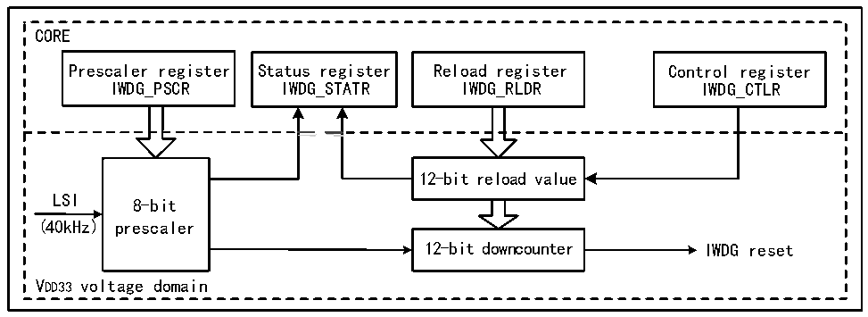

<!-- source-page: 143 -->

[← p.142](0142.md) · [index](../README.md) · [PDF p.143](https://ch32-riscv-ug.github.io/CH32H417/datasheet_en/CH32H417RM.PDF#page=143) · [p.144 →](0144.md)

<!-- header: CH32H417 Reference Manual https://wch-ic.com -->

# Chapter 7 Independent Watchdog (IWDG)

The system is equipped with an independent watchdog (IWDG) to detect software failures caused by logic errors  
and external environment interference. The IWDG clock source comes from LSI and can be run independently of  
the main program, so it is suitable for situations with low precision requirements.  

## 7.1 Main Features

● 12-bit self-subtractive counter.  
● Clock source LSI frequency division, can run in low-power mode.  
● Reset condition: counter value reduced to 0  

## 7.2 Functional Description

### 7.2.1 Principle and Application

The independent watchdog is clocked from the LSI clock and functions in shutdown and standby modes. When  
the watchdog counter decrements itself to 0, a system reset will be generated, so the timeout is (reload value + 1)  
clock.  

Figure 7-1 Structure block diagram of Independent Watchdog  
 <!-- rendered from the PDF; verify at https://ch32-riscv-ug.github.io/CH32H417/datasheet_en/CH32H417RM.PDF#page=143 -->

🖼 Text parsed from the figure above

CORE  
Prescaler register Status register Reload register Control register  
IWDG_PSCR IWDG_STATR IWDG_RLDR IWDG_CTLR  
<!-- image: p143-draw-image-00002 inside the figure -->
12-bit reload value  
LSI 8-bit  
(40kHz) prescaler  
12-bit downcounter IWDG reset  
VDD33 voltage domain  

● Enable independent watchdog  
After the system reset, the watchdog is OFF. Write 0xCCCC to the IWDG_CTLR register to enable the watchdog,  
and then it can no longer be disabled unless a reset occurs.  
If the hardware independent watchdog enable bit (IWDG_SW) is enabled in User Option Bytes, the IWDG is  
permanently enabled after the microcontroller reset.  
● Watchdog configuration  
Inside the watchdog is a 12-bit counter running progressively. When the value of the counter is reduced to 0, a  
system reset will occur. To enable the IWDG function, you need to perform the following actions:  
<!-- image: p143-draw-image-00001 bbox=[511.44, 786.36, 530.88, 796.68] -->
<!-- footer: V1.7 141 -->
