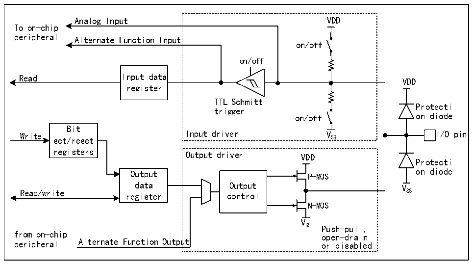

<!-- source-page: 152 -->

[← p.151](0151.md) · [index](../README.md) · [PDF p.152](https://ch32-riscv-ug.github.io/CH32H417/datasheet_en/CH32H417RM.PDF#page=152) · [p.153 →](0153.md)

<!-- header: CH32H417 Reference Manual https://wch-ic.com -->

## 9.2 Function Description

### 9.2.1 Overview

Figure 9-1 Basic structure of GPIO module  
 <!-- rendered from the PDF; verify at https://ch32-riscv-ug.github.io/CH32H417/datasheet_en/CH32H417RM.PDF#page=152 -->

🖼 Text parsed from the figure above

Analog Input VDD  
To on-chip  
peripheral Alternate Function Input  
on/off  
on/off  
Read Input data  
VDD  
register  
TTL Schmitt  
Protecti  
trigger  
on/off on diode  
Bit  
Write set/reset Input driver V SS I/O pin  
registers  
Output driver VDD  
Protecti  
Output P-MOS on diode  
data Output V  
Read/write register control SS  
N-MOS  
V  
SS Push-pull,  
from on-chip open-drain  
peripheral Alternate Function Output or disabled  

<em>Note: VDD is the supply voltage. The voltage type depends on the specific pin; refer to Chapter 9 for details.</em>  
As shown in figure 9-1, the IO port structure, each pin has 2 protection diodes inside the chip, and the IO port can  
be divided into input and output drive modules. The input driver has a weak pull-up resistor, which can be  
connected to AD and other analog input peripherals; if you input to a digital peripheral, you need to go through a  
TTL Schmitt trigger, and then connect to the GPIO input register or other multiplexed peripherals. The output  
driver has a pair of MOS tubes, and the IO port can be configured to open leakage or push-pull output by  
configuring whether the upper and lower MOS tubes are enabled or not; the output driver can also be configured  
to be controlled by GPIO or by other peripherals that are reused.  

### 9.2.2 GPIO Initialization

Just after the reset, the GPIO port is running in the initial state, at this time, most IO ports are running in the  
floating input state, but there are also HSE and other peripheral-related pins that run on the peripheral reuse  
function. For specific initialization functions, please refer to the relevant sections of the pin description.  

### 9.2.3 External Interrupt

All GPIO ports can be configured as external interrupt input channels, but each external interrupt input channel  
can only be mapped to one GPIO pin. Furthermore, the external interrupt channel number must correspond to the  
bit number of the GPIO port. For example, PA1 (or PB1, PC1, PD1, PE1, etc.) can only be mapped to EXTI1, and  
EXTI1 can only accept the mapping of either PA1, PB1, PC1, PD1, or PE1. Both sides maintain a one-to-one  
relationship.  
<!-- image: p152-draw-image-00001 bbox=[511.44, 786.36, 530.88, 796.68] -->
<!-- footer: V1.7 150 -->
