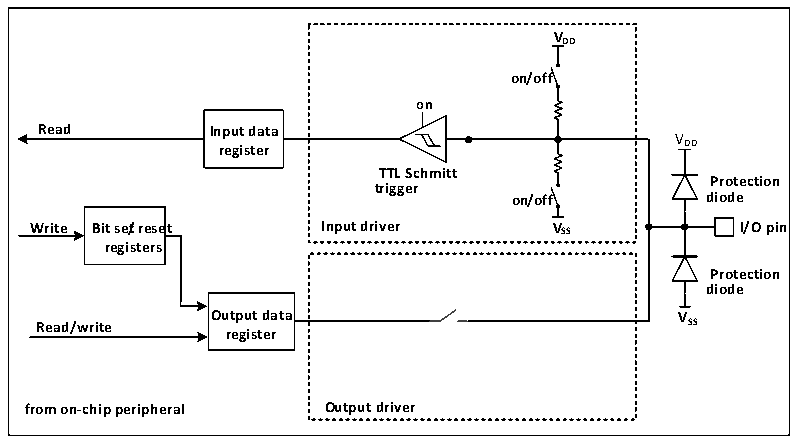

<!-- source-page: 153 -->

[← p.152](0152.md) · [index](../README.md) · [PDF p.153](https://ch32-riscv-ug.github.io/CH32H417/datasheet_en/CH32H417RM.PDF#page=153) · [p.154 →](0154.md)

<!-- header: CH32H417 Reference Manual https://wch-ic.com -->

### 9.2.4 multiplexing function multiplexer and mapping

<strong>Alternate functional</strong>  
The I/O pins are connected to the onboard peripherals/modules via a multiplexer that allows only one peripheral&#x27;s  
multiplexing function (AF) to be connected to the I/O pins at a time. This ensures that there is no conflict between  
peripherals sharing the same I/O pin.  
Each I/O pin has a multiplexer with up to 16 multiplexed functional inputs (AF0 to AF15) that can be configured  
via the GPIOx_AFLR and GPIOx_AFHR registers:  
After reset, the multiplexer is selected as multiplexing function 0(AF0). I/O is configured by  
GPIOx_CFGLR/GPIOx_CFGHR register in multiplexing mode.  
The specific multiplexing function assignment of each pin is detailed in the CH32H417DS0 manual.  
<strong>Multiplex function configuration</strong>  
● To use the multiplexing function of the input direction, the port must be configured to multiplex the input  
mode, and the up-and-down settings can be set according to actual needs.  
● To use the multiplexing function in the output direction, the port must be configured to multiplex the output  
mode, and the push-pull or open-drain can be set according to the actual situation.  
● For the bidirectional multiplexing function, the port must be configured to multiplex the output mode, and  
then the driver is configured to float the input mode.  
There may be multiple peripherals multiplexed to this pin in the same IO port, so in order to maximize the space  
for each peripheral, in addition to the default multiplexed pin, the multiplexed pin of the peripheral can be  
remapped to other pins to avoid the occupied pin.  

### 9.2.5 Locking Mechanism

The locking mechanism can lock the configuration of the IO port. After a specific write sequence, the selected IO  
pin configuration is locked and cannot be changed until the next reset.  

### 9.2.6 Input Configuration

Figure 9-2 Input configuration structure block diagram of GPIO module  
 <!-- rendered from the PDF; verify at https://ch32-riscv-ug.github.io/CH32H417/datasheet_en/CH32H417RM.PDF#page=153 -->

🖼 Text parsed from the figure above

<strong>VDD</strong>  
<strong>on/off</strong>  
<strong>on</strong>  
<strong>Read Input data</strong>  
VDD  
<strong>register</strong>  
<strong>TTL Schmitt</strong>  
<strong>Protection</strong>  
<strong>trigger</strong>  
<strong>on/off diode</strong>  
<strong>Write Bit se/treset Input driver VSS I/O pin</strong>  
<strong>registers</strong>  
<strong>Protection</strong>  
<strong>diode</strong>  
<strong>Output data VSS</strong>  
<strong>Read/write</strong>  
<strong>register</strong>  
<strong>from on-chip peripheral Output driver</strong>  

<em>Note: VDD is the supply voltage, and the voltage type depends on the specific pin. Please refer to Chapter 9 for</em>  
<!-- image: p153-draw-image-00001 bbox=[511.44, 786.36, 530.88, 796.68] -->
<!-- footer: V1.7 151 -->
