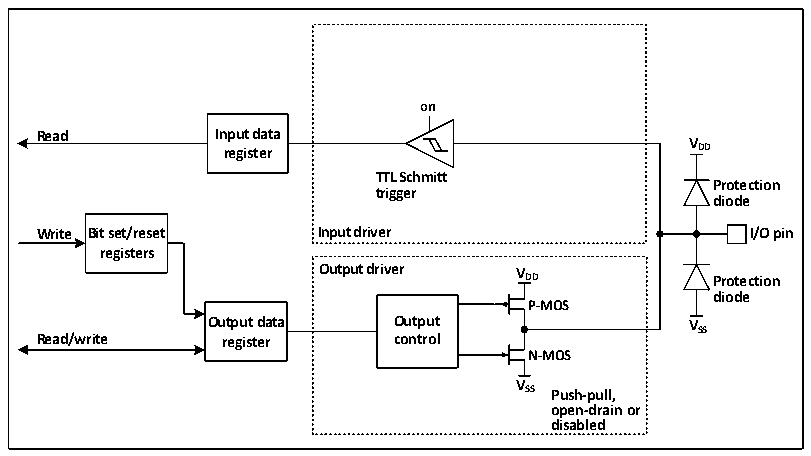

<!-- source-page: 154 -->

[← p.153](0153.md) · [index](../README.md) · [PDF p.154](https://ch32-riscv-ug.github.io/CH32H417/datasheet_en/CH32H417RM.PDF#page=154) · [p.155 →](0155.md)

<!-- header: CH32H417 Reference Manual https://wch-ic.com -->
<em>details.</em>  
When the IO port is configured in input mode, the output driver is disconnected, the input up and down is optional,  
and the alternate function and analog input are not connected. The data on each IO port is sampled to the input  
data register at each PB2 clock, and the level state of the corresponding pin is obtained by reading the  
corresponding bit of the input data register.  

### 9.2.7 Output Configuration

Figure 9-3 Output configuration structure block diagram of GPIO module  
 <!-- rendered from the PDF; verify at https://ch32-riscv-ug.github.io/CH32H417/datasheet_en/CH32H417RM.PDF#page=154 -->

🖼 Text parsed from the figure above

<strong>on</strong>  
<strong>Read Input data</strong>  
<strong>V</strong>  
<strong>register DD</strong>  
<strong>TTL Schmitt</strong>  
<strong>Protection</strong>  
<strong>trigger</strong>  
<strong>diode</strong>  
<strong>Write Bit set/reset Input driver I/O pin</strong>  
<strong>registers</strong>  
<strong>Output driver V</strong>  
<strong>DD Protection</strong>  
<strong>diode</strong>  
<strong>P-MOS</strong>  
<strong>Output data Output VSS</strong>  
<strong>Read/write register control</strong>  
<strong>N-MOS</strong>  
<strong>V</strong>  
<strong>SS Push-pull,</strong>  
<strong>open-drain or</strong>  
<strong>disabled</strong>  

<em>Note: VDD is the supply voltage, and the voltage type depends on the specific pin. Please refer to Chapter 9 for</em>  
<em>details.</em>  
When the IO port is configured in output mode, a pair of MOS in the output driver can be configured in push-pull  
or open-drain mode as needed, without using the alternate function. The input-driven pull-up resistor is disabled,  
the TTL Schmitt trigger is activated, and the level that appears on the IO pin will be sampled to the input data  
register at each HB clock, so reading the input data register will get the IO state, and in push-pull output mode,  
access to the output data register will get the last written value.  
<!-- image: p154-draw-image-00001 bbox=[511.44, 786.36, 530.88, 796.68] -->
<!-- footer: V1.7 152 -->
