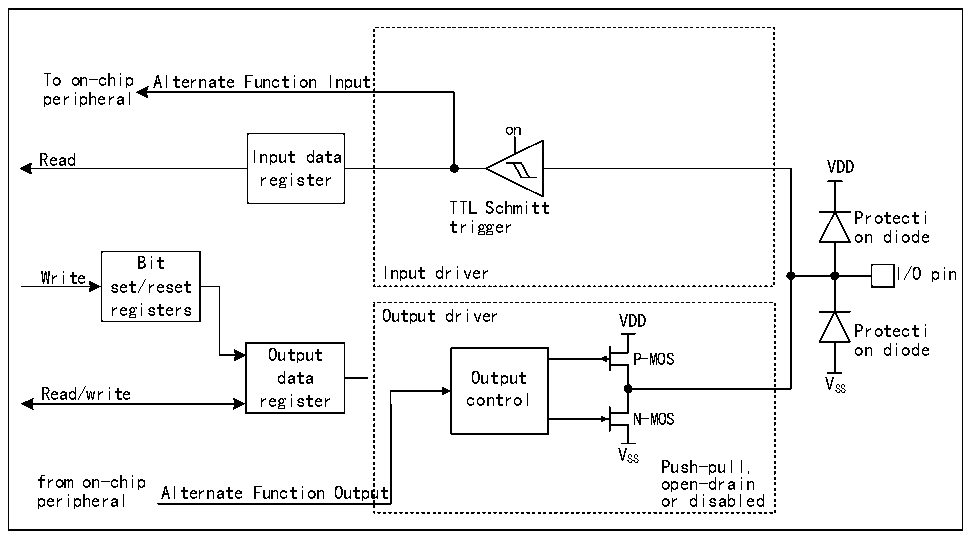

<!-- source-page: 155 -->

[← p.154](0154.md) · [index](../README.md) · [PDF p.155](https://ch32-riscv-ug.github.io/CH32H417/datasheet_en/CH32H417RM.PDF#page=155) · [p.156 →](0156.md)

<!-- header: CH32H417 Reference Manual https://wch-ic.com -->

### 9.2.8 Alternate Function Configuration

Figure 9-4 Structure block diagram when GPIO module is multiplexed by other peripherals  
 <!-- rendered from the PDF; verify at https://ch32-riscv-ug.github.io/CH32H417/datasheet_en/CH32H417RM.PDF#page=155 -->

🖼 Text parsed from the figure above

To on-chip Alternate Function Input  
peripheral  
on  
Read Input data  
VDD  
register  
TTL Schmitt  
Protecti  
trigger  
on diode  
Bit  
Write Input driver I/O pin  
set/reset  
registers  
Output driver VDD  
Protecti  
Output P-MOS on diode  
data Output V  
Read/write register control SS  
N-MOS  
V  
SS Push-pull,  
from on-chip open-drain  
Alternate Function Output  
peripheral or disabled  

<em>Note: VDD is the supply voltage, and the voltage type depends on the specific pin. Please refer to Chapter 9 for</em>  
<em>details.</em>  
When the alternate function is enabled, the output driver is enabled and can be configured in open-drain or  
push-pull mode as needed, the Schmitt trigger is also turned on, the input and output lines of the alternate function  
are connected, but the output data register is disconnected, and the level that appears on the IO pin will be  
sampled to the input data register at each HB clock. In open-drain mode, reading the input data register will get  
the current state of the IO port. In push-pull mode, reading the output data register will get the last written value.  
<!-- image: p155-draw-image-00001 bbox=[511.44, 786.36, 530.88, 796.68] -->
<!-- footer: V1.7 153 -->
