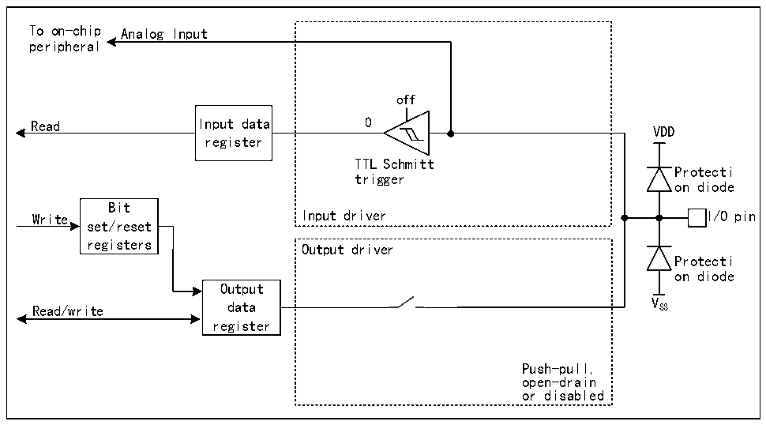

<!-- source-page: 156 -->

[← p.155](0155.md) · [index](../README.md) · [PDF p.156](https://ch32-riscv-ug.github.io/CH32H417/datasheet_en/CH32H417RM.PDF#page=156) · [p.157 →](0157.md)

<!-- header: CH32H417 Reference Manual https://wch-ic.com -->

### 9.2.9 Analog Input Configuration

Figure 9-5 Configuration structure block diagram of GPIO module as analog input  
 <!-- rendered from the PDF; verify at https://ch32-riscv-ug.github.io/CH32H417/datasheet_en/CH32H417RM.PDF#page=156 -->

🖼 Text parsed from the figure above

To on-chip Analog Input  
peripheral  
off  
Read Input data 0  
VDD  
register  
TTL Schmitt  
Protecti  
trigger  
on diode  
Bit  
Write Input driver I/O pin  
set/reset  
registers  
Output driver  
Protecti  
on diode  
Output  
Read/write data V SS  
register  
Push-pull,  
open-drain  
or disabled  

<em>Note: VDD is the supply voltage, and the voltage type depends on the specific pin. Please refer to Chapter 9 for</em>  
<em>details.</em>  
When the analog input is enabled, the output buffer is disconnected, the input of the Schmitt trigger in the input  
driver is disabled to prevent consumption on the IO port, the pull-up resistor is prohibited, and the read input data  
register will always be 0.  

### 9.2.10 Peripheral GPIO Setting

The following table recommends the corresponding GPIO port configuration of each peripheral pin.  

<!-- p156-table-001 (table-9-1@1) -->
<table><caption>Table 9-1 Advanced-control timer (TIM1/8)</caption><tr><th>TIM1</th><th>Configuration</th><th>GPIO configuration</th></tr><tr><td rowspan="2">TIMx_CHx</td><td>Input capture channel x</td><td>Floating input</td></tr><tr><td>Output compare channel x</td><td>Push-pull alternate output</td></tr><tr><td>TIMx_CHxN</td><td>Complementary output channel x</td><td>Push-pull alternate output</td></tr><tr><td>TIMx_BKIN</td><td>Break input</td><td>Floating input</td></tr><tr><td>TIMx_BKIN2</td><td>Break input</td><td>Floating input</td></tr><tr><td>TIMx_ETR</td><td>External trigger clock input</td><td>Floating input</td></tr></table>

<!-- p156-table-002 (table-9-2@1) -->
<table><caption>Table 9-2 General-purpose timer (TIM2/3/4/5/9/10/11/12)</caption><tr><th>TIMx pin</th><th>Configuration</th><th>GPIO configuration</th></tr><tr><td rowspan="2">TIMx_CHx</td><td>Input capture channel x</td><td>Floating input</td></tr><tr><td>Output compare channel x</td><td>Push-pull alternate output</td></tr><tr><td>TIMx_ETR</td><td>External trigger clock input</td><td>Floating input</td></tr></table>

<!-- image: p156-draw-image-00001 bbox=[511.44, 786.36, 530.88, 796.68] -->
<!-- footer: V1.7 154 -->
