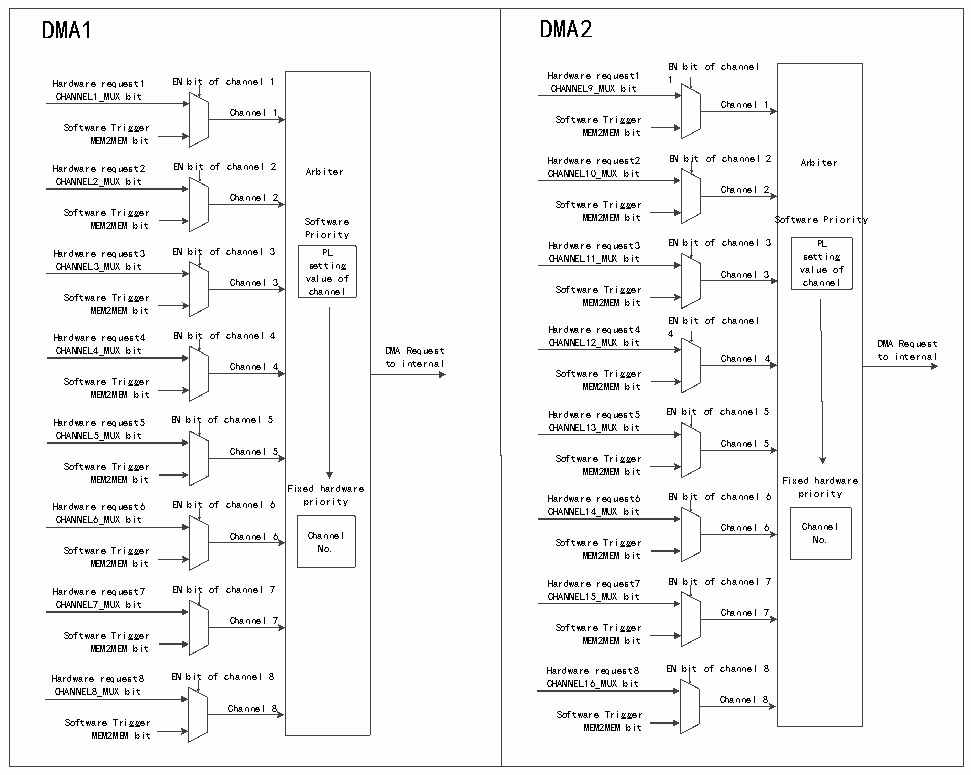

<!-- source-page: 178 -->

[← p.177](0177.md) · [index](../README.md) · [PDF p.178](https://ch32-riscv-ug.github.io/CH32H417/datasheet_en/CH32H417RM.PDF#page=178) · [p.179 →](0179.md)

<!-- header: CH32H417 Reference Manual https://wch-ic.com -->

Figure 10-1 Schematic diagram of DMA channel operation  
 <!-- rendered from the PDF; verify at https://ch32-riscv-ug.github.io/CH32H417/datasheet_en/CH32H417RM.PDF#page=178 -->

🖼 Text parsed from the figure above

DMA1 Hardware request1 EN bit of channel 1 CHANNEL1_MUX bit Channel 1 Software Trigger MEM2MEM bit Hardware request2 EN bit of channel 2 Arbiter CHANNEL2_MUX bit Channel 2 Software Trigger MEM2MEM bit Software Priority Hardware request3 EN bit of channel 3 PL CHANNEL3_MUX bit setting Channel 3 value of Software Trigger channel MEM2MEM bit Hardware request4 EN bit of channel 4 CHANNEL4_MUX bit DMA Request Channel 4 to internal Software Trigger MEM2MEM bit Hardware request5 EN bit of channel 5 CHANNEL5_MUX bit Channel 5 Software Trigger MEM2MEM bit Fixed hardware Hardware request6 EN bit of channel 6 priority CHANNEL6_MUX bit Channel 6 Channel Software Trigger No. MEM2MEM bit Hardware request7 EN bit of channel 7 CHANNEL7_MUX bit Channel 7 Software Trigger MEM2MEM bit Hardware request8 EN bit of channel 8 CHANNEL8_MUX bit Channel 8 Software Trigger MEM2MEM bit  DMA2 EN bit of channel Hardware request1 1 CHANNEL9_MUX bit Channel 1 Software Trigger MEM2MEM bit Hardware request2 EN bit of channel 2 Arbiter CHANNEL10_MUX bit Channel 2 Software Trigger MEM2MEM bit Software Priority Hardware request3 EN bit of channel 3 PL CHANNEL11_MUX bit setting Channel 3 value of Software Trigger channel MEM2MEM bit EN bit of channel Hardware request4 4 CHANNEL12_MUX bit DMA Request Channel 4 to internal Software Trigger MEM2MEM bit Hardware request5 EN bit of channel 5 CHANNEL13_MUX bit Channel 5 Software Trigger MEM2MEM bit Fixed hardware Hardware request6 EN bit of channel 6 priority CHANNEL14_MUX bit Channel 6 Channel Software Trigger No. MEM2MEM bit Hardware request7 EN bit of channel 7 CHANNEL15_MUX bit Channel 7 Software Trigger MEM2MEM bit Hardware request8 EN bit of channel 8 CHANNEL16_MUX bit Channel 8 Software Trigger MEM2MEM bit  
<!-- image: p178-draw-image-00018 inside the figure -->
<!-- image: p178-draw-image-00009 inside the figure -->
<!-- image: p178-draw-image-00011 inside the figure -->
<!-- image: p178-draw-image-00002 inside the figure -->
<!-- image: p178-draw-image-00012 inside the figure -->
<!-- image: p178-draw-image-00003 inside the figure -->
<!-- image: p178-draw-image-00013 inside the figure -->
<!-- image: p178-draw-image-00004 inside the figure -->
<!-- image: p178-draw-image-00014 inside the figure -->
<!-- image: p178-draw-image-00005 inside the figure -->
<!-- image: p178-draw-image-00015 inside the figure -->
<!-- image: p178-draw-image-00006 inside the figure -->
<!-- image: p178-draw-image-00016 inside the figure -->
<!-- image: p178-draw-image-00007 inside the figure -->
<!-- image: p178-draw-image-00017 inside the figure -->
<!-- image: p178-draw-image-00008 inside the figure -->
<!-- image: p178-draw-image-00019 inside the figure -->
<!-- image: p178-draw-image-00010 inside the figure -->

### 10.2.1 DMA Channel Processing

1) Arbitration priority  
DMA requests generated by multiple independent channels are logically or structurally input to the DMA  
controller, and currently only one channel request is answered. The arbitrator within the module selects the access  
of the peripheral / memory to be initiated according to the priority of the channel request.  
In software management, applications can independently configure priority levels for each channel, including the  
highest, high, medium and low levels, by setting the PL [1:0] bit of the DMA_CFGRx register. When the software  
settings between the channels are the same, the modules will be selected according to the fixed hardware priority,  
and the lower channel number will have higher priority than the higher one.  
2) DMA configuration  
When the DMA controller receives a request signal, it accesses the requesting peripheral or memory to establish  
the peripheral or data transfer between the memory and the memory. It mainly includes the following 3 steps:  
1) Data is taken from the memory address indicated by the peripheral data register or the current peripheral /  
memory address register, and the starting address of the first transmission is the peripheral base address or  
memory address specified by the DMA_PADDRx or DMA_MADDRx register.  
2) Data is stored in the peripheral data register or the memory address indicated by the current peripheral /  
<!-- image: p178-draw-image-00001 bbox=[511.44, 786.36, 530.88, 796.68] -->
<!-- footer: V1.7 176 -->
