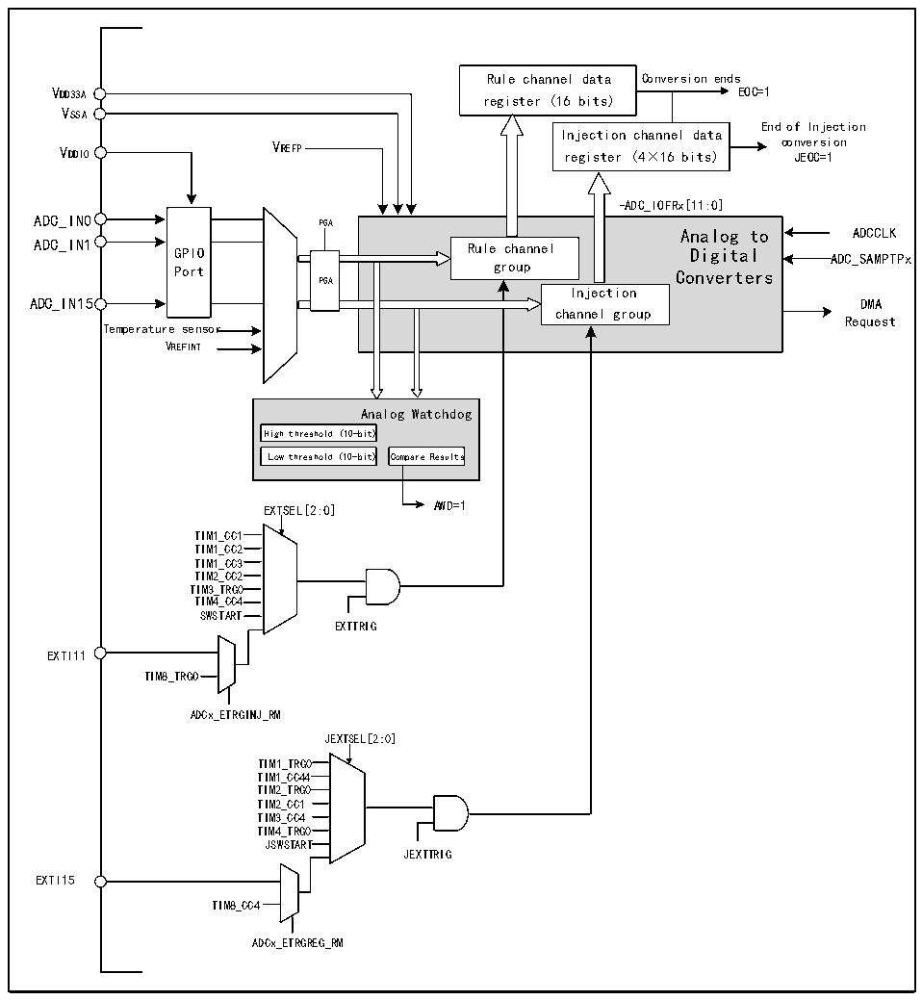

<!-- source-page: 195 -->

[← p.194](0194.md) · [index](../README.md) · [PDF p.195](https://ch32-riscv-ug.github.io/CH32H417/datasheet_en/CH32H417RM.PDF#page=195) · [p.196 →](0196.md)

<!-- header: CH32H417 Reference Manual https://wch-ic.com -->

## 11.2 Functional Description

### 11.2.1 Module Structure

Figure 11-1 ADC module block diagram  
 <!-- rendered from the PDF; verify at https://ch32-riscv-ug.github.io/CH32H417/datasheet_en/CH32H417RM.PDF#page=195 -->

🖼 Text parsed from the figure above

Rule channel data Conversion ends  
VDD33A  
EOC=1  
register (16 bits)  
VSSA  
End of Injection  
Injection channel data  
VDDIO VREFP register (4×16 bits) co J n E ve OC r = si 1 on  
-ADC_IOFRx[11:0]  
GPIOPort  
-ADC_IOFRx[11:0] Analog to Rule channel Digital group Converters Injection channel group  PGA  
Analog to ADCCLK  
ADC_IN15 DMA  
Request  
Temperature sensor  
VREFINT  
Analog Watchdog  
High threshold (10-bit)  Low threshold (10-bit)  
EXTSEL[2:0] AWD=1  
TIM11_CC11  
TIM1_CC2  
TIM1_CC3  
TIM2_CC2  
TIM3_TRG0  
TIM4_CC4  
SWSTART  
EXTTRIG  
EXTI11  
TIM8_TRGO  
ADCx_ETRGINJ_RM  
JEXTSEL[2:0]  
TIM1_TRG0  
TIM1_CC44  
TIM2_TRG0  
TIM2_CC1  
TIM3_CC4  
TIM4_TRG0  
JSWSTART  
JEXTTRIG  
EXTI15  
TIM8_CC4  
ADCx_ETRGREG_RM  

### 11.2.2 ADC Configuration

1) Module power on  
An ADON bit of 1 in the ADCx_CTLR2 register indicates that the ADC module is powered on. When the ADC  
module enters the power-on state (ADON=1) from the power-off mode (ADON=0), it needs to be delayed for a  
period of time for t to stabilize the module. After that, the ADON bit is written again as 1, which is used as the  
STAB  
startup signal for the software to start the ADC conversion. By clearing the ADON bit to 0, you can terminate the  
current conversion and put the ADC module in power-off mode, where ADC consumes almost no power.  
<!-- image: p195-draw-image-00001 bbox=[511.44, 786.36, 530.88, 796.68] -->
<!-- footer: V1.7 193 -->
