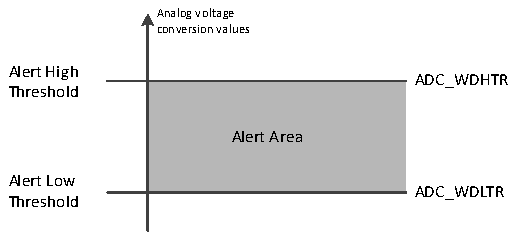

<!-- source-page: 201 -->

[← p.200](0200.md) · [index](../README.md) · [PDF p.201](https://ch32-riscv-ug.github.io/CH32H417/datasheet_en/CH32H417RM.PDF#page=201) · [p.202 →](0202.md)

<!-- header: CH32H417 Reference Manual https://wch-ic.com -->
JDISCEN=1, JL[1:0] = 3, Channel to be changed = 1, 3, 2.  
The first external trigger: the conversion sequence is: 1.  
The second external trigger: conversion sequence is: 3.  
The third external trigger: the conversion sequence is: 2, and both EOC and JEOC events are generated.  
The 4th external trigger: conversion sequence is: 1.  
<em>Note:</em>  
<em>1. When a rule group or injection group is converted in discontinuous mode, the conversion sequence does not</em>  
<em>automatically start from scratch at the end of the conversion sequence. When all subgroups are converted, the</em>  
<em>next trigger event initiates the conversion of the first subgroup.</em>  
<em>2. You cannot use both automatic injection (JAUTO=1) and discontinuous mode.</em>  
<em>3. Discontinuous mode cannot be set for both rule groups and injection groups, and can only be used for one set</em>  
<em>of transformations.</em>  
<em>4. In the intermittent mode of the injection group, the number of injection channels to be switched after an</em>  
<em>external trigger is 1.</em>  
<strong>4) Continuous conversion</strong>  
In continuous conversion mode, another conversion is started as soon as the current ADC conversion is completed,  
and the conversion does not stop on the last channel of the selection group, but continues again from the first  
channel of the selection group. Boot events in this mode include external trigger events and ADON position 1.  
After setting boot, CONT position 1 needs to be set.  
If a regular channel is converted, the converted data is stored in the ADCx_RDATAR register, the end of the  
conversion indicates that the EOC is set, and if EOCIE is set, an interrupt is generated.  
If an injection channel is converted, the converted data is stored in the ADCx_IDATARx register, the end of  
injection conversion flag JEOC is set, and an interrupt is generated if JEOCIE is set.  

### 11.2.5 Analog Watchdog

If the analog voltage being converted by the ADC is below the low threshold or above the high threshold, the  
AWD analog watchdog status bit is set. The threshold setting is located in the lowest 12 valid bits of the  
ADCx_WDHTR and ADCx_WDLTR registers. The corresponding interrupt is allowed to be generated by setting  
the AWDIE bit in the ADCx_CTLR1 register.  

Figure 11-4 Analog watchdog threshold area  
 <!-- rendered from the PDF; verify at https://ch32-riscv-ug.github.io/CH32H417/datasheet_en/CH32H417RM.PDF#page=201 -->

🖼 Text parsed from the figure above

Analog voltage  
conversion values  
Alert High  
ADC_WDHTR  
<!-- image: p201-draw-image-00002 inside the figure -->
Threshold  
Alert Area  
Alert Low  
ADC_WDLTR  
Threshold  

Configure the AWDSGL, AWDEN, JAWDEN, and AWDCH[4:0] bits of the ADCx_CTLR1 register to select the  
channel for analog watchdog alert, see the following table for the relationship:  
<!-- image: p201-draw-image-00001 bbox=[511.44, 786.36, 530.88, 796.68] -->
<!-- footer: V1.7 199 -->
