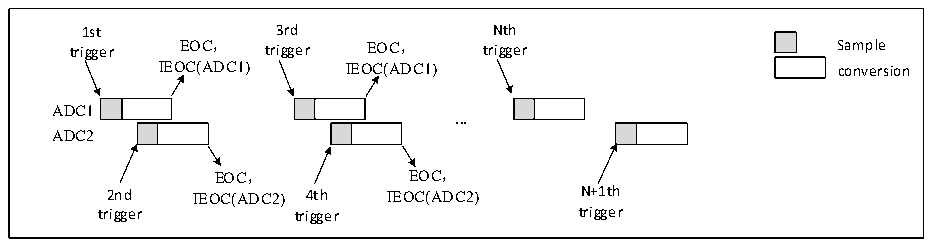
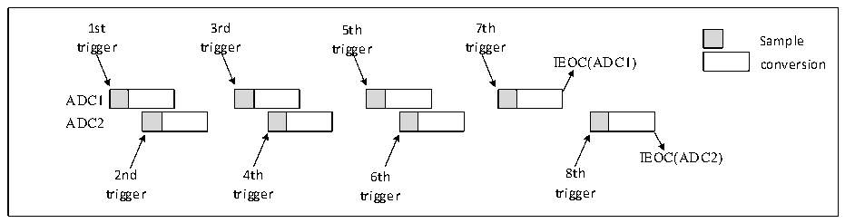
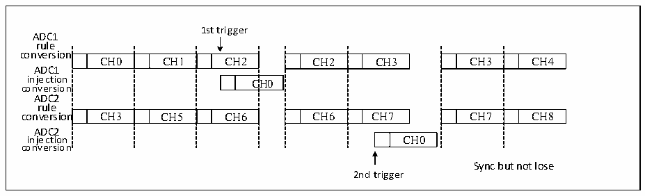

<!-- source-page: 207 -->

[← p.206](0206.md) · [index](../README.md) · [PDF p.207](https://ch32-riscv-ug.github.io/CH32H417/datasheet_en/CH32H417RM.PDF#page=207) · [p.208 →](0208.md)

<!-- header: CH32H417 Reference Manual https://wch-ic.com -->

Figure 11-10 Alternate trigger conversion for each ADC injection channel group  
 <!-- rendered from the PDF; verify at https://ch32-riscv-ug.github.io/CH32H417/datasheet_en/CH32H417RM.PDF#page=207 -->

🖼 Text parsed from the figure above

1st 3rd Nth  
trigger EOC， trigger EOC， trigger Sample  
IEOC(ADC1) IEOC(ADC1) conversion  
ADC1  
<strong>...</strong>  
ADC2  
EOC， EOC，  
2nd IEOC(ADC2) 4th IEOC(ADC2) N+1th  
trigger trigger trigger  

If injection break mode is used simultaneously, the first injection channel on ADC1 is converted when the first  
trigger event occurs, the first injection channel on ADC2 is converted when the second trigger event occurs, and  
so on. If interrupt is enabled, a JEOC interrupt is generated when all injection channels on ADC1 are converted,  
and a JEOC interrupt is generated when all injection channels on ADC2 are converted.  

Figure 11-11 Alternating trigger transitions for each ADC injection channel in discontinuous mode  
 <!-- rendered from the PDF; verify at https://ch32-riscv-ug.github.io/CH32H417/datasheet_en/CH32H417RM.PDF#page=207 -->

🖼 Text parsed from the figure above

1st 3rd 5th 7th  
Sample  
trigger trigger trigger trigger  
IEOC(ADC1) conversion  
ADC1  
ADC2  
IEOC(ADC2)  
2nd 4th 6th 8th  
trigger trigger trigger trigger  

<strong>7) Synchronous rule mode + synchronous injection mode</strong>  
In this mode, the synchronous transition of a rule group can be interrupted to initiate the synchronous transition of  
an injection group. At the same time, it is necessary to ensure that the transitions have the same length of time, or  
that the trigger time interval is longer than the longer of the two sequences.  
<strong>8) Synchronous rule mode + alternating trigger mode</strong>  
In this mode, synchronous conversion of rule groups can be interrupted to initiate alternate trigger conversion of  
injection groups. When an injection event occurs, alternate trigger conversion is initiated immediately. If  
synchronous rule conversion is ongoing, rule conversion of all ADCs is stopped, and synchronization resumes  
after injection conversion.  

Figure 11-12 Alternating trigger injection channel switching in synchronous regular mode  
 <!-- rendered from the PDF; verify at https://ch32-riscv-ug.github.io/CH32H417/datasheet_en/CH32H417RM.PDF#page=207 -->

🖼 Text parsed from the figure above

1st trigger  
ADC1  
rule  
conversion  
CH0  CH1  CH2  C  n  CH3  CH5  CH6  
CH2  CH3  CH6  CH7  
CH3  CH4  CH7  CH8  
ADC1  
C  CH0  
conversion  
ADC2  
rule  
ADC2  
CH0  
injection CH0  
conversion  
Sync but not lose  
2nd trigger  

<!-- image: p207-draw-image-00001 bbox=[511.44, 786.36, 530.88, 796.68] -->
<!-- footer: V1.7 205 -->
