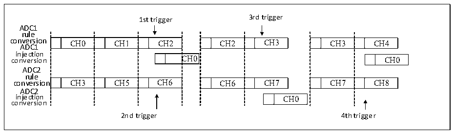
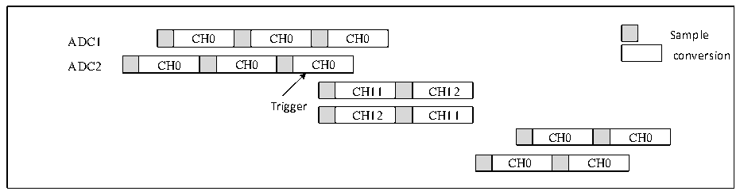

<!-- source-page: 208 -->

[← p.207](0207.md) · [index](../README.md) · [PDF p.208](https://ch32-riscv-ug.github.io/CH32H417/datasheet_en/CH32H417RM.PDF#page=208) · [p.209 →](0209.md)

<!-- header: CH32H417 Reference Manual https://wch-ic.com -->
<em>Note: In this mode, you need to ensure that sequences with the same time length are converted, or that the trigger</em>  
<em>interval is longer than the longer of the two sequences.</em>  
If an injection trigger event occurs during an injection transition that interrupts a rule transition, the trigger event  
is ignored, such as in the case of the second trigger depicted in the figure below.  

Figure 11-13 Trigger event occurs during injection transition  
 <!-- rendered from the PDF; verify at https://ch32-riscv-ug.github.io/CH32H417/datasheet_en/CH32H417RM.PDF#page=208 -->

🖼 Text parsed from the figure above

1st trigger 3rd trigger  
ADC1  
rule  
conversion CH0 CH1 CH2 CH2 CH3 CH3 CH4  
CH0  CH1  CH2  C  CH3  CH5  CH6  
CH2  CH3  CH6  CH7  
CH3  CH4  CH7  CH8  
ADC1  
injection  
C  CH0  
CH0  
ADC2  
rule  
ADC2  
CH0  
injection CH0  
conversion  
2nd trigger 4th trigger  

<strong>9) Synchronous injection mode + alternating mode</strong>  
In this mode, injection transitions can interrupt alternating transitions. When an injection event occurs, the  
alternating transition is interrupted, the injection transition begins, and after the injection transition completes, the  
alternating transition resumes.  

Figure 11-14 Trigger injection group switching under alternate switching  
 <!-- rendered from the PDF; verify at https://ch32-riscv-ug.github.io/CH32H417/datasheet_en/CH32H417RM.PDF#page=208 -->

🖼 Text parsed from the figure above

CH0  CH0  CH0  
ADC1 CH0 CH0 CH0 Sample  
conversion  
CH0  CH0  CH0  
CH11  CH12  
Trigger  
CH12  CH11  
CH0  CH0  
CH0  CH0  

<em>Note: When the prescaler of the ADC is 4, the sampling interval after alternate conversion recovery is no longer</em>  
<em>uniform at 7 ADC clocks, but alternating between 8 and 6 clock cycles.</em>  

### 11.2.8 DFSDM Transition

The ADC conversion result can be directly transferred to the digital filter with ΣΔ modulator (DFSDM). In this  
case, the ADCx_AUX[31] bit must be set to 1, and the DMA bit must be cleared to 0. The ADC transfers the 12  
least significant bits of the regular data register data to the DFSDM. Once the transfer is complete, the DFSDM  
resets the EOC flag.  

### 11.2.9 ADC Low-power Mode

The ADC operating mode can be configured via the ADC_LP bit in the ADCx_CTLR2 register. When set to 0  
(default), the mode consumes higher power and is suitable for sampling rates of 6M or higher, provided VDD33A is  
above 3V. When set to 1, the low-power mode consumes lower power and is suitable for sampling rates below 2  
Mbps.  
<!-- image: p208-draw-image-00001 bbox=[511.44, 786.36, 530.88, 796.68] -->
<!-- footer: V1.7 206 -->
