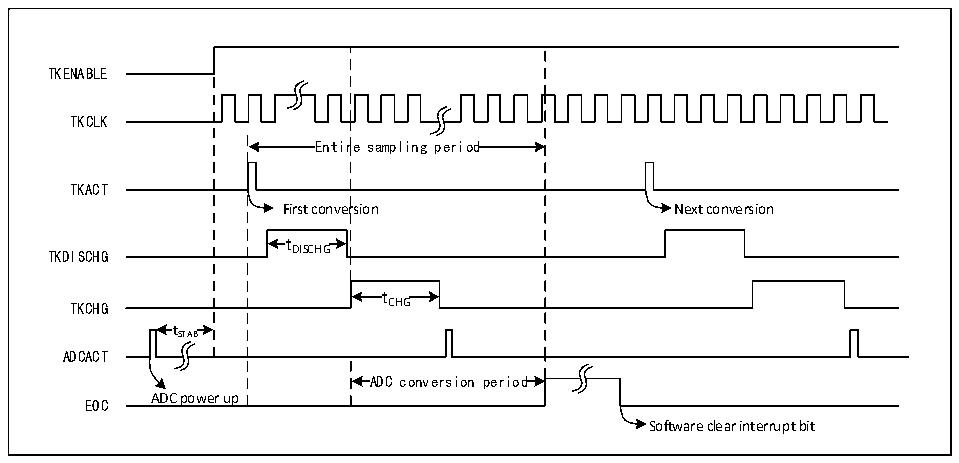

<!-- source-page: 229 -->

[← p.228](0228.md) · [index](../README.md) · [PDF p.229](https://ch32-riscv-ug.github.io/CH32H417/datasheet_en/CH32H417RM.PDF#page=229) · [p.230 →](0230.md)

<!-- header: CH32H417 Reference Manual https://wch-ic.com -->

# Chapter 13 Touch Key Detection (TKEY)

The touch detection control (TKEY) unit, with the help of the voltage conversion function of the ADC module,  
realizes the touch key detection function by converting the capacitance to the voltage for sampling. The detection  
channel reuses 16 external channels of the ADC, and the touch key detection is realized through the single  
conversion mode of the ADC module.  

## 13.1 Functional Description

● Enable TKEY  
For TKEY detection, the ADC module is needed. To enable TKEY, ensure that ADC is powered on (ADON=1),  
then set the TKENABLE bit in the ADC_CTLR1 register to 1. The charge current of the TKEY module can be  
adjusted by the TKITUNE bit.  
TKEY only supports single 1-channel conversion mode, which configures the channel to be converted as the first  
channel in the regular sequence of ADC. And software starts conversion (write to TKEY_ACT_DCG).  
<em>Note: When the TKEY conversion is disabled, ADC channel configuration function can still be retained.</em>  

Figure 13-1 TKEY working timing diagram  
 <!-- rendered from the PDF; verify at https://ch32-riscv-ug.github.io/CH32H417/datasheet_en/CH32H417RM.PDF#page=229 -->

🖼 Text parsed from the figure above

TKENABLE  
TKCLK  
Entir  re sampling period  Entir  re sampling period  
TKACT  
First conversion Next conversion  
t DISCHG  tDISCHG  
TKDISCHG DISCHG  
t CHG  tCHG  
TKCHG CHG  
t  tSTAB  
ADCACT  
ADC conversion period  ADC conversion period  
EOC ADC power up  
Software clear interrupt bit  

● Programmable sampling time  
TKEY cell conversion needs to use several HCLK clock cycles (tDISCHG) to discharge first, and then charge the  
channels through several HCLK cycles (tCHG) to sample the voltage. The number of charging cycles is  
TKEY_CHGOFFSET, and each channel can adjust the sampling voltage with different charging cycles.  

## 13.2 TKEY Operations Steps

TKEY detection belongs to the expansion function of ADC module, and its working principle is to change the  
capacitance perceived by hardware channel through &quot;touch&quot; and &quot;non-touch&quot; mode, and then convert the change  
of capacitance into voltage change through the number of charge and discharge cycles that can be set, and finally  
convert it into digital value through ADC module.  
<!-- image: p229-draw-image-00001 bbox=[511.44, 786.36, 530.88, 796.68] -->
<!-- footer: V1.7 227 -->
