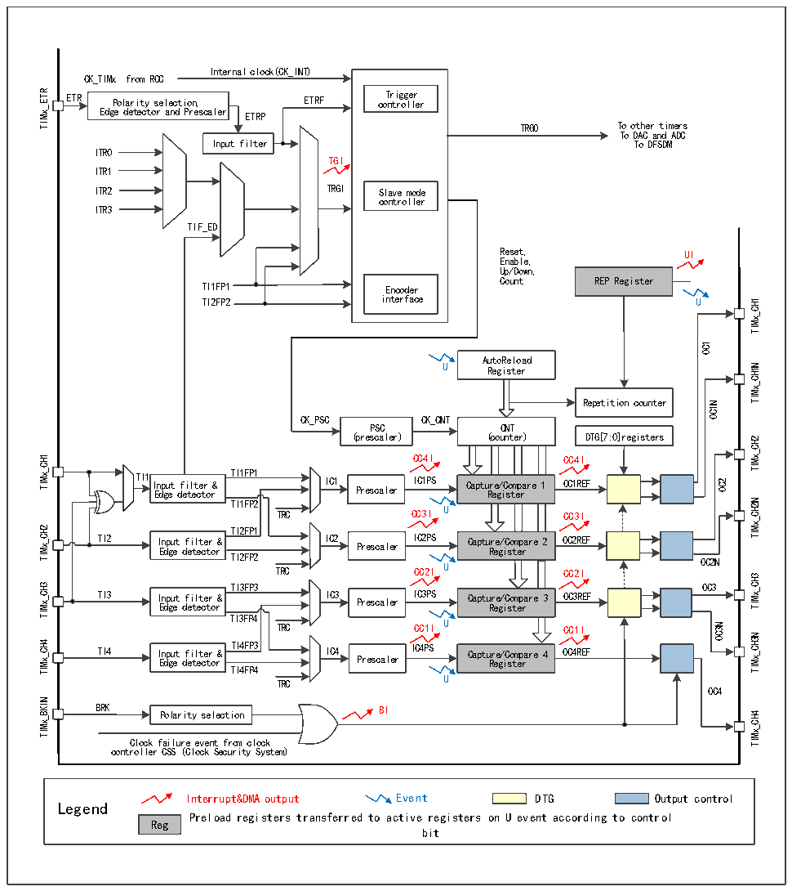

<!-- source-page: 234 -->

[← p.233](0233.md) · [index](../README.md) · [PDF p.234](https://ch32-riscv-ug.github.io/CH32H417/datasheet_en/CH32H417RM.PDF#page=234) · [p.235 →](0235.md)

<!-- header: CH32H417 Reference Manual https://wch-ic.com -->

Figure 14-1 Structure block diagram of advanced-control timer  
 <!-- rendered from the PDF; verify at https://ch32-riscv-ug.github.io/CH32H417/datasheet_en/CH32H417RM.PDF#page=234 -->

🖼 Text parsed from the figure above

Internal clock(CK_INT)  
CK_TIMx from RCC  
TIMx_ETR  
ETR Polarity selection, ETRF co T n r t i r g o g l e l r e r  
Polarity selection, Edge detector and Prescaler  r  
TRGO To other timers  
To DAC and ADC  
Input filter To DFSDM  
ITR0  
TGI  
ITR1  
ITR2 TRGI Slave mode  
controller  
ITR3  
TIF_ED  
Reset, UI  
Enable,  
Up/Down,  
Count REP Register  
TI1FP1 Encoder  
TI2FP2 interface U  
TIMx_CH1  
OC1  
AutoReload  
U Register  
TIMx_CH1N  
Repetition counter  
OC1N  
CK_PSC CK_CNT  
PSC CNT  
(prescaler) (counter) DTG[7:0]registers  
TIMx_CH2  
CC4I CC4I  
TIMx_CH1  
TI1 Input filter &amp; TTII11FFPP11 IC1 IICC11PPSS Capture/Compare 1 OC1REF  
OC2  
Edge detector Prescaler Register  
TIMx_CH2N  
TI1FP2  
TRC CC3I U CC3I  
TIMx_CH2  
TI2FP1  
TI2 I E n d p g u e t d f e i t l e t c e t r o r &amp; IC2 Prescaler IC2PS Captu R r e e g / i C s o t m e p r are 2 OC2REF  
TI2FP2 TRC CC2I U CC2I  
OC2N  
TIMx_CH3  
TIMx_CH3  
TI3FP3  
OC3  
TI3 I E n d p g u e t d f e i t l e t c e t r o r &amp; IC3 Prescaler IC3PS Captu R r e e g / i C s o t m e p r are 3 OC3REF  
TI3FP4 TRC CC1I U CC1I  
OC3N  
TIMx_CH3N  
TIMx_CH4  
TI4 I E n d p g u e t d f e i t l e t c e t r o r &amp; TI4FP3 IC4 Prescaler IC4PS Captu R r e e g / i C s o t m e p r are 4 OC4REF  
TI4FP4  
TRC U  
OC4  
TIMx_BKIN  
BRK BI  
Polarity selection  
TIMx_CH4  
Clock failure event from clock  
controller CSS (Clock Security System)  
Interrupt&amp;DMA output Event DTG Output control  
Legend  
Preload registers transferred to active registers on U event according to control  
Reg  
bit  

<!-- image: p234-draw-image-00001 bbox=[511.44, 786.36, 530.88, 796.68] -->
<!-- footer: V1.7 232 -->
