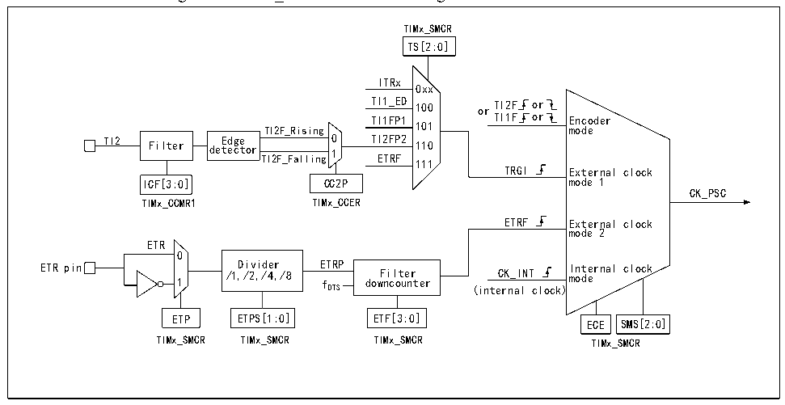

<!-- source-page: 235 -->

[← p.234](0234.md) · [index](../README.md) · [PDF p.235](https://ch32-riscv-ug.github.io/CH32H417/datasheet_en/CH32H417RM.PDF#page=235) · [p.236 →](0236.md)

<!-- header: CH32H417 Reference Manual https://wch-ic.com -->

### 14.2.2 Clock Input

Figure 14-2 CK_PSC source block diagram of advanced-control timer  
 <!-- rendered from the PDF; verify at https://ch32-riscv-ug.github.io/CH32H417/datasheet_en/CH32H417RM.PDF#page=235 -->

🖼 Text parsed from the figure above

TIMx_SMCR  
TS[2:0]  
ITRx  
0xx  
TI1_ED 100 or TI2F or  
TI1FP1 TI1F or Encoder  
TI2F_Rising 101 mode  
TI2 Filter de E t d ec ge tor TI2F_Falling 0 1 TI ET 2F R P F 2 110  
111  
TRGI External clock  
ICF[3:0] CC2P mode 1  
CK_PSC  
TIMx_CCMR1 TIMx_CCER  
ETRF External clock  
mode 2  
ETR  
0  
ETR pin 1 /1 D , i /2 vi , d /4 er ,/8 E f TRP dow F n i c l o t u e n r ter CK_INT I m n o t d e e rnal clock  
DTS (internal clock)  
ETP ETPS[1:0] ETF[3:0] ECE SMS[2:0]  
TIMx_SMCR TIMx_SMCR TIMx_SMCR TIMx_SMCR  

There are many clock sources for advanced-control timer CK_PSC, which can be divided into 4 categories:  
1) The route of external clock pin (ETR) input clock: ETR→ETRP→ETRF;  
2) Internal PB clock input route: CK_INT;  
3) The route from the compare/capture channel pin (TIMx_CHx): TIMx_CHx→TIx→TIxFPx; this route is also  
used in encoder mode;  
4) Input from other internal timers: ITRx;  
The actual operation can be divided into 4 categories by determining the input pulse selection of the SMS from  
the CK_PSC source:  
1) Select the internal clock source (CK_INT);  
2) External clock source mode 1;  
3) External clock source mode 2;  
4) Encoder mode;  
The 4 clock sources mentioned above can be selected by these 4 operations.  

#### 14.2.2.1 Internal Clock Source (CK_INT)

If the advanced-control timer is started when the SMS field is kept at 000b, then the internal clock source  
(CK_INT) is selected as the clock. At this moment, CK_INT is CK_PSC.  

#### 14.2.2.2 External Clock Source Mode 1

If SMS is set to 111b, the external clock source mode1 is enabled. When external clock source 1 is enabled, TRGI  
is selected as the source of CK_PSC. It is worth noting that you need to configure TS to select the source of TRGI.  
For TS, the following pulses can be used as the clock sources:  
1) Internal Trigger (ITRx, x is 0,1,2,3);  
2) Signal of compare/capture 1 after passing through the edge detector (TI1F_ED);  
3) Signals TI1FP1 and TI2FP2 of compare/capture channel;  
4) Signal ETRF from external clock pin.  
<!-- image: p235-draw-image-00001 bbox=[511.44, 786.36, 530.88, 796.68] -->
<!-- footer: V1.7 233 -->
