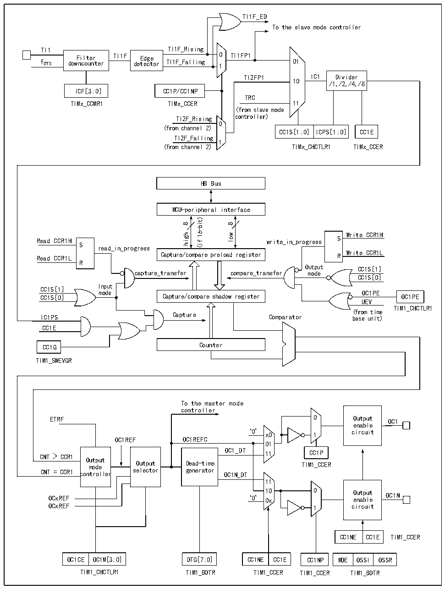

<!-- source-page: 237 -->

[← p.236](0236.md) · [index](../README.md) · [PDF p.237](https://ch32-riscv-ug.github.io/CH32H417/datasheet_en/CH32H417RM.PDF#page=237) · [p.238 →](0238.md)

<!-- header: CH32H417 Reference Manual https://wch-ic.com -->

Figure 14-3 Structure block diagram of compare/capture channel  
 <!-- rendered from the PDF; verify at https://ch32-riscv-ug.github.io/CH32H417/datasheet_en/CH32H417RM.PDF#page=237 -->

🖼 Text parsed from the figure above

TI1F_ED  
To the slave mode controller  
TI1 TI1F_Rising  
Filter TI1F Edge 0 TI1FP1  
f DTS downcounter detector TI1F_Falling 1 01  
TI2FP1 IC1 Divider  
10 /1,/2,/4,/8  
ICF[3:0] CC1P/CC1NP  
TRC  
TIMx_CCMR1 TIMx_CCER 11  
(from slave mode  
TI2F_Rising controller)  
0  
(from channel 2)  
CC1S[1:0] ICPS[1:0] CC1E  
TI2F_Falling  
1  
(from channel 2) TIMx_CHCTLR1 TIMx_CCER  
HB Bus  
MCU-peripheral interface  
16-bit)  
8  
8  
wol Write CCfi(R1H Read CCR1H write_in_progress S S  
high  
read_in_progress  
Write CCR1L Read CCR1L R  
Capture/compare preload register  
R  
Output CC1S[1]  
capture_transfer compare_transfer mode  
CC1S[0]  
Input  
CC1S[1]  
mode OC1PE  
Capture/compare shadow register  
CC1S[0] OC1PE  
UEV  
TIM1_CHCTLR1  
IC1PS Capture Comparator ( b f as ro e m un ti it me )  
CC1E  
CC1G Counter  
TIM1_SWEVGR  
To the master mode  
controller  
ETRF 0 Output OC1  
enable  
‘0’ x0 1 circuit  
OC1REF OC1REFC  
01  
Dead-time generator  
Output  
CNT = CCR1 controller selector generator OC1N_DT  
11  
OCxREF ‘0’ 1 0 0 x 0 O e u n t a p b u l t e OC1N  
OCxREF 1 circuit  
CC1NE  CC1E  
OC1CE  OC1M[3:0]  
CC1NE  CC1E  
MOE  OSSI  OSSR  
OC1CE OC1M[3:0] DTG[7:0] CC1NE CC1E CC1NP MOE OSSI OSSR  
TIM1_CHCTLR1 TIM1_BDTR TIM1_CCER TIM1_CCER TIM1_BDTR  

The block diagram of the compare/capture channel is as shown in Figure 14-3. After the signal is inputted from  
the channel x pin, it can be selected as TIx (the source of TI1 may be more than CH1. See the timer structure  
block diagram 14-1). Take TI1 as example, TI1 passes through the filter (ICF[3:0]) to generate TI1F, and then is  
divided into TI1F_Rising and TI1F_Falling after passing through the edge detector. These 2 signals are selected  
<!-- image: p237-draw-image-00001 bbox=[511.44, 786.36, 530.88, 796.68] -->
<!-- footer: V1.7 235 -->
