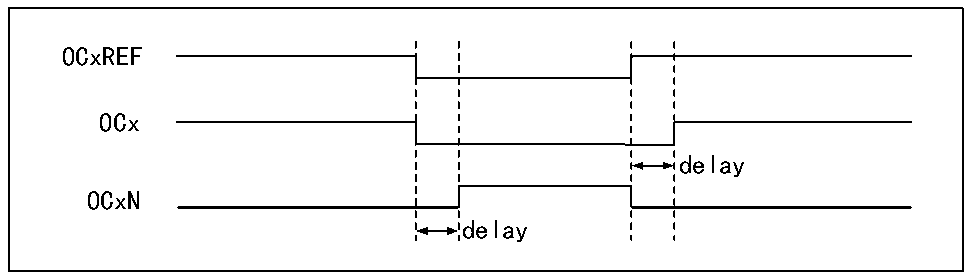

<!-- source-page: 240 -->

[← p.239](0239.md) · [index](../README.md) · [PDF p.240](https://ch32-riscv-ug.github.io/CH32H417/datasheet_en/CH32H417RM.PDF#page=240) · [p.241 →](0241.md)

<!-- header: CH32H417 Reference Manual https://wch-ic.com -->

### 14.3.5 PWM Output Mode

The PWM output mode is one of basic functions of timer. The most common method of PWM output mode is to  
use the reload value to determine the PWM frequency, and to use the capture comparison register to determine the  
duty cycle. Set 110b or 111b in OCxM to use PWM mode 1 or mode 2, set the OCxPE bit to enable the preload  
register, and finally set the ARPE bit. Since the value of the preload register can be sent to the shadow register  
when an update event occurs, it is necessary to set the UG bit to initialize all registers before the core counter  
starts counting. In the PWM mode, the core counter and the compare/capture register are always being compared.  
According to the CMS bit, the timer can output edge-aligned or center-aligned PWM signals.  
● Edge alignment  
When the edge alignment is used, the core counter counts up or down. In the scenario of PWM mode 1, when the  
value of the core counter is greater than that of the compare/capture register, OCxREF will be high; when the  
value of the core counter is less than the compare capture register (such as When the core counter increases to the  
value of R16_TIMx_ATRLR and returns to all 0s), OCxREF drops to low.  
● Central alignment  
When the center-aligned mode is used, the core counter will run in a mode where up counting and down counting  
are performed alternately, and OCxREF performs rising and falling jumps when the values of the core counter and  
the compare/capture register are consistent. However, in 3 types of central alignment mode of comparison flag,  
the bit setting timing is different somewhat. When the center-alignment mode is used, it is the best to generate a  
software update flag (setting the UG bit) before starting the core counter.  

### 14.3.6 Complementary Output and Deadband

The compare/capture channel generally has 2 output pins (compare/capture channel 4 has only one output pin), to  
output 2 complementary signals (OCx and OCxN). OCx and OCxN can be independently set by the CCxP and  
CCxNP bits. The output enable is set independently through CCxE and CCxNE, and the deadband and other  
controls are performed through the MOE, OIS, OISN, OSSI and OSSR bits. Meanwhile, OCx and OCxN outputs  
are enabled to insert into the deadband, each channel has a 10-bit deadband generator. If there is a break circuit,  
set the MOE bit. OCx and OCxN are generated by OCxREF in association. If OCx and OCxN are both high and  
effective, then OCx will be the same as OCxREF, but the rising edge of OCx is equivalent to OCxREF with a  
delay. OCxN is opposite to OCxREF, and its rising edge has a delay relative to the falling edge of the reference  
signal, and if the delay is greater than the effective output width, the corresponding pulse will not be generated.  
Figure 14-4 shows the relationship between OCx, OCxN and OCxREF, and shows the deadband.  

Figure 14-4 Complementary output and deadband  
 <!-- rendered from the PDF; verify at https://ch32-riscv-ug.github.io/CH32H417/datasheet_en/CH32H417RM.PDF#page=240 -->

🖼 Text parsed from the figure above

OCxREF  
OCx  
delay  
OCxN  
delay  

<!-- image: p240-draw-image-00001 bbox=[511.44, 786.36, 530.88, 796.68] -->
<!-- footer: V1.7 238 -->
