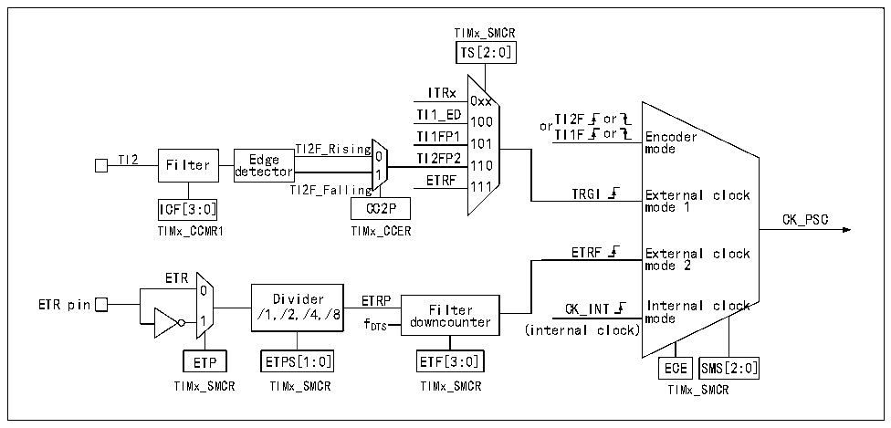

<!-- source-page: 269 -->

[← p.268](0268.md) · [index](../README.md) · [PDF p.269](https://ch32-riscv-ug.github.io/CH32H417/datasheet_en/CH32H417RM.PDF#page=269) · [p.270 →](0270.md)

<!-- header: CH32H417 Reference Manual https://wch-ic.com -->
The core of the general-purpose timer is a 16-bit or 32-bit counter (CNT). CK_PSC is divided by a prescaler (PSC)  
to become CK_CNT and then finally fed to the CNT, which supports incremental counting mode, decremental  
counting mode, and incremental and decremental counting mode, and has an auto-reload register (ATRLR) to  
reload the initialization value for the CNT at the end of each counting cycle.  
The general-purpose timer has 4 sets of compare capture channels, each of which can input pulses from exclusive  
pins or output waveforms to pins, i.e., the compare capture channels support both input and output modes. The  
input of each channel of the compare capture register supports filtering, dividing, edge detection, and other  
operations, and supports mutual triggering between channels, and can also provide clock for the core counter CNT.  
Each compare capture channel has a set of compare capture registers (CHxCVR) that support comparison with the  
main counter (CNT) to output pulses.  

### 15.2.2 Difference between General-purpose Timer and Advanced-control Timer

Compared with the advanced-control timer, the general-purpose timer is lack of the following functions:  
1) The general-purpose timer lacks a repeated counting register that counts the count cycle of core counter.  
2) The compare/capture of general-purpose timer lacks deadband generation and has no complementary output.  
3) The general-purpose timer has no break signal mechanism.  

### 15.2.3 Clock Input

This section describes the source of CK_PSC. The clock source part of the general structure block diagram of the  
general-purpose timer is abstracted here.  

Figure 15-2 Block diagram of general-purpose timer source  
 <!-- rendered from the PDF; verify at https://ch32-riscv-ug.github.io/CH32H417/datasheet_en/CH32H417RM.PDF#page=269 -->

🖼 Text parsed from the figure above

TIMx_SMCR  
TS[2:0]  
ITRx  
0xx  
TI1_ED 100 or TI2F or  
TI1FP1 TI1F or Encoder  
TI2F_Rising 101 mode  
TI2 Filter Edge 0 TI2FP2 110  
detector 1 ETRF  
TI2F_Falling 111 TRGI External clock  
ICF[3:0] CC2P mode 1  
CK_PSC  
TIMx_CCMR1 TIMx_CCER  
ETRF External clock  
mode 2  
ETR  
0  
ETR pin 1 /1, D / i 2 v , i / d 4 e , r /8 E f TRP dow F n i c l o t u e n r ter CK_INT I m n o t d e e rnal clock  
DTS (internal clock)  
ETP ETPS[1:0] ETF[3:0] ECE SMS[2:0]  
TIMx_SMCR TIMx_SMCR TIMx_SMCR TIMx_SMCR  

The available input clocks can be divided into 4 categories:  
1) External clock pin (ETR) input: ETR→ETRP→ETRF;  
2) Internal PB clock input: CK_INT;  
3) From the compare/capture pin (TIMx_CHx): TIMx_CHx→TIx→TIxFPx; it is also used in encoder mode;  
4) Input from other internal timers: ITRx.  
The actual operation can be divided into 3 categories by determining the input pulse selection of the SMS from  
the CK_PSC source:  
<!-- image: p269-draw-image-00001 bbox=[511.44, 786.36, 530.88, 796.68] -->
<!-- footer: V1.7 267 -->
