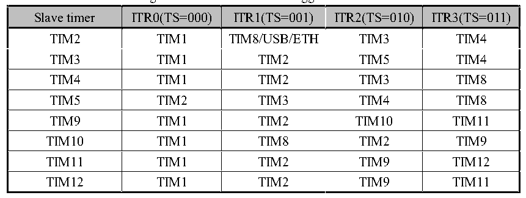

<!-- source-page: 275 -->

[← p.274](0274.md) · [index](../README.md) · [PDF p.275](https://ch32-riscv-ug.github.io/CH32H417/datasheet_en/CH32H417RM.PDF#page=275) · [p.276 →](0276.md)

<!-- header: CH32H417 Reference Manual https://wch-ic.com -->
are: set the SMS field to 001b (count only on TI2 edge), 010b (count only on TI1 edge) or 011b (count on both  
TI1 and TI2 edges), and connect the encoder to compare/capture 1, 2 inputs, set a value for the reload value  
register and this value can be set to be greater. In the encoder mode, the internal compare/capture register of timer,  
prescaler, repeat count register and other registers all work normally. The following table shows the relationship  
between the counting direction and the encoder signal.  

<!-- p275-table-001 (table-15-1@1) -->
<table><caption>Table 15-1 Relationship between count direction of timer in encoder mode and encoder signal</caption><tr><th rowspan="2">Count active edge</th><th rowspan="2" style="text-align:left">Relative signal level</th><th colspan="2">TI1FP1 signal edge</th><th colspan="2">TI2FP2 signal edge</th></tr><tr><td style="text-align:left">Rising edge</td><td style="text-align:left">Falling edge</td><td style="text-align:left">Rising edge</td><td style="text-align:left">Falling edge</td></tr><tr><td rowspan="2">Only count at TI1 edge</td><td>High</td><td>Downcount</td><td>Upcount</td><td rowspan="2" colspan="2">Not count</td></tr><tr><td>Low</td><td>Upcount</td><td>Downcount</td></tr><tr><td rowspan="2">Only count at TI2 edge</td><td>High</td><td rowspan="2" colspan="2">Not count</td><td>Upcount</td><td>Downcount</td></tr><tr><td>Low</td><td>Downcount</td><td>Upcount</td></tr><tr><td rowspan="2" style="text-align:left">Count on both edges of TI1 and TI2</td><td>High</td><td>Downcount</td><td>Upcount</td><td>Upcount</td><td>Downcount</td></tr><tr><td>Low</td><td>Upcount</td><td>Downcount</td><td>Downcount</td><td>Upcount</td></tr></table>

### 15.3.8 Timer Synchronous Mode

The timer can output clock pulses (TRGO) and can also receive input from other timers (ITRx). The sources of  
ITRx of different timers (TRGO of other timers) are different. Table 15-2 shows the internal trigger connection of  
timers.  

Figure 15-2 GTPM internal trigger connection  
 <!-- rendered from the PDF; verify at https://ch32-riscv-ug.github.io/CH32H417/datasheet_en/CH32H417RM.PDF#page=275 -->

🖼 Text parsed from the figure above

<!-- p275-table-003 (table-15-1@1) -->
<table><tr><th>Slave timer</th><th>ITR0(TS=000)</th><th>ITR1(TS=001)</th><th>ITR2(TS=010)</th><th>ITR3(TS=011)</th></tr><tr><td>TIM2</td><td>TIM1</td><td>TIM8/USB/ETH</td><td>TIM3</td><td>TIM4</td></tr><tr><td>TIM3</td><td>TIM1</td><td>TIM2</td><td>TIM5</td><td>TIM4</td></tr><tr><td>TIM4</td><td>TIM1</td><td>TIM2</td><td>TIM3</td><td>TIM8</td></tr><tr><td>TIM5</td><td>TIM2</td><td>TIM3</td><td>TIM4</td><td>TIM8</td></tr><tr><td>TIM9</td><td>TIM1</td><td>TIM2</td><td>TIM10</td><td>TIM11</td></tr><tr><td>TIM10</td><td>TIM1</td><td>TIM8</td><td>TIM2</td><td>TIM9</td></tr><tr><td>TIM11</td><td>TIM1</td><td>TIM2</td><td>TIM9</td><td>TIM12</td></tr><tr><td>TIM12</td><td>TIM1</td><td>TIM2</td><td>TIM9</td><td>TIM11</td></tr></table>

### 15.3.9 Dual Edge Capture Mode

Enable dual edge capture for pulse measurement on the corresponding channel via the CAP_ED_CHx bit in the  
TIMx_AUX register.  
For example: To capture pulse width using Channel 2, configure the capture function by selecting the IC2 signal  
source (CC2S bit in TIMx_CHCTLR1 register set to 11b) and enabling Channel 2&#x27;s dual-edge capture  
(CAP_ED_CH2 bit in TIMx_AUX register set to 1). This completes the dual-edge capture configuration.  
The high/low-level width values of captured pulses can be read via the CH2CVR bit in the TIMx_CH2CVR  
register. Enabling the CAPLVL bit allows the corresponding level of the captured value to be indicated by bit[16]  
in the TIMx_CH2CVR register.  
<em>Note: This function is only available for TIM2/TIM3/TIM4/TIM5.</em>  
<!-- image: p275-draw-image-00001 bbox=[511.44, 786.36, 530.88, 796.68] -->
<!-- footer: V1.7 273 -->
