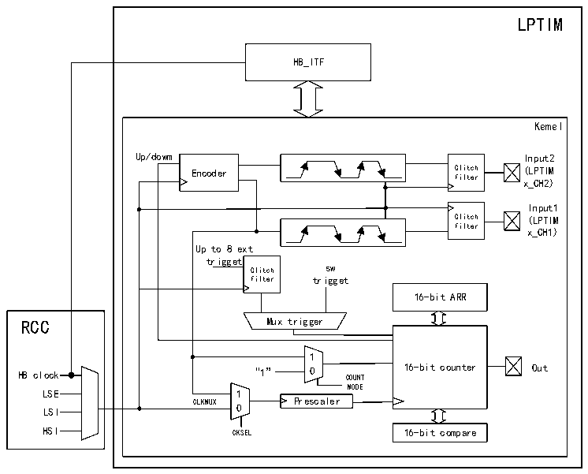

<!-- source-page: 306 -->

[← p.305](0305.md) · [index](../README.md) · [PDF p.306](https://ch32-riscv-ug.github.io/CH32H417/datasheet_en/CH32H417RM.PDF#page=306) · [p.307 →](0307.md)

<!-- header: CH32H417 Reference Manual https://wch-ic.com -->

## 17.2 Function Description

### 17.2.1 LPTIM Structure

Figure 17-1 Block diagram of LPTIM  
 <!-- rendered from the PDF; verify at https://ch32-riscv-ug.github.io/CH32H417/datasheet_en/CH32H417RM.PDF#page=306 -->

🖼 Text parsed from the figure above

LPTIM  
HB_ITF  
Kemel  
Up/dowm Input2  
Encoder Glitch (LPTIM  
filter x_CH2)  
Input1  
Glitch (LPTIM  
filter  
x_CH1)  
Up to 8 ext  
trigget  
Glitch sw  
filter trigget  
16-bit ARR  
1  
HB clock “1” 0 COUNT 16-bit counter Out  
MODE  
LSE 1  
LSI CLKMUX 0 Prescaler  
HSI CKSEL 16-bit compare  

## 17.3 LPTIM Trigger Mapping

The information for LPTIM external trigger connections is as follows:  

<!-- p306-table-002 (table-17-1@1) -->
<table><caption>Table 17-1 LPTIM external trigger connection</caption><tr><th>TRIGSEL[1:0]</th><th>External trigger</th></tr><tr><td>LPTIMx_TRG_00</td><td>LPTIMx_ETR</td></tr><tr><td>LPTIMx_TRG_01</td><td>RTC_ALARM</td></tr></table>

### 17.3.1 LPTIM Reset and Clock

The reset of the LPTIM module is controlled by the LPTIMRST bit of the RCC_PB1PRSTR register, which has  
no effect when setting 0 and resets the module when setting 1.  
The LPTIM module clock is controlled by the LPTIMEN bit of the RCC_PB1PCENR register. The module clock  
is turned off at 0 and turned on at 1.  
The counting clock of LPTIM is provided by multiple optional clock sources, which can be divided into internal  
clock sources and external clock sources.  
When using the internal clock source count, the internal clock source can select the four PB1, LSI, LSE, HIS  
clock sources through the CLKMX_SEL bit of the LPTIMx_CFGR register. In addition, the LPTIM can be timed  
using an external clock signal injected on the external input LPTIMx_CH1.  
<!-- image: p306-draw-image-00001 bbox=[511.44, 786.36, 530.88, 796.68] -->
<!-- footer: V1.7 304 -->
