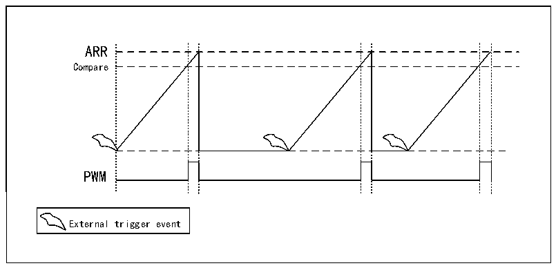

<!-- source-page: 309 -->

[← p.308](0308.md) · [index](../README.md) · [PDF p.309](https://ch32-riscv-ug.github.io/CH32H417/datasheet_en/CH32H417RM.PDF#page=309) · [p.310 →](0310.md)

<!-- header: CH32H417 Reference Manual https://wch-ic.com -->

<!-- p309-table-001 (table-17-5@1) -->
<table><caption>Table 17-5 Trigger source</caption><tr><th>TRIGSEL[1:0]</th><th>Trigger source</th></tr><tr><td>00</td><td>LPTIMx_ETR</td></tr><tr><td>01</td><td>RTC_ALARM</td></tr><tr><td>10</td><td>Invalid</td></tr><tr><td>11</td><td>Invalid</td></tr></table>

### 17.3.5 Operating Mode

LPTIM has 2 modes of operation:  
Continuous mode: the timer runs freely, starting from the trigger event and not stopping until the timer is disabled.  
Single trigger mode: the timer starts from the trigger event and stops when the ARR value is reached.  
In single trigger mode, to enable single counting, you must set SNGSTRT location 1, a new trigger event will  
restart the timer, and any trigger events that occur after the counter starts until it reaches ARR will be lost.  
When an external trigger is selected, each external trigger event that arrives after the SNGSTRT bit is set and after  
the counter register stops starts the counter for a new count loop.  

Figure 17-3 LPTIM output waveforms in single count mode configuration  
 <!-- rendered from the PDF; verify at https://ch32-riscv-ug.github.io/CH32H417/datasheet_en/CH32H417RM.PDF#page=309 -->

🖼 Text parsed from the figure above

ARR  
Compare  
PWM  
External trigger event  

To activate one-trigger setup mode, it should be noted that in one-trigger mode, one-time setup mode is activated  
when the WAVE bit field in the LPTIMx_CFGR register is set. In this case, the counter is activated only once  
after the first trigger and any subsequent trigger events are discarded.  
<!-- image: p309-draw-image-00001 bbox=[511.44, 786.36, 530.88, 796.68] -->
<!-- footer: V1.7 307 -->
