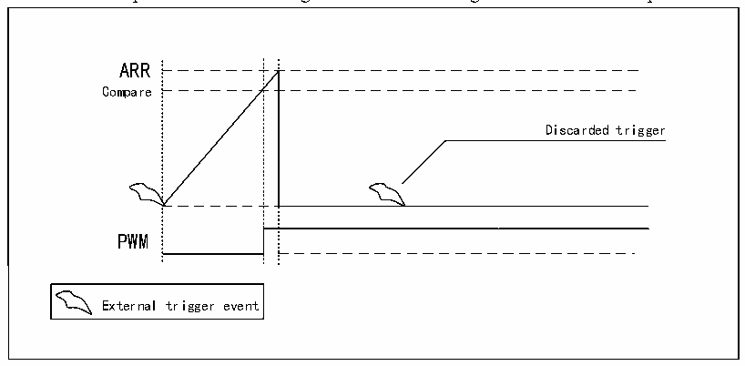
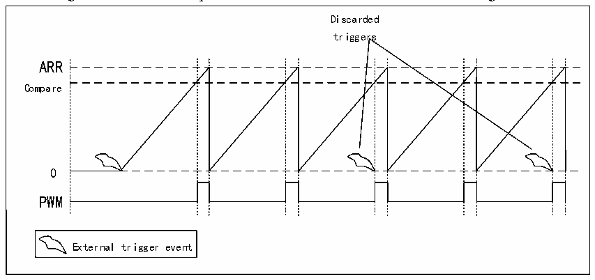

<!-- source-page: 310 -->

[← p.309](0309.md) · [index](../README.md) · [PDF p.310](https://ch32-riscv-ug.github.io/CH32H417/datasheet_en/CH32H417RM.PDF#page=310) · [p.311 →](0311.md)

<!-- header: CH32H417 Reference Manual https://wch-ic.com -->

Figure 17-4 LPTIM output waveform for single count mode configuration with one setup mode activated  
 <!-- rendered from the PDF; verify at https://ch32-riscv-ug.github.io/CH32H417/datasheet_en/CH32H417RM.PDF#page=310 -->

🖼 Text parsed from the figure above

ARR  
Compare  
Discarded trigger  
PWM  
External trigger event  

In continuous mode, to enable continuous counting, the CNTSTRT bit must be set, and if an external trigger is  
selected, external trigger events that arrive after setting CNTSTRT will start the counter for continuous counting.  
Any subsequent external trigger events will be discarded, and setting CNTSTRT in the case of software startup  
(TRIGEN=00) will start the counter to count continuously.  

Figure 17-5 LPTIM output waveforms in continuous count mode configuration  
 <!-- rendered from the PDF; verify at https://ch32-riscv-ug.github.io/CH32H417/datasheet_en/CH32H417RM.PDF#page=310 -->

🖼 Text parsed from the figure above

Discarded  
triggers  
ARR  
Compare  
0  
PWM  
External trigger event  

The SNGSTRT and SNGSTRT bits can only be set when the timer is enabled (ENABLE bit is set to 1). You can  
change the LPTIM counter mode. If you previously selected continuous mode, setting SNGSTRT will switch  
LPTIM to single trigger mode, and the counter will stop counting when the ARR value is reached. If you have  
previously selected single trigger mode, setting CNTSTRT will switch CNTSTRT to continuous mode. Restart as  
soon as the counter reaches the ARR value.  

### 17.3.6 Timeout Function

The detection of a valid edge on a selected trigger input can be used to reset the counter, which is controlled by  
the TIMOUT bit. The first trigger event will start the counter, any successive trigger event will reset the counter  
and the timer will restart, you can achieve low-power timeout function, if no trigger event occurs, the MCU will  
be awakened by the comparison match event.  

### 17.3.7 Waveform Generation

Two 16-bit registers LPTIM_ARR and LPTIM_CMP are used to generate several different waveforms on the  
<!-- image: p310-draw-image-00001 bbox=[511.44, 786.36, 530.88, 796.68] -->
<!-- footer: V1.7 308 -->
