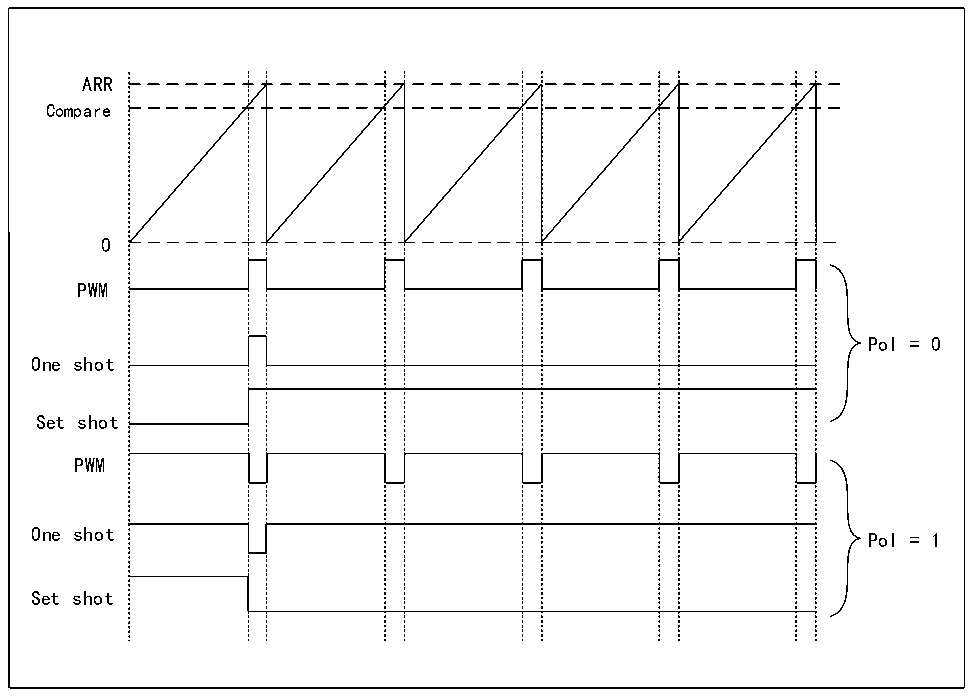

<!-- source-page: 311 -->

[← p.310](0310.md) · [index](../README.md) · [PDF p.311](https://ch32-riscv-ug.github.io/CH32H417/datasheet_en/CH32H417RM.PDF#page=311) · [p.312 →](0312.md)

<!-- header: CH32H417 Reference Manual https://wch-ic.com -->
LPTIM output.  
The timer can generate the following waveforms:  
- (1) PWM mode: once the counter value in LPTIMx_CNT exceeds the comparison value in LPTIMx_CMP, the
LPTIM output is set. Once the LPTIMx_ARR and LPTIMx_CNT register values are equal, the LPTIM output is  
reset.  
- (2) Mono-pulse mode: the output waveform is similar to the PWM mode of the first pulse, and then permanently
reset.  
- (3) one-time setting mode: the output waveform is similar to the mono-pulse mode, except that the output remains
at the last signal level (depending on the polarity of the output configuration).  
The above mode requires that the LPTIMx_ARR register value is strictly greater than the LPTIMx_CMP register  
value.  
The LPTIM output waveform can be configured through the Wave bit as follows:  
- (1) resetting the WAVE bit to 0 forces LPTIM to generate a PWM waveform or a mono-pulse waveform,
depending on the bit set: CNTSTRT or SNGSTRT.  
- (2) setting the WAVE bit to 1 forces LPTIM to generate a setting mode once.
The WAVPOL bit controls the polarity of the LPTIM output, and the change takes effect immediately, so the  
output default value changes immediately after the polarity is reconfigured, even before the timer is enabled.  
The frequency of the generated signal is as high as the LPTIM clock frequency 2 division. Figure 17-6 shows  
three waveforms that may be generated on the LPTIM output. In addition, the figure shows the effect of changing  
polarity through the WAVPOL bit.  

Figure 17-6 Waveform generation  
 <!-- rendered from the PDF; verify at https://ch32-riscv-ug.github.io/CH32H417/datasheet_en/CH32H417RM.PDF#page=311 -->

🖼 Text parsed from the figure above

ARR  
Compare  
0  
PWM  
Pol = 0  
One shot  
Set shot  
PWM  
One shot Pol = 1  
Set shot  

<!-- image: p311-draw-image-00001 bbox=[511.44, 786.36, 530.88, 796.68] -->
<!-- footer: V1.7 309 -->
