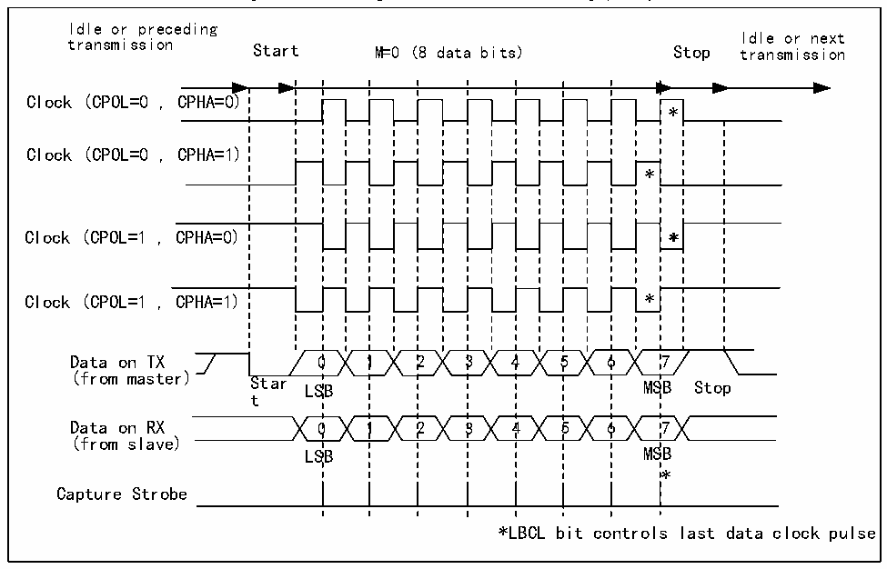
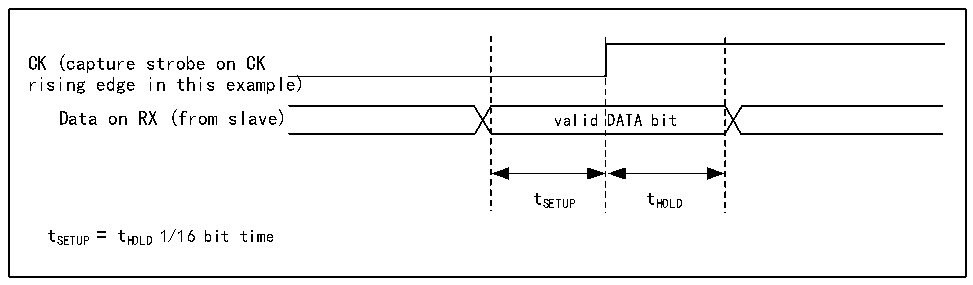

<!-- source-page: 342 -->

[← p.341](0341.md) · [index](../README.md) · [PDF p.342](https://ch32-riscv-ug.github.io/CH32H417/datasheet_en/CH32H417RM.PDF#page=342) · [p.343 →](0343.md)

<!-- header: CH32H417 Reference Manual https://wch-ic.com -->

Figure 19-2 Example of USART clock timing (M=0)  
 <!-- rendered from the PDF; verify at https://ch32-riscv-ug.github.io/CH32H417/datasheet_en/CH32H417RM.PDF#page=342 -->

🖼 Text parsed from the figure above

Idle or preceding  
Idle or next  
transmission Start M=0 (8 data bits) Stop transmission  
0 1SB 0 1SB  1 21  2 32  3 43  4 54  5 65  * * MS6MS  
Clock (CPOL=0 , CPHA=0)  
*  **  7  
3  
Clock (CPOL=0 , CPHA=1)  
(from slave)  
LSB MSB  
*  
Capture Strobe  
*LBCL bit controls last data clock pulse  

Figure 19-3 Data sample hold time  
 <!-- rendered from the PDF; verify at https://ch32-riscv-ug.github.io/CH32H417/datasheet_en/CH32H417RM.PDF#page=342 -->

🖼 Text parsed from the figure above

valid  DATA bit  
CK (capture strobe on CK  
rising edge in this example)  
Data on RX (from slave) valid DATA bit  
tSETUP tHOLD  
tSETUP= tHOLD 1/16 bit time  

## 19.5 1-wire Half-duplex Mode

The half-duplex mode supports the use of a single pin (only TX pin) to receive and transmit, and the TX pin and  
RX pin are connected inside the chip.  
To enable half-duplex mode, set HDSEL bit in the control register 3 (R16_USARTx_CTLR3), but you need to  
disable LIN mode, smartcard mode, infrared mode and synchronous mode at the same time, i.e., to ensure that the  
SCEN, CLKEN and IREN bits are in the reset status. These 3 bits are in the control register 2 and the control  
register 3 (R16_USARTx_CTLR2 and R16_USARTx_CTLR3).  
After setting to half-duplex mode, it is needed to set the TX IO port to open-drain output high mode. When TE bit  
is set, the data will be sent out as long as the data is written to the data register. Special attention shall be paid to  
the fact that bus conflicts may occur when multiple devices use a single bus to transmit and receive in half-duplex  
mode. This requires users to avoid it by software.  
<!-- image: p342-draw-image-00001 bbox=[511.44, 786.36, 530.88, 796.68] -->
<!-- footer: V1.7 340 -->
