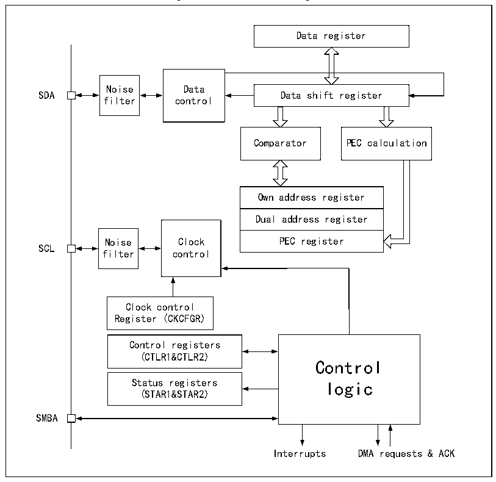

<!-- source-page: 368 -->

[← p.367](0367.md) · [index](../README.md) · [PDF p.368](https://ch32-riscv-ug.github.io/CH32H417/datasheet_en/CH32H417RM.PDF#page=368) · [p.369 →](0369.md)

<!-- header: CH32H417 Reference Manual https://wch-ic.com -->
For normal use, the correct clock must be input to I2C. In the standard mode, the minimum input clock is 2MHz,  
while the minimum input clock is 4MHz in the fast mode.  
Figure 21-2 shows the block diagram of I2C.  

Figure 21-2 I2C block diagram  
 <!-- rendered from the PDF; verify at https://ch32-riscv-ug.github.io/CH32H417/datasheet_en/CH32H417RM.PDF#page=368 -->

🖼 Text parsed from the figure above

Data register  
Noise Data  
SDA Data shift register  
filter control  
Comparator PEC calculation  
Own address register  Dual address register  PEC register  
Noise Clock PEC register  
SCL  
filter control  
Clock control  
Register (CKCFGR)  
Control registers  
(CTLR1&amp;CTLR2)  
Control  
Status registers logic  
(STAR1&amp;STAR2)  
SMBA  
Interrupts DMA requests &amp; ACK  

## 21.3 Master Mode

In master mode, the I2C module leads the data transmission and outputs the clock signal. The data transfer starts  
with a Start event and ends with a Stop event. The following is the required operations in master mode:  
Set the correct clock in the control register2 (R16_I2Cx_CTLR2) and the clock control register  
(R16_I2Cx_CKCFGR).  
Set a proper rising edge in the rising edge register (R16_I2Cx_RTR).  
Set the PE bit in R16_I2Cx_CTLR1 to start the peripheral.  
Set the START bit in the control register (R16_I2Cx_CTLR1) to generate a start event.  
After the START bit is set, the I2C module automatically switches to master mode, the MSL bit is set, and a Start  
event is generated. After the start event is generated, the SB bit is set. If the ITEVTEN bit (in R16_I2Cx_CTLR2)  
is set, an interrupt is generated. In this case, it is needed to read the R16_I2Cx_STAR1 register. After the slave  
<!-- image: p368-draw-image-00001 bbox=[511.44, 786.36, 530.88, 796.68] -->
<!-- footer: V1.7 366 -->
