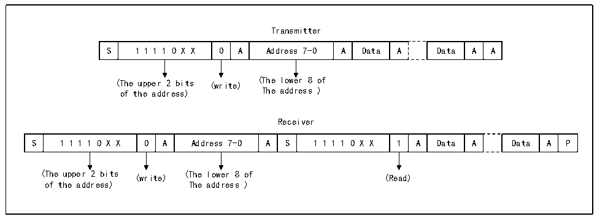

<!-- source-page: 369 -->

[← p.368](0368.md) · [index](../README.md) · [PDF p.369](https://ch32-riscv-ug.github.io/CH32H417/datasheet_en/CH32H417RM.PDF#page=369) · [p.370 →](0370.md)

<!-- header: CH32H417 Reference Manual https://wch-ic.com -->
address is written to the data register, the SB bit is automatically cleared.  
If the 10-bit address mode is enabled, then write the data register to send the header sequence (the header  
sequence is 11110xx0b, of which the xx bits are the highest 2 bits of the 10-bit address).  
After the header sequence is transmitted, the ADD10 bit in the status register is set. If the ITEVTEN bit is already  
set, an interrupt will be generated. At this time, read the R16_I2Cx_STAR1 register and write the second address  
byte to the data register. Then, clear the ADD10 bit.  
Then, write the data register to send the second address byte. After sending the second address byte, the ADDR bit  
in the status register is set. If the ITEVTEN bit has been set, an interrupt will be generated. Read the  
R16_I2Cx_STAR2 register at this time and then read R16_I2Cx_STAR1 register again to clear the ADDR bit;  
If the 7-bit address mode is enabled, the write data register transmit the address byte. After the address byte is sent,  
the ADDR bit in the status register is set. If the ITEVTEN bit has been set, an interrupt will be generated. Read  
the R16_I2Cx_STAR1 register and then read the R16_I2Cx_STAR2 register again to clear the ADDR bit.  
In the 7-bit address mode, the first byte sent is the address byte, the first 7 bits represent the address of the target  
slave device, the 8th bit determines the direction of the subsequent message, and ‘0’ means the master device  
writes data to the slave device, ‘1’ means that the master device reads information from the slave device.  
In the 10-bit address mode, as shown in Figure 18-3, the first byte is 11110xx0, xx are the highest 2 bits of the  
10-bit address, and the second byte is the lower 8 bits of the 10-bit address in the address transmission phase. If  
you subsequently enter the master transmitter mode, send data continuously. If the device enters the master  
receiver mode subsequently, a start event needs to be re-sent, and a byte of 11110xx1 will be sent together. Then,  
enter the master receiver mode.  

Figure 21-3 Master receive/transmits data in 10-bit address mode  
 <!-- rendered from the PDF; verify at https://ch32-riscv-ug.github.io/CH32H417/datasheet_en/CH32H417RM.PDF#page=369 -->

🖼 Text parsed from the figure above

Transmitter  
S  1 1 1 1 0 X X  0  A  Address 7-0  A  Data  A  Data  A  A  
(The upper 2 bits (write) (The lower 8 of  
of the address) The address )  
Receiver  
S  1 1 1 1 0 X X  0  A  Address 7-0  A  S  1 1 1 1 0 X X  1  A  Data  A  Data  A  P  
(The upper 2 bits (write) (The lower 8 of (Read)  
of the address) The address )  

<strong>Master transmit mode:</strong>  
The master device&#x27;s internal shift register sends data from the data register to the SDA line. When the master  
device receives an ACK, TxE in status register 1 (R16_I2Cx_STAR1) is set, and an interrupt is also generated if  
ITEVTEN and ITBUFEN are set. Writing data to the data register will clear the TxE bit.  
If the TxE bit is set and no new data was written to the data register before the last data was sent, then the BTF bit  
will be set and SCL will remain low until it is cleared, and writing data to the data register after reading  
R16_I2Cx_STAR1 will clear the BTF bit.  
<!-- image: p369-draw-image-00001 bbox=[511.44, 786.36, 530.88, 796.68] -->
<!-- footer: V1.7 367 -->
