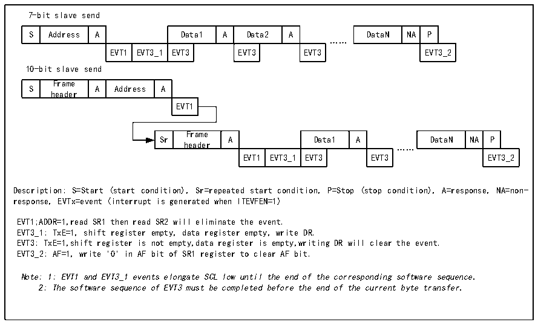

<!-- source-page: 371 -->

[← p.370](0370.md) · [index](../README.md) · [PDF p.371](https://ch32-riscv-ug.github.io/CH32H417/datasheet_en/CH32H417RM.PDF#page=371) · [p.372 →](0372.md)

<!-- header: CH32H417 Reference Manual https://wch-ic.com -->
control the identification of broadcast call addresses on or off. Once the start event is detected, the I2C module  
compares the SDA data through the shift register with its own address (the number of bits depends on ENDUAL  
and ADDMODE) or the broadcast address (when ENGC is set). If there is a mismatch, it will be ignored until a  
new start event is generated. If it matches the header sequence, an ACK signal is generated and waits for the  
address of the second byte; if the address of the second byte also matches, or if the address of the whole segment  
matches in the case of a 7-bit address, then:  
First an ACK reply is generated; the ADDR bit is set, and if the ITEVTEN bit is set, there will be a corresponding  
interrupt.  
If you are using dual-address mode (the ENDUAL bit is set), you also need to read the DUALF bit to determine  
which address the host is calling.  
The slave mode defaults to receive mode, and when the last bit of the received header sequence is 1, or the last bit  
of the 7-bit address is 1 (depending on whether the header sequence is received for the first time or a normal 7-bit  
address), the I2C module will enter sender mode, and the TRA bit will indicate whether it is currently in receiver  
or sender mode.  
<strong>Slave transmit mode:</strong>  
After the ADDR bit is cleared, the I2C module sends bytes from the data register to the SDA line via a shift  
register. The slave device holds SCL low until the ADDR bit is cleared and the data to be sent has been written to  
the data register. (See EVT1 and EVT3 in the figure below). Upon receipt of an answer ACK, the TxE bit will be  
set and an interrupt will be generated if ITEVTEN and ITBUFEN are set. The BTF bit will be set if TxE is set but  
no new data is written to the data register before the end of the next data transmission. SCL will remain low until  
the BTF is cleared. Reading status register 1 (R16_I2Cx_STAR1) and then writing data to the data register will  
clear the BTF bit.  

Figure 21-6 Slave transmitter transmission sequence diagram  
 <!-- rendered from the PDF; verify at https://ch32-riscv-ug.github.io/CH32H417/datasheet_en/CH32H417RM.PDF#page=371 -->

🖼 Text parsed from the figure above

7-bit slave send  
S  Address  A  Data1  A  Data2  A  EVT1  EVT3_1  EVT3  EVT3  EVT3  
DataN  NA  P  EVT3_2  
……  
10-bit slave send  
S  Frame header  A  Address  A  EVT1  
Sr  Frame header  A  Data1  A  EVT1  EVT3_1  EVT3  EVT3  
DataN  NA  P  EVT3_2  
……  
Description: S=Start (start condition), Sr=repeated start condition, P=Stop (stop condition), A=response, NA=non-  
response, EVTx=event (interrupt is generated when ITEVFEN=1)  
EVT1;ADDR=1,read SR1 then read SR2 will eliminate the event.  
EVT3_1: TxE=1, shift register empty, data register empty, write DR.  
EVT3: TxE=1,shift register is not empty,data register is empty,writing DR will clear the event.  
EVT3_2: AF=1, write &#x27;0&#x27; in AF bit of SR1 register to clear AF bit.  
Note: 1: EVT1 and EVT3_1 events elongate SCL low until the end of the corresponding software sequence.  
2: The software sequence of EVT3 must be completed before the end of the current byte transfer.  

Slave receive mode:  
<!-- image: p371-draw-image-00001 bbox=[511.44, 786.36, 530.88, 796.68] -->
<!-- footer: V1.7 369 -->
