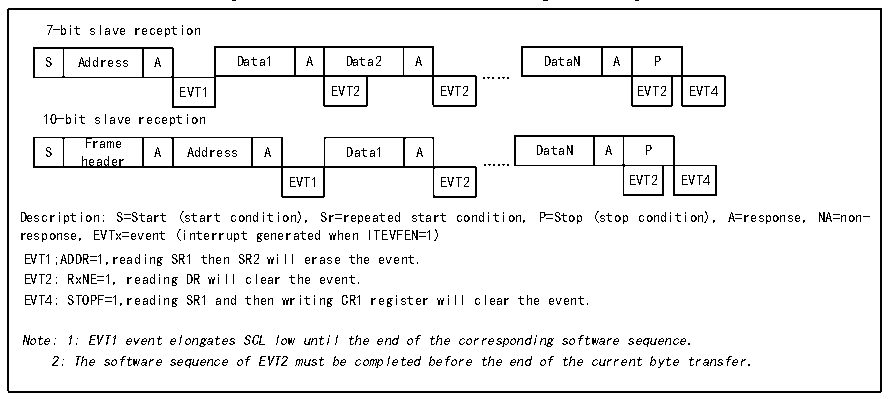

<!-- source-page: 372 -->

[← p.371](0371.md) · [index](../README.md) · [PDF p.372](https://ch32-riscv-ug.github.io/CH32H417/datasheet_en/CH32H417RM.PDF#page=372) · [p.373 →](0373.md)

<!-- header: CH32H417 Reference Manual https://wch-ic.com -->
After ADDR is cleared, the I2C module stores the data on SDA into the data register via a shift register. After  
every byte received, the I2C module sets an ACK bit and sets the RxNE bit. If ITEVTEN and ITBUFEN are set,  
an interrupt is also generated. If RxNE is set and the old data is not read before the new data is received, then BTF  
is set. SCL will remain low until the BTF bit is cleared. Reading status register 1 (R16_I2Cx_STAR1) and reading  
the data in the data register will clear the BTF bit.  

Figure 21-7 Receiver transmission sequence diagram  
 <!-- rendered from the PDF; verify at https://ch32-riscv-ug.github.io/CH32H417/datasheet_en/CH32H417RM.PDF#page=372 -->

🖼 Text parsed from the figure above

7-bit slave reception  
S  Address  A  Data1  A  Data2  A  EVT1  EVT2  EVT2  
DataN  A  P  EVT2  EVT4  
……  
10-bit slave reception  
S  Frame header  A  Address  A  Data1  A  EVT1  EVT2  
DataN  A  P  EVT2  EVT4  
EVT1 EVT2 EVT2 EVT4  
Description: S=Start (start condition), Sr=repeated start condition, P=Stop (stop condition), A=response, NA=non-  
response, EVTx=event (interrupt generated when ITEVFEN=1)  
EVT1;ADDR=1,reading SR1 then SR2 will erase the event.  
EVT2: RxNE=1, reading DR will clear the event.  
EVT4: STOPF=1,reading SR1 and then writing CR1 register will clear the event.  
Note: 1: EVT1 event elongates SCL low until the end of the corresponding software sequence.  
2: The software sequence of EVT2 must be completed before the end of the current byte transfer.  

The master device will generate a stop condition after the last data byte is transferred. When the I2C module  
detects a stop event, it will set the STOPF bit, and if the ITEVFEN bit is set, it will also generate an interrupt. The  
user needs to read the status register (R16_I2Cx_STAR1) and then write the control register (e.g. reset control  
word SWRST) to clear it. (See EVT4 in the figure above).  

## 21.5 Error

### 21.5.1 Bus Error (BERR)

When the I2C module detects an external start or stop event during address or data transmission, a bus error  
occurs. When a bus error is generated, the BERR bit is set, and an interrupt occurs if ITERREN is set. In slave  
mode, the data is discarded and the hardware releases the bus. If it is a start signal, the hardware will consider it as  
a restart signal and start waiting for the address or stop signal; if it is a stop signal, it will operate according to the  
normal stop condition in advance. In main mode, the hardware does not release the bus and does not affect the  
current transmission, and it is up to the user code to decide whether to abort the transmission.  

### 21.5.2 Acknowledge Failure (AF)

When the I2C module detects no response after a byte, a reply error occurs. When a reply error is generated: AF  
will be set, and an interrupt will be generated if ITERREN is set; if an AF error is encountered, if the I2C module  
works in slave mode, the hardware must release the bus, and if it is in master mode, the software must generate a  
stop event.  

### 21.5.3 Arbitration Lost (ARLO)

When the I2C module detects the arbitration loss, an arbitration loss error occurs. When an arbitration loss error  
occurs: the ARLO bit is set and an interrupt is generated if ITERREN is set; the I2C module switches to slave  
mode and no longer responds to slave-initiated transfers against it unless a host initiates a new start event; the  
<!-- image: p372-draw-image-00001 bbox=[511.44, 786.36, 530.88, 796.68] -->
<!-- footer: V1.7 370 -->
