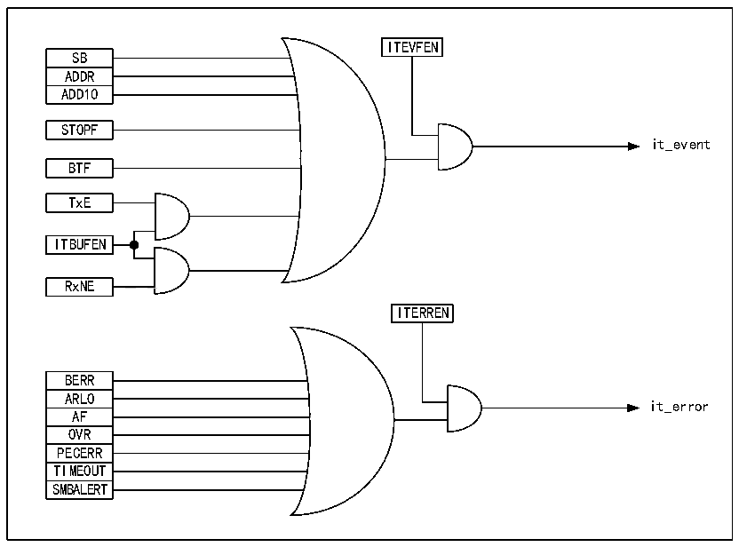

<!-- source-page: 374 -->

[← p.373](0373.md) · [index](../README.md) · [PDF p.374](https://ch32-riscv-ug.github.io/CH32H417/datasheet_en/CH32H417RM.PDF#page=374) · [p.375 →](0375.md)

<!-- header: CH32H417 Reference Manual https://wch-ic.com -->
as needed.  

## 21.8 Interrupt

Each I2C module has 2 interrupt vectors: event interrupt and error interrupt. 2 types of interrupts support the  
interrupt sources as shown in Figure 21-8.  

Figure 21-8 I2C interrupt request  
 <!-- rendered from the PDF; verify at https://ch32-riscv-ug.github.io/CH32H417/datasheet_en/CH32H417RM.PDF#page=374 -->

🖼 Text parsed from the figure above

ITEVFEN  
SB  ADDR  ADD10  
STOPF  
it_event  
BTF  
TxE  
ITBUFEN  
RxNE  
<!-- image: p374-draw-image-00002 inside the figure -->
ITERREN  
BERR  ARLO  AF  OVR  PECERR  TIMEOUT  SMBALERT  
it_error  

## 21.9 DMA

DMA can be used to receive/transmit bulk data. When DMA is used, the ITBUFEN bit of the control register  
cannot be set.  
<strong>● DMA is used for transmission</strong>  
The DMA mode can be activated by setting the DMAEN bit in the CTLR2 register. As long as the TxE bit is set,  
the data can be loaded into the I2C data register from the set memory by DMA. The following settings are  
required to allocate channels for I2C.  
1) Set the I2Cx_DATAR register address to the DMA_PADDRx register, and set the memory address in the  
DMA_MADDRx register, so that the data will be sent from the memory to the I2Cx_DATAR register after  
each TxE event.  
2) Set the required number of transferred bytes in the DMA_CNTRx register. After each TxE event, this value will  
be reduced progressively.  
3) The channel priority is configured using the PL[0:1] bits in the DMA_CFGRx register.  
4) Set the DIR bit in the DMA_CFGRx register, and it can be configured to issue an interrupt request according to  
application requirements when the entire transmission is half or wholly completed.  
<!-- image: p374-draw-image-00001 bbox=[511.44, 786.36, 530.88, 796.68] -->
<!-- footer: V1.7 372 -->
