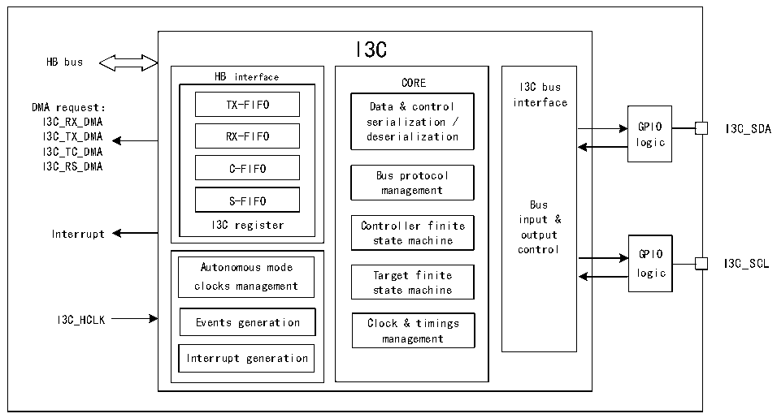

<!-- source-page: 386 -->

[← p.385](0385.md) · [index](../README.md) · [PDF p.386](https://ch32-riscv-ug.github.io/CH32H417/datasheet_en/CH32H417RM.PDF#page=386) · [p.387 →](0387.md)

<!-- header: CH32H417 Reference Manual https://wch-ic.com -->

# Chapter 22 I3C Bus (I3C)

The I3C bus is a 2-wire serial single-ended multi-drop bus designed to enhance the traditional I2C bus. The I3C  
interface handles communication between this device and other devices connected to the I3C bus. It supports  
operation as both a master and a slave device. When functioning as a master, it extends the capabilities of the I2C  
interface while maintaining a degree of backward compatibility.  

## 22.1 Main Features

● Support master and slave devices  
● Support MIPI I3C specification v1.1  
● Support multi-host functionality  
● Support DMA  
● In-band interrupt (IBI) capability  
● Built-in error detection and recovery  
● I3C SCL bus clock up to 12.5MHz  
● Support dynamic address allocation, direct and broadcast common command codes (CCC), and private  
read/write transfers  

## 22.2 Overview

Figure 22-1 I3C timing diagram  
 <!-- rendered from the PDF; verify at https://ch32-riscv-ug.github.io/CH32H417/datasheet_en/CH32H417RM.PDF#page=386 -->

🖼 Text parsed from the figure above

I3C  
HB bus  
HB interface CORE I3C bus  
DMA request： TX-FIFO Data &amp; control interface  
I3C_RX_DMA serialization / GPIO I3C_SDA  
I3C_TX_DMA RX-FIFO deserialization logic  
I3C_TC_DMA  
I3C_RS_DMA C-FIFO  
Bus protocol  
management  
S-FIFO Bus  
input &amp;  
I3C register Controller finite  
Interrupt output  
state machine  
control GPIO  
Autonomous mode Target finite logic I3C_SCL  
clocks management state machine  
I3C_HCLK Events generation Clock &amp; timings  
management  
Interrupt generation  

## 22.3 Function Description

### 22.3.1 I3C Peripheral Status

I3C peripherals can be used as both I3C master devices and I3C slave devices. In any case, the peripheral is in one  
<!-- image: p386-draw-image-00001 bbox=[511.44, 786.36, 530.88, 796.68] -->
<!-- footer: V1.7 384 -->
