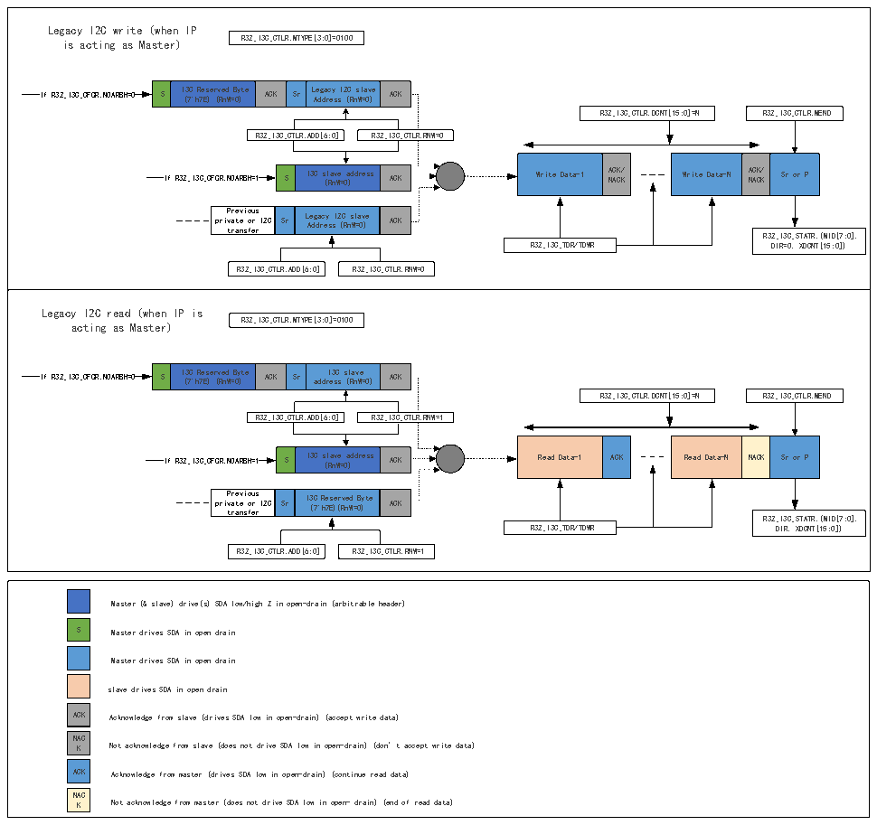

<!-- source-page: 407 -->

[← p.406](0406.md) · [index](../README.md) · [PDF p.407](https://ch32-riscv-ug.github.io/CH32H417/datasheet_en/CH32H417RM.PDF#page=407) · [p.408 →](0408.md)

<!-- header: CH32H417 Reference Manual https://wch-ic.com -->

#### 22.3.4.12 Traditional I2C Read/Write Transfer (as master devices)

Figure 22-11 Traditional I2C read/write message (as master devices)  
 <!-- rendered from the PDF; verify at https://ch32-riscv-ug.github.io/CH32H417/datasheet_en/CH32H417RM.PDF#page=407 -->

🖼 Text parsed from the figure above

Legacy I2C write (when IP is acting as Master) R32_I3C_CTLR.MTYPE[3:0]=0100 If R32_I3C_CFGR.NOARBH=0 S I ( 3 7 C &#x27; h R 7 e E s ) e r ( v R e n d W = B 0 y ) te ACK Sr L A e d g d a r c e y s s I 2 ( C R n s W l = a 0 v ) e ACK R32_I3C_CTLR.DCNT[15:0]=N R32_I3C_CTLR.MEND R32_I3C_CTLR.ADD[6:0] R32_I3C_CTLR.RNW=0 If R32_I3C_CFGR.NOARBH=1 S I3C s ( l R a n v W e = 0 a ) ddress ACK Write Data-1 A N C A K C / K Write Data-N A N C A K C / K Sr or P pri P t v r r a e a t v n e i s o f o u e r s r I2C Sr L A e d g d a r c e y s s I 2 ( C R n s W l = a 0 v ) e ACKR32_I3C_STATR.(MID[7:0], R32_I3C_TDR/TDWR DIR=0, XDCNT[15:0]) R32_I3C_CTLR.ADD[6:0] R32_I3C_CTLR.RNW=0  Legacy I2C read (when IP is acting as Master) R32_I3C_CTLR.MTYPE[3:0]=0100 If R32_I3C_CFGR.NOARBH=0 S I ( 3 7 C &#x27; h R 7 e E s ) e r ( v R e n d W = B 0 y ) te ACK Sr add r I e 3 s C s s ( l R a n v W e = 0) ACK R32_I3C_CTLR.DCNT[15:0]=N R32_I3C_CTLR.MEND R32_I3C_CTLR.ADD[6:0] R32_I3C_CTLR.RNW=1 If R32_I3C_CFGR.NOARBH=1 S I3C s ( l R a n v W e = 0 a ) ddress ACK Read Data-1 ACK Read Data-N NACK Sr or P pri P t v r r a e a t v n e i s o f o u e r s r I2C Sr I3 ( C 7 &#x27; R h e 7E s ) e ( r R v n ed W= 0 By ) te ACKR32_I3C_STATR.(MID[7:0], R32_I3C_TDR/TDWR DIR, XDCNT[15:0]) R32_I3C_CTLR.ADD[6:0] R32_I3C_CTLR.RNW=1  
S  I3C Reserved Byte (7&#x27;h7E) (RnW=0)  ACK  Sr  Legacy I2C slave Address (RnW=0)  ACK  
Write Data-1  ACK/ NACK  
Write Data-N  ACK/ NACK  Sr or P  
S  I3C slave address (RnW=0)  ACK  
Previous private or I2C transfer  Sr  Legacy I2C slave Address (RnW=0)  ACK  
S  I3C Reserved Byte (7&#x27;h7E) (RnW=0)  ACK  Sr  I3C slave address (RnW=0)  ACK  
Read Data-1  ACK  
Read Data-N  NACK  Sr or P  
S  I3C slave address (RnW=0)  ACK  
Previous private or I2C transfer  Sr  I3C Reserved Byte (7&#x27;h7E)(RnW=0)  ACK  
S  ACK  NACK  ACK  NACK  
Master (&amp; slave) drive(s) SDA low/high Z in open-drain (arbitrable header)  
S Master drives SDA in open drain  
Master drives SDA in open drain  
slave drives SDA in open drain  
ACK Acknowledge from slave (drives SDA low in open-drain) (accept write data)  
K Not acknowledge from slave (does not drive SDA low in open-drain) (don’t accept write data)  
ACK Acknowledge from master (drives SDA low in open-drain) (continue read data)  
K Not acknowledge from master (does not drive SDA low in open- drain) (end of read data)  

<!-- image: p407-draw-image-00001 bbox=[511.44, 786.36, 530.88, 796.68] -->
<!-- footer: V1.7 405 -->
