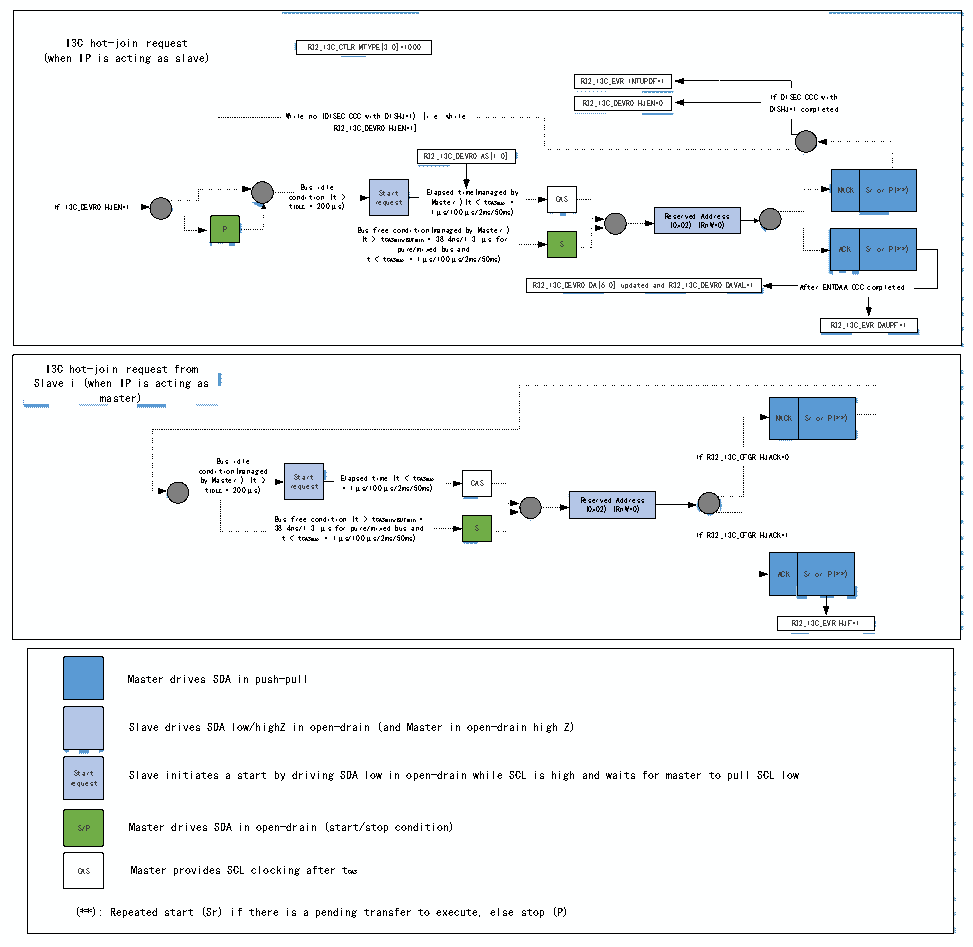

<!-- source-page: 409 -->

[← p.408](0408.md) · [index](../README.md) · [PDF p.409](https://ch32-riscv-ug.github.io/CH32H417/datasheet_en/CH32H417RM.PDF#page=409) · [p.410 →](0410.md)

<!-- header: CH32H417 Reference Manual https://wch-ic.com -->
When the peripheral operates as the master device, the R32_I3C_IBIDR register is used to receive the IBI data  
payload. Therefore, IBI requests from the slave device must not exceed a 4-byte data payload. If more information  
needs to be exchanged within the context of this in-band interrupt, the master device software must issue a private  
read control word.  

#### 22.3.4.14 I3C Hot Join Request Transfer (as master/slave devices)

Figure 22-13 I3C hot join request transfer (as master/slave devices)  
 <!-- rendered from the PDF; verify at https://ch32-riscv-ug.github.io/CH32H417/datasheet_en/CH32H417RM.PDF#page=409 -->

🖼 Text parsed from the figure above

<!-- image: p409-draw-image-00020 inside the figure -->
<!-- image: p409-draw-image-00021 inside the figure -->
<!-- image: p409-draw-image-00002 inside the figure -->
I3C hot-join request R32_I3C_CTLR.MTYPE[3:0]=1000  
<!-- image: p409-draw-image-00003 inside the figure -->
<!-- image: p409-draw-image-00022 inside the figure -->
(when IP is acting as slave)  
<!-- image: p409-draw-image-00023 inside the figure -->
<!-- image: p409-draw-image-00015 inside the figure -->
R32_I3C_EVR.INTUPDF=1  
<!-- image: p409-draw-image-00024 inside the figure -->
If DISEDISHJ=1  EC CCC with 1 completed  
R32_I3C_DEVR0.HJEN=0 I D f I S D H I J= S 1 EC c o CC mp C l w et i e th d  
<!-- image: p409-draw-image-00016 inside the figure -->
<!-- image: p409-draw-image-00025 inside the figure -->
While no (DISEC CCC with DISHJ=1) [i.e. while  
<!-- image: p409-draw-image-00026 inside the figure -->
R32_I3C_DEVR0.HJEN=1]  
<!-- image: p409-draw-image-00013 inside the figure -->
<!-- image: p409-draw-image-00027 inside the figure -->
<!-- image: p409-draw-image-00012 inside the figure -->
R32_I3C_DEVR0.AS[1:0]  
<!-- image: p409-draw-image-00028 inside the figure -->
<!-- image: p409-draw-image-00004 inside the figure -->
<!-- image: p409-draw-image-00005 inside the figure -->
<!-- image: p409-draw-image-00011 inside the figure -->
<!-- image: p409-draw-image-00029 inside the figure -->
<!-- image: p409-draw-image-00091 inside the figure -->
If I3C_DEVR0.HJEN=1 c t o ID n L B d E i u = t s i o i 2 d 0 n l 0 ( e μ t s &gt; ) re St qu a e rt st El 1 M μ a a p s s s t / e e d 1 r 0 t 0 ) i μ ( m t s e ( / &lt; m 2 a m t s n C a / AS g 5 m 0 e a d m x s = b ) y CAS Reserved Address NACK Sr or P(**)  
<!-- image: p409-draw-image-00010 inside the figure -->
<!-- image: p409-draw-image-00014 inside the figure -->
<!-- image: p409-draw-image-00030 inside the figure -->
<!-- image: p409-draw-image-00007 inside the figure -->
<!-- image: p409-draw-image-00008 inside the figure -->
<!-- image: p409-draw-image-00006 inside the figure -->
<!-- image: p409-draw-image-00090 inside the figure -->
<!-- image: p409-draw-image-00031 inside the figure -->
P Bus free condition(managed by Master ) (0x02) (RnW=0)  
<!-- image: p409-draw-image-00017 inside the figure -->
<!-- image: p409-draw-image-00018 inside the figure -->
<!-- image: p409-draw-image-00009 inside the figure -->
<!-- image: p409-draw-image-00032 inside the figure -->
(t &gt; tCASmi p n u /B r U e F / mi m n i x = e d 3 8 b . u 4 s n s a / n 1 d . 3 μs for S ACK Sr or P(**)  
<!-- image: p409-draw-image-00033 inside the figure -->
t &lt; tCASmax = 1μs/100μs/2ms/50ms)  
<!-- image: p409-draw-image-00034 inside the figure -->
<!-- image: p409-draw-image-00089 inside the figure -->
R32_I3C_DEVR0.DA[6:0] updated and R32_I3C_DEVR0.DAVAL=1 After ENTDAA CCC completed  
<!-- image: p409-draw-image-00035 inside the figure -->
<!-- image: p409-draw-image-00036 inside the figure -->
<!-- image: p409-draw-image-00019 inside the figure -->
R32_I3C_EVR.DAUPF=1  
<!-- image: p409-draw-image-00037 inside the figure -->
<!-- image: p409-draw-image-00038 inside the figure -->
<!-- image: p409-draw-image-00052 inside the figure -->
<!-- image: p409-draw-image-00051 inside the figure -->
I3C hot-join request from  
<!-- image: p409-draw-image-00053 inside the figure -->
Slave i (when IP is acting as  
<!-- image: p409-draw-image-00054 inside the figure -->
master)  
<!-- image: p409-draw-image-00039 inside the figure -->
<!-- image: p409-draw-image-00040 inside the figure -->
NACK  Sr or P(**)  
<!-- image: p409-draw-image-00055 inside the figure -->
<!-- image: p409-draw-image-00056 inside the figure -->
<!-- image: p409-draw-image-00057 inside the figure -->
Bus idle If R32_I3C_CF GR.HJACK=0  
<!-- image: p409-draw-image-00046 inside the figure -->
<!-- image: p409-draw-image-00058 inside the figure -->
c b o y t n I d D M i L a E t s i t = o e n 2 r ( 0 m ) 0 a μ n ( a t s g ) e &gt; d re St qu a e rt st E = l a 1 p μ se s d / 1 t 0 i 0 m μ e s ( / t 2 m &lt; s / t 5 C 0 A m S s ma ) x CAS  
<!-- image: p409-draw-image-00045 inside the figure -->
<!-- image: p409-draw-image-00047 inside the figure -->
<!-- image: p409-draw-image-00059 inside the figure -->
<!-- image: p409-draw-image-00042 inside the figure -->
<!-- image: p409-draw-image-00043 inside the figure -->
<!-- image: p409-draw-image-00041 inside the figure -->
Reserved Address  
<!-- image: p409-draw-image-00060 inside the figure -->
(0x02) (RnW=0)  
<!-- image: p409-draw-image-00044 inside the figure -->
Bus free condition (t &gt; tCASmin/BUFmin =  
<!-- image: p409-draw-image-00061 inside the figure -->
38.4ns/1.3 μs for pure/mixed bus and S  
t &lt; tCASmax = 1μs/100μs/2ms/50ms) If R32_I3C_CFGR.HJACK=1  
<!-- image: p409-draw-image-00062 inside the figure -->
<!-- image: p409-draw-image-00048 inside the figure -->
<!-- image: p409-draw-image-00049 inside the figure -->
ACK  Sr or P(**)  
<!-- image: p409-draw-image-00063 inside the figure -->
<!-- image: p409-draw-image-00064 inside the figure -->
<!-- image: p409-draw-image-00065 inside the figure -->
<!-- image: p409-draw-image-00066 inside the figure -->
<!-- image: p409-draw-image-00050 inside the figure -->
R32_I3C_EVR.HJF=1  
<!-- image: p409-draw-image-00067 inside the figure -->
<!-- image: p409-draw-image-00073 inside the figure -->
<!-- image: p409-draw-image-00068 inside the figure -->
<!-- image: p409-draw-image-00074 inside the figure -->
Master drives SDA in push-pull  
<!-- image: p409-draw-image-00075 inside the figure -->
<!-- image: p409-draw-image-00076 inside the figure -->
<!-- image: p409-draw-image-00069 inside the figure -->
Slave drives SDA low/highZ in open-drain (and Master in open-drain high Z)  
<!-- image: p409-draw-image-00077 inside the figure -->
<!-- image: p409-draw-image-00078 inside the figure -->
<!-- image: p409-draw-image-00070 inside the figure -->
<!-- image: p409-draw-image-00079 inside the figure -->
Start Slave initiates a start by driving SDA low in open-drain while SCL is high and waits for master to pull SCL low  
<!-- image: p409-draw-image-00080 inside the figure -->
request  
<!-- image: p409-draw-image-00081 inside the figure -->
<!-- image: p409-draw-image-00071 inside the figure -->
<!-- image: p409-draw-image-00082 inside the figure -->
S/P Master drives SDA in open-drain (start/stop condition)  
<!-- image: p409-draw-image-00083 inside the figure -->
<!-- image: p409-draw-image-00072 inside the figure -->
<!-- image: p409-draw-image-00084 inside the figure -->
CAS Master provides SCL clocking after tCAS  
<!-- image: p409-draw-image-00085 inside the figure -->
<!-- image: p409-draw-image-00086 inside the figure -->
(**): Repeated start (Sr) if there is a pending transfer to execute, else stop (P)  
<!-- image: p409-draw-image-00087 inside the figure -->
<!-- image: p409-draw-image-00088 inside the figure -->

<!-- image: p409-draw-image-00001 bbox=[511.44, 786.36, 530.88, 796.68] -->
<!-- footer: V1.7 407 -->
