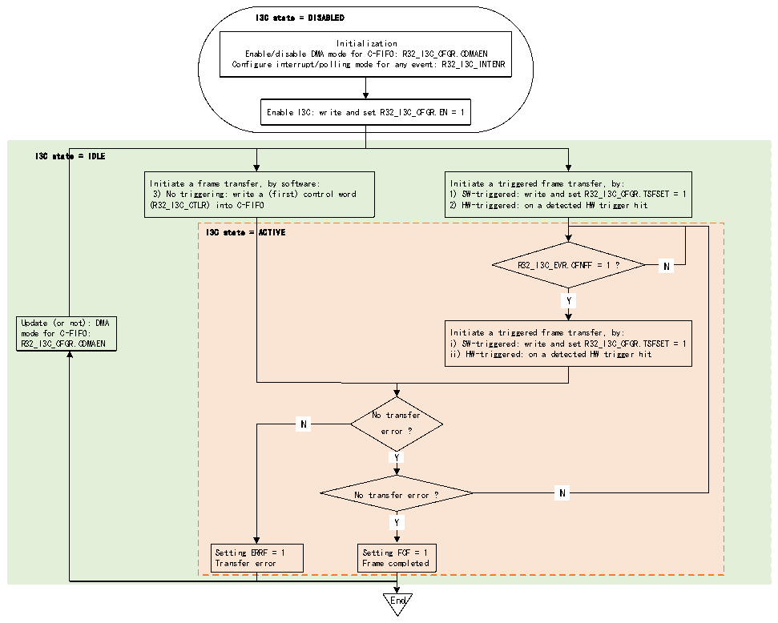

<!-- source-page: 411 -->

[← p.410](0410.md) · [index](../README.md) · [PDF p.411](https://ch32-riscv-ug.github.io/CH32H417/datasheet_en/CH32H417RM.PDF#page=411) · [p.412 →](0412.md)

<!-- header: CH32H417 Reference Manual https://wch-ic.com -->

#### 22.3.5.1 C-FIFO Management (as master)

When it is used as a master device, it can be used during C-FIFO broadcast CCC, direct read/write CCC, private  
read/write, traditional I2C read/write, and software-initiated error recovery.  
Figure 22-15 illustrates how to manage the C-FIFO to queue the control words on the I3C bus when the I3C  
peripheral is used as the master device.  

Figure 22-15 C-FIFO management (as master)  
 <!-- rendered from the PDF; verify at https://ch32-riscv-ug.github.io/CH32H417/datasheet_en/CH32H417RM.PDF#page=411 -->

🖼 Text parsed from the figure above

I3C state = DISABLED  
Initialization  
Enable/disable DMA mode for C-FIFO: R32_I3C_CFGR.CDMAEN  
Configure interrupt/polling mode for any event: R32_I3C_INTENR  
Enable I3C: write and set R32_I3C_CFGR.EN = 1  
I3C state = IDLE  
Initiate a frame transfer, by software: Initiate a triggered frame transfer, by:  
3) No triggering: write a (first) control word 1) SW-triggered: write and set R32_I3C_CFGR.TSFSET = 1  
(R32_I3C_CTLR) into C-FIFO 2) HW-triggered: on a detected HW trigger hit  
I3C state = ACTIVE  
N  N  
R32_I3C_EVR.CFNFF = 1 ? N  
Y  Y  
Update (or not): DMA  
mode for C-FIFO: Initiate a triggered frame transfer, by:  
R32_I3C_CFGR.CDMAEN i) SW-triggered: write and set R32_I3C_CFGR.TSFSET = 1  
ii) HW-triggered: on a detected HW trigger hit  
No transfer  
N  N  
error ?  
Y  Y  
N  N  
No transfer error ? N  
Y  Y  
Setting ERRF = 1 Setting FCF = 1  
Transfer error Frame completed  
End  

First, the software must initialize the C-FIFO management through the R32_I3C_CFGR register CDMAEN, and  
the specific steps are as follows:  
● The software writes directly according to the control word (when CDMAEN=0):  
–By polling mode (setting CFNFIE=0 in R32_I3C_INTENR register): Wait for the hardware to request the next  
control word (CFNFF=1 in R32_I3C_INTENR register) before explicitly writing into R32_I3C_CTLR register.  
–Through enabled interrupt notification (when CFNFIE=1):  
● Written by the assigned DMA channel (when CDMAEN=1) to enable the corresponding I3C peripheral  
DMA request:  
–According to the configuration at the module level, DMA will automatically push/write the control word from  
its memory source buffer to the R32_I3C_CTLR register until the frame is completed (after the last message of  
the frame, a stop bit will be issued on the I3C bus), except when a transmission error occurs.  
● In any case, as long as the C-FIFO is empty and the repeated start bit of a new control word must be issued,  
the C-FIFO underflow will be reported (ERRF=1 in the R32_I3C_EVR register and COVR=1 in the  
<!-- image: p411-draw-image-00001 bbox=[511.44, 786.36, 530.88, 796.68] -->
<!-- footer: V1.7 409 -->
