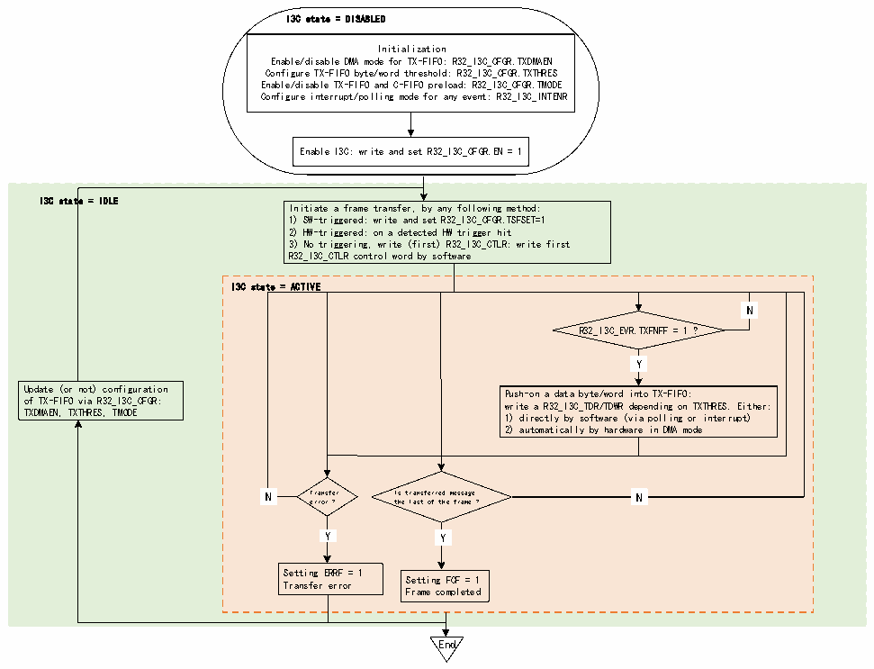

<!-- source-page: 412 -->

[← p.411](0411.md) · [index](../README.md) · [PDF p.412](https://ch32-riscv-ug.github.io/CH32H417/datasheet_en/CH32H417RM.PDF#page=412) · [p.413 →](0413.md)

<!-- header: CH32H417 Reference Manual https://wch-ic.com -->
R32_I3C_STATR register). If the ERRIE bit in the R32_I3C_INTENR register is enabled, an interrupt is  
generated.  
● When the I3C peripheral is not working, the DMA mode configuration of C-FIFO management can be  
modified.  
● When used as a master device, if there is a transmission error (ERRF=1 in the R32_I3C_EVR register), the  
hardware will automatically empty the CFIFO.  

#### 22.3.5.2 TX-FIFO Management (as master)

When operating as a master device, the TX-FIFO may be used during broadcasts or direct CCCs (including  
ENTDAA and RSTACT), when parsing bytes/subcommand bytes or data bytes, during private writes, or during  
traditional I2C writes.  
Figure 22-16 illustrates how the TX-FIFO is managed to queue data bytes or words to be transmitted on the I²C  
bus when the I²C peripheral operates as a master device.  

Figure 22-16 TX-FIFO management (as master)  
 <!-- rendered from the PDF; verify at https://ch32-riscv-ug.github.io/CH32H417/datasheet_en/CH32H417RM.PDF#page=412 -->

🖼 Text parsed from the figure above

I3C state = DISABLED  
Initialization  
Enable/disable DMA mode for TX-FIFO: R32_I3C_CFGR.TXDMAEN  
Configure TX-FIFO byte/word threshold: R32_I3C_CFGR.TXTHRES  
Enable/disable TX-FIFO and C-FIFO preload: R32_I3C_CFGR.TMODE  
Configure interrupt/polling mode for any event: R32_I3C_INTENR  
Enable I3C: write and set R32_I3C_CFGR.EN = 1  
I3C state = IDLE  
Initiate a frame transfer, by any following method:  
1) SW-triggered: write and set R32_I3C_CFGR.TSFSET=1  
2) HW-triggered: on a detected HW trigger hit  
3) No triggering, write (first) R32_I3C_CTLR: write first  
R32_I3C_CTLR control word by software  
I3C state = ACTIVE  
N  N  
R32_I3C_EVR.TXFNFF = 1 ?  
Y  Y  
Update (or not) configuration Push-on a data byte/word into TX-FIFO:  
of TX-FIFO via R32_I3C_CFGR: write a R32_I3C_TDR/TDWR depending on TXTHRES. Either:  
TXDMAEN, TXTHRES, TMODE 1) directly by software (via polling or interrupt)  
2) automatically by hardware in DMA mode  
N  N  
N Transfer Is transferred message N  
error ? the last of the frame ?  
Y  Y  
Y  Y  
Y Y  
Setting ERRF = 1  
Transfer error Setting FCF = 1  
Frame completed  
End  

First, TX-FIFO management must be initialized through the following fields in the R32_I3C_CFGR register:  
● TXDMAEN: Enable/disable DMA mode for the TX-FIFO  
● TXTHRES: Push data bytes or words into the TX-FIFO  
● TMODE: Enable/disable TX-FIFO and C-FIFO preload  
Then, according to the TXDMAEN bit in R32_I3C_CFGR register, there are two ways to write data into the  
TX-FIFO:  
● Software writes directly by byte/word (when TXDMAEN=0):  
<!-- image: p412-draw-image-00001 bbox=[511.44, 786.36, 530.88, 796.68] -->
<!-- footer: V1.7 410 -->
